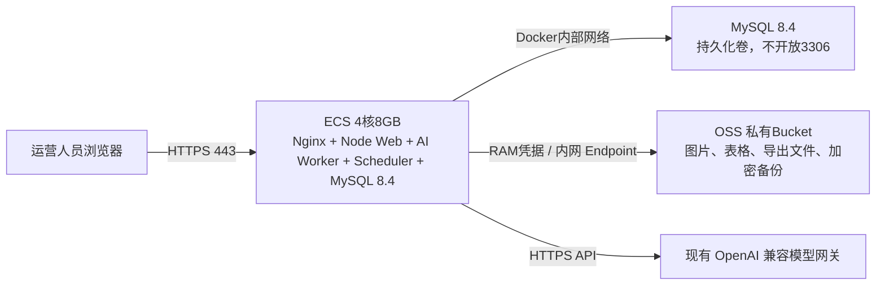

# 阿里云杭州地域采购清单

本清单用于部署 **亚马逊全链路智能工具** 的独立生产环境。它不执行购买、不提交付费订单，也不迁移任何数据；仅列出在阿里云控制台中应选择的规格与安全边界。

## 1. 资源拓扑

## 2. ECS 采购项

| 控制台字段 | 应选择的值 |
|---|---|
| 地域 | **华东1（杭州）** |
| 网络 | 新建或复用专有网络 VPC；ECS与OSS选择同一地域 |
| 实例族 | 通用型非突发性能实例；优先选择当前可售的 `g` 系列，若不可售则选择 `u` 系列同规格 |
| CPU / 内存 | **4 vCPU / 8GB RAM** |
| 镜像 | **Ubuntu 24.04 LTS 64位**；若当前可售镜像不含 24.04，选择 Ubuntu 22.04 LTS 64位 |
| 系统盘 | **100GB ESSD PL1** |
| 公网 | 分配固定公网IPv4，先按固定带宽 **3Mbps BGP** 起步；文件通过OSS预签名URL访问，必要时升至5Mbps |
| 计费 | 可先按量付费做迁移验证；测试完成后再转包年包月或节省计划 |
| 登录 | 优先 SSH 密钥对；关闭密码登录或设置高强度初始密码后立即改为密钥登录 |

> 不选择突发性能实例、2核4GB轻量机或仅4GB内存机型。4核8GB是当前内部低并发启动配置；若连续一周内存高于70%、AI任务明显排队或开始面向外部多团队使用，则先升配ECS，随后将MySQL迁入RDS。

## 3. 本机MySQL与恢复保护项

| 控制台字段 | 应选择的值 |
|---|---|
| 部署方式 | Docker Compose 内的 **MySQL 8.4** 服务，持久化卷位于ECS云盘 |
| 网络 | 仅加入Docker内部网络；**不映射、不开放3306端口** |
| 账号 | 以独立应用账号连接，root密码仅用于容器初始化和受控维护 |
| 备份 | 每日加密逻辑备份到私有OSS，保留14天；同时启用ECS云盘快照 |
| 恢复 | 上线前以测试库演练一次对象备份恢复；恢复时先停止Web、Worker和Scheduler |

## 4. OSS 采购与安全项

| 控制台字段 | 应选择的值 |
|---|---|
| Bucket 地域 | **华东1（杭州）** |
| 存储类型 | 标准存储 |
| 读写权限 | **私有** |
| 版本控制 | 开启 |
| 生命周期 | 临时导出文件建议 30 天转低频或删除；业务图片和知识库源文件不自动删除 |
| 访问方式 | 应用服务器使用 RAM Role；浏览器仅获取短期预签名上传/下载 URL |
| RAM 权限 | 仅限该 Bucket 的指定业务前缀读写；不授予全账号 OSS 管理权限 |

建议 Bucket 名称：`amz-ai-prod-<唯一后缀>`。对象键按 `workspace/{workspaceId}/...` 分区，避免不同工作空间混淆。

## 5. 安全组与网络规则

| 入站端口 | 来源 | 用途 |
|---|---|---|
| 22 / TCP | 仅管理员固定公网 IP 或堡垒机 | SSH 运维 |
| 80 / TCP | 0.0.0.0/0 | HTTP 跳转至 HTTPS / 证书校验 |
| 443 / TCP | 0.0.0.0/0 | 网站与 API HTTPS 访问 |
| 3306 / TCP | **不开放** | MySQL仅在Docker内部网络监听 |
| 3000、4800 等开发端口 | 不开放公网 | 仅本机或内网调试 |

## 6. 购买后的交接信息

购买完成后，请提供以下**非密钥**信息即可让我先进行只读环境核验：

1. ECS 公网 IP、SSH 端口、登录用户名，以及通过安全渠道配置的临时 SSH 密钥访问方式。
2. VPC ID、vSwitch ID、应用数据库名称与云盘快照策略（不要在聊天中发送数据库密码）。
3. OSS Bucket 名称、杭州公网及内网Endpoint与为ECS配置好的RAM Role名称（不要发送AccessKey）。
4. 计划绑定的正式域名，以及是否已完成中国大陆网站备案。

在收到后，我会先运行只读的系统、网络、MySQL、OSS 和模型网关连通性检查；任何数据导入、DNS 修改、端口放行、写入密钥或正式切换都会先向你说明并取得确认。

## 参考

- [阿里云 ECS 详细价格信息](https://www.aliyun.com/price/detail/ecs)
- [阿里云块存储计费](https://help.aliyun.com/zh/ecs/block-storage-devices)
- [阿里云 OSS 价格详情](https://www.aliyun.com/price/detail/oss)
- [阿里云 OSS 地域和Endpoint](https://help.aliyun.com/zh/oss/user-guide/regions-and-endpoints)
- [OSS 私有对象预签名访问说明](https://help.aliyun.com/zh/oss/user-guide/how-to-obtain-the-url-of-a-single-object-or-the-urls-of-multiple-objects)
- [ECS 安全组应用指导](https://help.aliyun.com/zh/ecs/user-guide/security-groups-for-different-use-cases)
