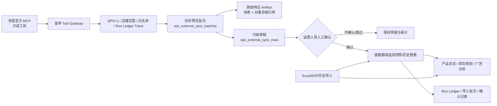
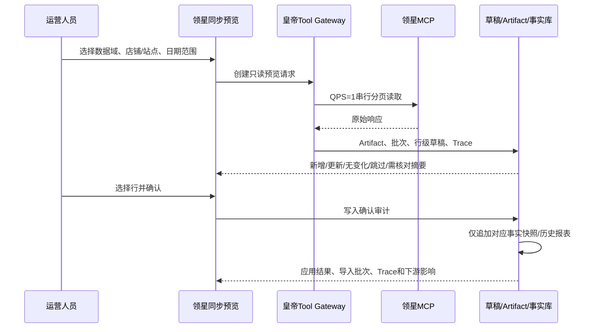

# 领星 MCP 与现有运营系统数据同步方案

**版本：** v1.0  
**编制日期：** 2026-08-25  
**适用范围：** 单公司、单工作空间的亚马逊运营AI提效工具  
**数据源：** 领星官方 Streamable HTTP MCP、既有Excel/ERP导入、人工维护数据

## 1. 目标与治理原则

本方案的目标不是将领星ERP“镜像复制”到本系统，而是把对运营决策有用的领星数据以**可审阅、可追溯、可恢复**的方式接入现有工作台。系统应保留“AI是助手、人是决策者”的原则：MCP只负责读取；所有会影响业务事实表的写入，均遵循**读取预览 → 差异审查 → 人工确认 → 追加快照 → 下游汇总**的固定链路。

领星官方说明，MCP查询范围受当前领星账号权限约束，数据与ERP页面一致，并受每秒1次查询限制。[1] 因此，本系统把MCP视为外部只读数据源，而非可直接改写业务配置的控制接口。广告预算、竞价、投放状态、库存规划人工参数、产品成本、生产/物流/缓冲天数和人工填写的财务利润均不由MCP自动覆盖。

> **核心约束：** 原始响应进入受控Artifact；行级数据进入独立同步草稿；确认后只追加版本化快照。任何展示层的聚合或AI分析均应读取快照与审计，不直接依赖一次性的外部响应。

## 2. 总体数据架构



| 层级 | 主要对象 | 责任 | 不允许的行为 |
| --- | --- | --- | --- |
| 外部读取层 | 领星官方MCP | 获取授权范围内的实时ERP数据 | 通过MCP修改广告、Listing、库存或自定义指标 |
| 治理层 | 皇帝Tool Gateway、能力白名单、Trace | 强制只读、店铺范围、QPS=1、调用审计 | 绕过Tool Gateway直连外部接口 |
| 预览层 | `ops_external_sync_batches`、`ops_external_sync_rows` | 保存批次、差异、过滤原因和人工选择 | 直接将未确认行写入业务事实表 |
| 原始证据层 | 统一Artifact生命周期 | 保存大响应的对象存储引用、SHA-256和批次关联 | 将大体积原始JSON塞入业务表JSON列 |
| 事实层 | 日快照、库存快照、广告历史报表、周度历史报表 | 追加可追溯事实记录 | 覆盖历史Excel、人工配置或既有批次 |
| 消费层 | 产品总览、库存规划、广告模块、AI Skill | 在明确粒度和来源优先级下汇总、分析和展示 | 将缺失值伪造为0或跨粒度直接相加 |

## 3. 当前已落地的同步能力

截至本方案版本，系统已经通过受治理路径完成以下真实验收。美国站9个授权店铺在2026-08-10至2026-08-16的ASIN日数据已生成草稿批次#3，并在人工确认后创建导入批次#660001、追加3,759条日快照。该批次过滤63条占位ASIN、无分页截断，原始约35MB响应已保存为Artifact引用，且未向周度产品表写入记录。

| 数据域 | 官方读取工具/来源 | 已落库目标 | 当前状态 | 严格边界 |
| --- | --- | --- | --- | --- |
| 店铺目录 | `get_my_sids` | 同步范围与批次摘要 | 已接入 | 仅用于授权范围识别，不自动扩大店铺范围 |
| ASIN日产品表现 | `query_product_performance_asin_lists`，`date_view_type=day`、ASIN维度 | `ops_asin_daily_snapshots` | 已接入并完成批次#3真实应用 | 仅人工确认后追加；不写`lingxing_product_weekly` |
| FBA库存 | `get_fba_stock_list` | 子ASIN库存快照 | 已完成真实验收 | 不覆盖生产/物流/缓冲和补货人工参数 |
| 订单利润 | `query_order_profit_list_gross_profit` | 父ASIN周度历史记录 | 已完成真实验收 | 仅补充历史周度事实，不取代日快照 |
| 广告活动 | `ad_auth_shops`、`ad_campaign_report` | 广告活动历史报表 | 已完成真实验收 | 不修改预算、竞价、状态或投放配置 |
| 广告关键词 | `ad_campaign_keyword_report` | 关键词历史周报 | 已完成真实验收 | 不修改关键词或投放策略 |
| Listing/产品主数据 | `erp_listing` | 后续按需做只读富化 | 规划中 | 产品品名、人工映射和运营负责人不被无条件覆盖 |

领星产品表现工具可按ASIN、父ASIN、MSKU、SKU、SPU及店铺维度查看销量、库存、流量、广告和利润；但不同粒度的流量口径不应直接横向相加。[2] 本系统默认使用**子ASIN日快照作为父ASIN周度运营汇总的原子事实**，避免混用父ASIN报表流量与子ASIN流量而造成重复统计。

## 4. 分域数据映射与权威来源

### 4.1 产品表现与产品总览

ASIN日产品表现是产品总览的近期权威数据源。同步身份键为：

```text
workspaceId + sourceStoreId(SID) + country + childASIN + reportDate
```

父ASIN只用于汇总维度，不参与日快照唯一身份。父子关系按同步时的原始响应保存，避免因为后续变体解绑/新增而重写历史日事实。

| 领星MCP字段 | 日快照字段 | 父ASIN自然周规则 | 缺失或冲突处理 |
| --- | --- | --- | --- |
| `sid`、店铺名、国家 | `sourceStoreId`、`storeName`、`country` | 作为分组和去重条件 | 无SID或站点的行进入`needs_review`，不应用 |
| `rdate` | `reportDate` | 归入站点自然周 | 日期缺失不允许确认应用 |
| `asin`、`parent_asins` | 子ASIN、父ASIN | 子ASIN原子指标按父ASIN聚合 | `asin="-"`等占位行过滤并审计 |
| `volume`、`order_items`、`amount` | 销量、订单、销售额 | 同店、同站、同周求和 | 源真实0保留为0 |
| `gross_profit` | 订单利润 | 同周求和 | 缺失显示“数据未提供” |
| `sessions_total` | 总Session | 同周求和 | 仅在分母大于0时计算总CVR |
| `ad_order_quantity`、`ad_sales_amount`、`spend` | 广告订单、广告销售额、广告花费 | 同周求和 | 广告销售额或点击为0时相关比率为缺失 |
| `clicks`、`impressions` | 广告点击、曝光 | 同周求和 | CTR=点击/曝光；CPC=花费/点击 |
| `nature_click`、`nature_order_items` | 自然点击、自然订单 | 同周求和 | 自然CVR=自然订单/自然点击；没有自然点击时不推导 |
| `avg_star`、`reviews_count`、退货字段 | 评分、评论、退货 | 按指标语义聚合或取最新快照 | 无原子数据时展示“数据未提供”，绝不显示伪0 |

比率一律使用**汇总后的分子/分母重算**，不得对每日/子ASIN比例求平均：

| 指标 | 公式 |
| --- | --- |
| 总CVR | 周订单量 ÷ 周Session |
| 广告CVR | 周广告订单 ÷ 周广告点击 |
| CTR | 周广告点击 ÷ 周广告曝光 |
| CPC | 周广告花费 ÷ 周广告点击 |
| ACOS | 周广告花费 ÷ 周广告销售额 |
| 订单利润率 | 周订单利润 ÷ 周销售额 |
| 退货率 | 周退货量 ÷ 周销量 |

领星官方产品表现说明中，销量、销售额与订单量可即时更新，广告销量/花费约15分钟更新，其他数据约1小时更新；流量数据每天更新两次且每次回补最近7天。[2] 因此，日快照同步采用“**近期滚动回补 + 人工确认后追加新版本**”而不是假设一次读取已永久完整。

### 4.2 库存与库存规划

FBA库存数据使用库存工具读取并追加到子ASIN库存快照。库存规划的库存量可由最新快照联动，但采购成本、预估/实际头程、FBA费用、总货期、缓冲天数、人工补货决策仍以运营人员维护值为准。

| 数据 | 读取粒度 | 落库与消费 | 禁止覆盖 |
| --- | --- | --- | --- |
| FBA可售、预留、在途 | 子ASIN / 店铺 / 最新快照 | 库存规划可用库存、覆盖天数 | 人工货期、缓冲、采购成本、补货策略 |
| 产品成本、头程、FBA费用、售价 | 人工维护/既有产品基本信息 | 月度采购与资金规划 | 不由MCP回写 |
| 建议采购量 | 系统计算 | 待审核建议 | 不自动下单或变更采购单 |

库存事实与人工策略必须分层保存。领星库存同步仅更新**事实快照层**；库存规划在计算时按工作空间、站点、子ASIN读取最近报告日的`ops_asin_daily_snapshots`，使用`fbaAvailable`、`fbaReserved`、`fbaInTransit`和库存快照日期作为库存基准。月度采购表与资金规划复用库存规划的建议订货日和建议采购量，并从人工维护的产品成本读取采购金额，不能把领星库存金额或空库存行当作成本来源。

| 领星库存字段 | 快照目标字段 | 系统消费端 | 消费规则 | 保护边界 |
| --- | --- | --- | --- | --- |
| `available` / 可售 | `ops_asin_daily_snapshots.fbaAvailable` | 库存规划、覆盖天数 | 以最近报告日为基准；按子ASIN读取 | 不覆盖本地库存调整记录 |
| `reserved` / 预留 | `fbaReserved` | 可用库存/覆盖天数计算 | 与可售、在途按规划公式组合 | 不将缺失解释为0预留 |
| `in_transit` / 在途 | `fbaInTransit` | 预计到货与补货建议 | 仅作为库存事实输入 | 不覆盖人工补货调整 |
| 快照时间、SID、站点、ASIN | `reportDate`、`sourceStoreId`、`country`、`asin` | 库存规划基准日、月度采购/资金规划筛选 | 使用店铺×站点×子ASIN×报告日身份键 | 不混用跨店同名SKU |
| 人工采购成本、头程/FBA费用、总货期、缓冲、MOQ | 不从领星写入 | 月度采购金额、资金需求、补货计算 | 继续读取人工参数 | 领星同步绝不覆盖 |

### 4.3 订单利润与财务利润

订单利润MCP报表适用于补齐父ASIN周度的销售、订单、毛利和广告费用历史，不应用于覆盖更细的ASIN日快照。财务利润趋势仍为按月人工输入，因为其可能包含结算口径、会计调整和本地费用；系统不应将订单利润自动替代财务利润。

### 4.4 广告活动、关键词与搜索词

广告同步只同步**历史表现事实**，如曝光、点击、花费、销售额、订单和ACOS。所有广告配置型动作属于高风险写操作，默认禁止：预算、竞价、竞价策略、广告/广告组/关键词状态、否定投放、组合和投放对象均不由同步任务改写。

| 广告域 | 推荐读取频率 | 历史落库 | 人工确认要求 |
| --- | --- | --- |
| 广告活动 | 每日或按周预览 | `ad_campaign_reports` | 确认后追加历史报表 |
| 广告关键词 | 每日或按周预览 | `ad_keyword_weekly` | 确认后追加历史报表 |
| 搜索词/投放目标 | 第二阶段接入 | 独立历史表，不与关键词混写 | 先预览字段、粒度、重复键 |
| 广告配置 | 不在同步范围 | 不落库为同步写操作 | 需单独高风险审批流程 |

广告历史报表与产品总览的广告指标也必须分层。产品总览的父ASIN自然周广告贡献只使用ASIN日产品表现中的广告原子指标（广告订单、广告销售额、广告花费、点击、曝光），以避免把活动报表再次求和造成双重累计。广告活动/关键词同步则服务于广告看板与优化模块的**活动级、关键词级**分析，并按报告期保留历史事实。

| 领星广告字段 | 历史目标表 | 系统消费端 | 关联与计算规则 | 严格禁止 |
| --- | --- | --- | --- | --- |
| 活动曝光、点击、花费、销售额、订单 | `ad_campaign_reports.impressions/clicks/spend/sales/orders` | 广告优化看板、广告深度优化、活动级复盘 | 按工作空间×Profile×活动×报告期过滤；ACOS=花费/销售额、CPC=花费/点击 | 不将活动级数值再叠加到产品总览的ASIN日广告指标 |
| 关键词曝光、点击、花费、销售额、订单、匹配方式 | `ad_keyword_weekly` | 关键词分析、搜索词策略、广告优化 | 按Profile×活动×关键词/投放目标×匹配方式×周期间隔 | 不将关键词报表写入广告配置或自动生成投放动作 |
| 产品总览广告字段 | `ops_asin_daily_snapshots` | 产品总览父ASIN自然周趋势 | 只按子ASIN日快照聚合并重算ACOS/CPC/广告CVR | 不从活动/关键词历史表补加，避免重复统计 |
| 预算、竞价、状态、否词、投放目标、广告结构 | 无同步写目标 | 仅在独立高风险广告操作流程中管理 | 同步任务只读、只追加表现事实 | 不由MCP同步修改 |

## 5. 标准同步流程

### 5.1 手动同步：当前默认模式



**预览阶段必须完成的检查：**

1. 检查店铺SID是否在当前授权范围内，并按站点筛选。
2. 逐页读取且通过网关串行限速；任何429、网络错误或分页异常进入批次摘要，不静默跳过。
3. 过滤占位ASIN、缺父ASIN、缺报告日和无效数字行，并为每行记录过滤理由。
4. 计算日快照身份键和与既有快照的差异，分类为`new`、`changed`、`unchanged`、`skipped`或`needs_review`。
5. 将超过数据库JSON承载能力的大响应放入Artifact对象存储，批次表只保留摘要、哈希和Artifact引用。

**确认应用阶段的不可变规则：**

1. 只能应用用户明确选中的草稿行；批次、行和确认记录均须可审计。
2. 使用新增导入批次追加事实，不修改历史Excel快照。
3. 日数据仅写`ops_asin_daily_snapshots`，不得误写`lingxing_product_weekly`。
4. 同身份键的多版本日快照保留来源与哈希；产品总览逻辑选择已确认的MCP来源优先版本，不与Excel同周相加。
5. 应用后必须验证下游产品总览、库存规划或广告历史表读取到正确批次；失败时停止后续应用并保留草稿。

## 6. 同步频率与补数建议

系统当前支持手动预览与人工确认。定时同步应作为第二阶段能力，在上线前单独完成Heartbeat回调、幂等键、部署、监控和暂停/恢复控制；不得使用`setInterval`或`node-cron`等进程内定时器。[3]

| 数据域 | 建议时点（北京时间） | 窗口 | 默认行为 | 原因 |
| --- | --- | --- | --- |
| ASIN日产品表现 | 每日17:30 | 回补最近7天 | 只生成草稿，不自动应用 | 兼容流量每日两次更新及近7天回补 |
| FBA库存 | 每日09:30、17:30 | 当日最新快照 | 只生成草稿 | 降低库存决策使用陈旧数据的风险 |
| 广告活动/关键词 | 每日18:00或每周一 | 最近7天 | 只生成草稿 | 广告数据约15分钟更新，运营需审阅异常波动 |
| 订单利润 | 每周一10:00 | 上一自然周 | 只生成草稿 | 适合周度经营复盘和历史补数 |
| 缺失补数 | 管理员手动触发 | 指定日期范围 | 只生成草稿 | 避免自动反复读取或错误回填 |

对于美国站全店日数据，调用量近似为“店铺数 × 日期数 × 分页数”。领星MCP的QPS=1与平台Heartbeat单次2分钟限制意味着全店长窗口不能单一任务内无限展开。[1] [3] 推荐将定时任务设计为按**店铺 × 报告日**可恢复的小批次，并以同步运行ID聚合；每个子任务采用幂等身份键、记录游标和页数上限，失败仅重试当前子任务。

## 7. 数据质量、冲突和缺失值规则

| 场景 | 处理规则 | 页面表现 |
| --- | --- | --- |
| MCP返回真实0 | 保留0，不转为缺失 | 显示0或0.0% |
| 分母为0的派生比率 | 不计算 | 显示“数据未提供” |
| MCP未提供原子字段 | 不猜测、不用0填充 | 显示“数据未提供”及字段来源说明 |
| 占位ASIN/缺失ASIN | 过滤，不应用 | 草稿摘要显示过滤数量 |
| 同一日有Excel与MCP | 均保留历史事实；MCP作为已确认优先来源用于产品总览 | 不相加，避免双重累计 |
| MCP数据晚到或回补 | 用新确认批次追加同身份版本 | 产品总览读取优先版本并保留审计 |
| 父子关系变化 | 以报告日快照中的关系做当期汇总 | 不使用当前关系重写旧日快照 |
| 字段定义冲突 | 标记`needs_review` | 人工决定映射后再应用 |

领星明确提示父ASIN流量与子ASIN流量来自不同报表口径，父ASIN行并非简单对子ASIN流量求和。[2] 因此，本系统的产品总览需要在页面中注明当前是“子ASIN日快照派生父ASIN周汇总”，而不是声称与领星父ASIN报表流量完全等价。若未来需要与领星父ASIN流量逐项对账，应新增独立的父ASIN日/周报表快照，不应混入子ASIN原子表。

## 8. 权限、安全与审计设计

| 控制项 | 方案 |
| --- | --- |
| MCP密钥 | 仅以环境引用保存；不写入代码、Git、前端、日志或Artifact正文 |
| 账号权限 | MCP地址与密钥继承领星账号授权范围；系统再次按工作空间、店铺SID和站点执行范围校验 [1] |
| Tool白名单 | 仅登记只读查询工具；配置型`create_*`/`update_*`工具不进入自动同步目录 |
| 限速 | Gateway全局QPS=1，分页严格串行，记录每次外部调用开始、成功、失败和耗时 |
| 原始数据 | 大响应转存Artifact，保存SHA-256、大小、批次引用和受控访问策略 |
| 人工确认 | 记录确认人、时间、选中行、确认前后摘要和导入批次 |
| Run Ledger | 记录Tool Run、Trace、Context/Artifact引用、错误类型和恢复结果 |
| 数据删除 | 同步事实默认追加；更正通过新批次/新版本表达，禁止无审计物理覆盖 |

## 9. 分阶段实施路线

| 阶段 | 内容 | 验收标准 | 状态 |
| --- | --- | --- | --- |
| Phase 0：治理底座 | MCP只读白名单、店铺范围、QPS=1、Trace、草稿/确认表 | 任一调用均可关联Tool Run与Trace；无确认不写事实 | 已完成 |
| Phase 1：产品与库存 | ASIN日快照、父ASIN周度聚合、FBA库存快照 | 多变体不归零；分母为0不伪造0%；人工库存参数不被覆盖 | 已完成 |
| Phase 2：广告与利润 | 广告活动/关键词历史报表、订单利润周度补数 | 仅追加历史表现；不写广告配置 | 已完成 |
| Phase 3：真实会话体验 | 同步页面展示批次摘要、差异、Artifact说明与人工确认入口 | 管理员真实登录会话能查看、筛选、确认和追溯 | 待完成 |
| Phase 4：定时草稿 | Heartbeat子任务、游标、幂等、失败监控、管理员暂停 | 定时仅生成草稿；全店任务可恢复且不超时 | 待用户另行确认 |
| Phase 5：补充数据域 | Listing主数据富化、广告搜索词/投放目标、父ASIN原始流量快照 | 每个新域先完成字段/粒度对账和人工确认 | 规划中 |

## 10. 上线验收清单

在启用任何新数据域或定时任务前，必须逐项通过下表。

| 检查项 | 合格标准 |
| --- | --- |
| 授权范围 | 店铺SID、站点和日期范围均显式记录，未跨越当前账号授权 |
| 工具治理 | 仅调用白名单只读工具，QPS=1，Trace完整 |
| 粒度 | 明确ASIN/父ASIN/MSKU、日/周/月和店铺/站点范围 |
| 映射 | 原始字段、目标字段、单位、币种、分母和缺失值规则均可审阅 |
| 差异 | 草稿展示新增、更新、无变化、过滤和需人工核对行数 |
| 确认 | 未确认不写业务事实；确认仅应用选中行 |
| 追溯 | 可从日快照追溯至行哈希、批次、Artifact、Tool Run和Trace |
| 下游 | 产品总览/库存规划/广告分析读取到预期批次，且历史Excel与人工参数未被覆盖 |
| 失败 | 429、空结果、分页截断、字段缺失和网络错误均有可读摘要与恢复策略 |

## 参考资料

[1] [领星MCP官方说明：权限范围、工具清单、实时性与QPS=1](https://www.lingxing.com/help/article/mcp)  
[2] [领星产品表现官方说明：字段来源、刷新频率与ASIN/父ASIN流量口径](https://www.lingxing.com/help/article/productExpressionNew)  
[3] [项目周期更新规范：Heartbeat定时任务、幂等和2分钟回调限制](../../../../skills/webdev-periodic-updates/SKILL.md)
