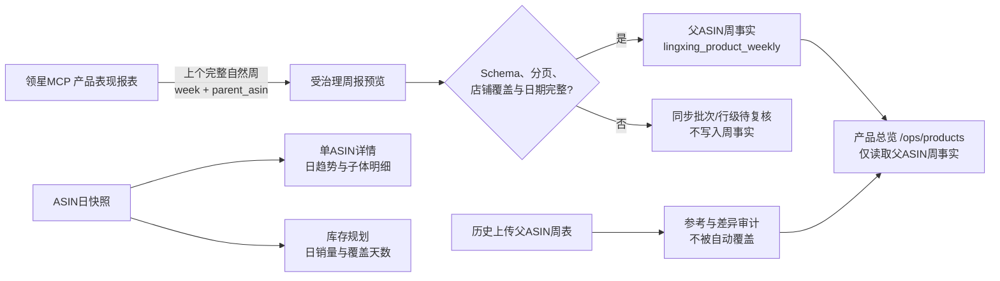

# 产品总览周度父ASIN数据源重构方案

## 结论与边界

本方案将产品总览的周度经营指标固定为**父ASIN周粒度的领星报表**，而不是由ASIN日快照再次聚合得到。当前领星MCP目录中的产品表现工具已经明确支持自定义起止日期、`week`周维度展示、`parent_asin`汇总维度，以及按店铺和站点范围筛选，因此具备进行受治理周报同步的技术前提。

ASIN日数据不会删除，也不会再参与产品总览的父ASIN周度金额、销量、广告或流量指标计算。它将被限制为两类用途：**单ASIN详情中的日趋势与子体明细**，以及**库存规划中的日销量/库存覆盖天数参考**。这样可以消除“一个周数据来自父级报表、另一个周数据来自子ASIN日汇总”造成的口径漂移。

> 本方案不运行AI模型。它是确定性的数据采集、校验和归档流程；任何后续AI分析只能读取已确认的父ASIN周事实或ASIN日事实，不得自行从另一粒度重算并覆盖权威指标。

## 可选路径

| 方案 | 运行方式 | 优点 | 权衡 | 成本 | 配置复杂度 |
| --- | --- | --- | --- | --- | --- |
| **A. 领星MCP父ASIN周报直连** | 每周读取上一个完整自然周，父ASIN维度落入周事实表 | 与您此前上传的父ASIN周表口径一致；自动更新；周度页面只有唯一权威来源 | 首次需要只读预览验证字段映射与分页覆盖 | 不新增平台费用 | 中等 |
| B. 继续由ASIN日数据聚合周度 | 保留现有周一日快照聚合任务 | 改动最少；不依赖周报字段映射 | 不能保证与父ASIN周表完全一致，仍有子ASIN覆盖/归因差异 | 不新增费用 | 低 |

您当前提出的目标与**方案A**一致。方案B仅作为轻量回退选择，不建议同时运行两条周度写入链路。

## 目标数据流



| 页面或模块 | 固定数据源 | 禁止使用 | 展示口径 |
| --- | --- | --- | --- |
| 产品总览 `/ops/products` | 已确认的父ASIN周事实 | ASIN日数据派生周汇总 | 自然周、父ASIN、店铺、站点 |
| 产品总览父ASIN详情 | 父ASIN周事实用于周趋势；ASIN日快照用于子ASIN日明细 | 子ASIN日数据回写父ASIN周指标 | 周指标与日明细并列、来源可见 |
| 单ASIN详情 | ASIN日快照 | 父ASIN周报拆分回填为日数据 | 每日销量、订单、流量、广告、可售/在途库存 |
| 库存规划 | ASIN日快照与库存快照 | 父ASIN周指标替代日销量 | 日均销量、可售天数、补货建议 |
| 广告关键词 | 既有广告关键词事实 | 父ASIN周报替代广告关键词明细 | 不改变当前领域边界 |

## 周度定时任务设计

现有`parent_asin_weekly_rollup`任务会读取ASIN日快照并在周一生成父ASIN周汇总。经确认方案A后，该任务将被**停用并归档保留历史Run**，不会删除已有批次或周事实；同一时间只启用一个新任务，例如`parent_asin_weekly_mcp`。新任务沿用当前本机单实例LeaderLock、Trace、1 QPS节流和UTC受限周一计时器，默认在**北京时间每周一16:10**读取上一个已结束的自然周。

| 控制项 | 规则 |
| --- | --- |
| 读取范围 | 已确认的美国站店铺集合；首次预览范围为全部美国站店铺与最近一个完整自然周 |
| MCP参数 | `start_date`=周一、`end_date`=周日、`date_view_type`=`week`、`summary_field`=`parent_asin`、开启汇总、按店铺范围分页 |
| 自然周 | 固定周一至周日；不读取未结束的本周 |
| 分页 | 直到服务端无下一页或达到经审计的上限；任何截断均视为不完整 |
| 成功标准 | Schema有效、日期精确匹配、预期店铺覆盖完整、父ASIN身份完整、分页未截断、数值可解析 |
| 写入策略 | 通过校验后直接幂等追加；同一父ASIN/店铺/站点/周已存在且内容相同则跳过；内容不同则冲突待复核，绝不覆盖 |
| 失败策略 | 批次及行级异常留在复核队列；不写入部分周事实，不降级回ASIN日聚合 |
| 审计 | 保存MCP Tool Run/Trace、请求范围、Schema版本、原始响应哈希和Artifact归档引用；当前OSS归档已恢复 |

## 数据模型与历史保护

现有`lingxing_product_weekly`已覆盖父ASIN周报所需的销售、利润、流量、广告、库存与评价字段，并同时承接历史上传数据和旧日快照聚合结果。实施时会新增最小化来源元数据，而不重建或清空历史表。

| 字段或审计项 | 拟定值 | 目的 |
| --- | --- | --- |
| `weekly_source_type` | `uploaded_parent_weekly` / `lingxing_mcp_parent_weekly` / `legacy_daily_rollup` | 将用户上传、直接MCP周报和旧日汇总明确区分 |
| `source_batch_id` | 同步批次ID | 从页面指标回溯至受治理读取批次 |
| `source_schema_version` | MCP Schema版本 | 追溯字段契约变更 |
| `source_window_start/end` | 固定自然周起止日 | 防止跨周或未完结周混入 |
| `comparison_status` | `matched` / `material_difference` / `not_compared` | 上传周表与MCP周报的差异审计，不做自动覆盖 |

产品总览查询将只选择`lingxing_mcp_parent_weekly`作为自动更新权威来源；在某周尚未有该来源时，才可显示同周的`uploaded_parent_weekly`并显式标注“上传参考数据”。`legacy_daily_rollup`继续保留用于追溯，但不会再进入产品总览指标计算。

## 页面与交互变更

产品总览表头将新增“周度来源”和“同步状态”列/标签，例如“领星MCP父ASIN周报 · 已确认 · 2026-08-24至2026-08-30”。页面不再合并`getLingxingDailyOverview`产生的父级周数据，避免当前“日数据优先、导入周表被合并覆盖”的行为。

父ASIN详情中，顶部周度KPI、周趋势图和周表读取父ASIN周事实；“子ASIN日数据”改为独立模块，支持查看每个子ASIN的日趋势和数据来源。库存规划维持现有日快照读取逻辑，并在页面提示“日数据参考，不参与产品总览周度指标”。用户可以筛选周度来源和查看批次Trace，但不能直接修改事实指标。

## AI消费规则与结构化合同

所有AI模块只能以结构化上下文使用已确认数据。以下规则会固化在后端Skill输入组装器中，而不是依赖前端文案约定。

```json
{
  "weekly_parent_fact": {
    "source_type": "lingxing_mcp_parent_weekly",
    "week_start_date": "YYYY-MM-DD",
    "week_end_date": "YYYY-MM-DD",
    "parent_asin": "string",
    "store_name": "string",
    "country": "US",
    "status": "confirmed"
  },
  "daily_asin_context": {
    "usage": ["single_asin_detail", "inventory_planning"],
    "must_not_replace_weekly_parent_fact": true
  }
}
```

> AI指令：以`weekly_parent_fact`解释父ASIN周度经营表现；不得用`daily_asin_context`重新汇总、修正或覆盖周度销量、销售额、利润、流量和广告指标。若周事实缺失或状态不是`confirmed`，必须返回`data_gap`并提示人工处理，而不是推测数值。

## 首次只读预览与验收

在实施前先完成一次只读预览，不创建草稿、不写入周事实。建议范围为**全部美国站已授权店铺**和**最近一个完整自然周（2026-08-24至2026-08-30）**。预览仅核验MCP输出是否确实为父ASIN周粒度、是否包括页面所需字段、是否需要多页读取，以及与该周已上传父ASIN周表在聚合层面的可解释差异。

确认后实施顺序为：新增来源元数据与迁移 → 增加MCP父ASIN周报读取/规范化/校验 → 停用旧日聚合周触发器并注册唯一周报触发器 → 切换产品总览与详情的来源消费 → 用上传周表进行差异审计 → 运行单元回归、服务验证和人工页面验收。

## 需要您确认的三项

| 决策 | 建议默认值 | 请确认 |
| --- | --- | --- |
| 周报数据范围 | 全部美国站已授权店铺 | 是否按此范围执行首次只读预览？ |
| 首次对比周 | 2026-08-24至2026-08-30 | 是否使用该最近完整自然周？ |
| 调度替换 | 每周一北京时间16:10直接读取父ASIN周报，并停用旧日聚合周任务 | 是否按此时间和替换策略上线？ |

确认后我才会调用父ASIN周报的实际业务读取或修改正式定时任务。当前不会写入、覆盖或删除任何周度业务数据。
