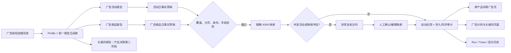

# 产品总览单产品详情广告数据 MCP 自动录入方案

**文档版本：** v1.2  
**日期：** 2026-09-09  
**作者：** Manus AI  
**状态：** P0 最小只读契约核验已完成；待确认 P1 实施范围。除本次受控采样外，未创建同步批次、定时任务、迁移或业务事实写入。

## 一、结论与目标

**可以实现自动录入。** 当前受治理领星 MCP 连接已启用；其只读能力目录已核验包含广告授权店铺、广告活动、广告商品、广告组、关键词、搜索词和投放报告。活动报告支持报告日期、广告 Profile、广告 ASIN、广告类型和分页条件；广告商品报告支持广告 Profile、报告日期、活动及 ASIN/SKU 搜索条件。这一能力组合足以建立“广告账户 → 广告活动 → 广告商品（ASIN）→ 父/子 ASIN 产品详情”的可审计数据链路。

当前单产品详情的广告概览存在两个结构性限制。首先，它在人工产品档案路由中仍依赖即时广告查询与缓存映射；其次，来源型统一产品详情已能显示 ASIN 日表现中的广告花费、广告销售额和 ACoS，却没有一条稳定、可追溯的广告活动/广告商品事实链。因此，本方案不建议把广告活动数据直接塞入 `ops_asin_daily_snapshots`，也不建议用广告活动名称模糊匹配作为自动写入依据。

> **核心原则：** ASIN 日表现是“商品日经营事实”；广告报告是“广告实体日事实”。两者可以在产品详情中联动展示，但不能混写、不能互相替代，也不能因同一天同一 ASIN 而互相判重。

本方案的目标是让运营人员在一个父 ASIN 的统一详情中，按“店铺 × 站点 × **完整自然周** × 子 ASIN”准确看到广告指标、关联活动、关键词和映射质量；广告源事实仍按报告日保存，但详情消费窗口必须与产品总览一致为周一至周日。**搜索词报告不进入产品详情，继续由独立广告搜索词分析模块消费。**正常数据自动入库，异常数据进入可编辑、可确认的复核队列。

| 目标 | 达成标准 |
| --- | --- |
| 自动性 | 广告事实在后台按固定时间运行，无需下载报表或保持浏览器打开。 |
| 准确性 | 产品汇总只累计已经由广告商品事实精确关联到目标 ASIN 的指标。 |
| 可解释性 | 页面同时展示报告日期、来源、更新时间、Profile、映射状态、批次和 Trace。 |
| 可控性 | 同源重复、分页截断、身份冲突、店铺覆盖不足和异常波动均停止自动应用。 |
| 人工决策 | 运营仅处理“共享活动、无 ASIN 映射、映射冲突、异常数据”等例外，不参与正常批次逐行审批。 |

## 二、现状与设计边界

当前来源型产品详情已经使用 `dataImport.getLingxingDailyVariants` 显示子 ASIN 的广告花费、广告销售额、ACoS 与日表现来源日期；但“广告概览（近 30 天）”只在人工产品档案路由中显示，并通过缓存、即时查询及活动名称回退匹配获取数据。现有 `ad_campaign_reports`、`ad_search_term_reports` 等表主要服务于人工上传报表，具有 `upload_id` 必填、按周起止日期存储以及广告活动名称为主的历史模型，不适合作为 MCP 自动同步的唯一事实落点。

因此，应保持三层分离：商品经营指标继续以 ASIN 日快照为权威来源；自动同步的广告实体事实进入独立 MCP 广告事实表；产品详情在读取层以严格映射规则把两类事实组合，而非在写入层相加或覆盖。

| 数据层 | 粒度与身份 | 现有/新增用途 | 禁止事项 |
| --- | --- | --- | --- |
| ASIN 日表现 | 工作空间 × 店铺 × 站点 × 子 ASIN × 报告日 | 销量、销售额、利润、Session、广告汇总指标；仍是产品总览周度聚合的广告原子指标来源。 | 不从活动报告反写或覆盖。 |
| MCP 广告活动日事实 | 工作空间 × 广告 Profile × 站点 × 报告日 × 广告类型 × Campaign ID | 活动级花费、销售、曝光、点击、订单、预算、状态和归因指标。 | 不按名称猜测产品归属。 |
| MCP 广告商品日事实 | 工作空间 × 广告 Profile × 站点 × 报告日 × 广告类型 × Campaign ID × 广告组/广告 ID × 广告 ASIN | 单产品详情的精确广告归因、活动—ASIN关系与共享活动识别。 | 不把一个共享活动完整金额复制给每个 ASIN。 |
| MCP 广告关键词事实 | 工作空间 × Profile × 报告日 × 广告实体 × 关键词 | 详情页后续关键词诊断与复盘。 | 不自动执行竞价、匹配方式或广告状态变更。 |
| MCP 广告搜索词事实 | 工作空间 × Profile × 报告日 × 广告实体 × 搜索词 | 独立广告搜索词分析、否词候选与复盘。 | **不进入产品详情**；不自动执行否词、预算、竞价或活动状态变更。 |
| 映射与复核 | 产品身份 × 广告实体 × 来源批次 | 自动精确映射、人工确认映射、失效与审计。 | 不以活动名称模糊匹配自动持久化。 |

### 2.1 P0 最小实样核验结果（已完成）

已对一个美国广告 Profile 和一个单一报告日执行最小范围只读采样：授权店铺目录 1 次、广告活动报告 1 页、广告商品报告 1 页。采样只用于字段和结构核验，不创建任何同步批次、不写入数据库、不读取关键词或搜索词明细。结果确认：**父 ASIN 不由广告报告直接返回，而是应由系统已有的 ASIN 日表现事实提供；广告商品报告返回的是可用于关联的子 ASIN 和 SKU。**

| 读取对象 | 已验证的真实字段/行为 | 对实施的影响 |
| --- | --- | --- |
| 广告授权店铺目录 | 返回 `profile_id`、`sid`、`store_id`、`country`、市场标识和店铺别名。 | 同步批次先持久化 `Profile → SID × 规范站点` 映射；`sid` 是对接现有 ASIN 日快照店铺键的依据。 |
| 广告活动报告 | 实体行包含 `campaign_id`、`profile_id`、`store_id`、`store_country`、`name`、`sponsored_type`、`state`、预算和活动级指标；同页还会返回 `campaign_id` 为空的总计行。 | 仅 `campaign_id` 非空的实体行可入活动事实表；总计行只可作为读取校验摘要，不能落为活动事实。 |
| 广告商品报告 | 实体行包含 `asin`、`sku`、`campaign_id`、`ad_group_id`、`ad_id`、`profile_id`、`store_id`、`store_country`、`sponsored_type`、活动/广告组状态与商品级指标；嵌套创意对象同时包含广告 SKU 与解析后的 ASIN。 | 这是产品详情 KPI 的权威关联源。以 `asin` 为主键，SKU 只作经验证的回退证据。 |
| 广告商品报告 | 同页同样出现所有实体维度为空的总计行；`recordsFiltered` 表示源端命中总量。 | 预览必须过滤全空总计行，并以源端总量、页数和已读实体行数验证分页完整性。 |
| 报告日与指标 | 报告日期由查询窗口表达，实体行中的更新时间不是报告日；部分非适用比率返回哨兵值 `99999999`。 | 事实的 `reportDate` 必须写入请求的单日窗口，禁止取 `updated_at`；哨兵值归一为“数据未提供”，不能写成真实指标或零。 |

### 2.2 已确认的父 ASIN 关联规则

广告报告的最小可归因对象是**广告商品中的子 ASIN**，而不是父 ASIN，也不是活动名称。父 ASIN 应从已确认的 `ops_asin_daily_snapshots` 中解析：该表已保存 `sourceStoreId`、`country`、`asin`、`sku` 和 `parentAsin`；当前产品详情查询也以 `parentAsin` 为入口，并再按店铺与规范站点过滤变体。

> **精确关联键：** `workspaceId × 广告Profile映射得到的SID × 规范站点 × 广告商品ASIN` → `ops_asin_daily_snapshots(sourceStoreId, country, asin)` → `parentAsin`。

| 优先级 | 关联步骤 | 自动化结果 |
| --- | --- | --- |
| 1 | 用广告授权店铺目录将 `profile_id` 解析为 `sid` 与规范站点。 | 缺少唯一 Profile 映射时，整行待复核。 |
| 2 | 用广告商品实体行的 `asin` 在同工作空间、同 `sid`、同规范站点中匹配 ASIN 日快照。 | 唯一命中后得到权威 `parentAsin`，可作为精确映射。 |
| 3 | 若广告商品 ASIN 缺失但 SKU 存在，则在同店铺、站点和产品有效期内匹配已验证的日快照 SKU。 | 仅唯一命中时可建立“精确 SKU 映射”；否则待复核。 |
| 4 | 若同一活动关联多个已映射子 ASIN，则活动显示为共享活动；产品 KPI 只取广告商品级的可归属事实。 | 禁止将活动级总花费或销售额复制给每个父/子 ASIN。 |
| 5 | 活动名、商品标题或组合名称相似但无 ASIN/SKU 证据。 | 只生成候选，不自动建立映射，也不计入 KPI。 |

## 三、方案选项

广告数据同步是确定性的读取、校验、映射和写入工作，且需要长期按日运行并可由运营人员调整范围与异常策略。以下两种路径均可落地；请选择其一作为实施基线。

| 方案 | 运行方式 | 优点 | 取舍 | 运行成本 | 配置复杂度 |
| --- | --- | --- | --- | --- | --- |
| **A. 正常数据自动应用 + 异常人工复核** | 每日后台读取前一报告日，完整性和映射校验通过即写入；异常才进入复核。 | 最符合现有 ASIN 日表现治理和“AI 是助手、人是决策者”原则；运营无需每日审批。 | 需要先建立严格身份键、批次审计、共享活动处理和异常面板。 | 低；以项目后台定时执行为主。 | 中等。 |
| **B. 每日生成广告草稿 + 人工一键应用** | 每日只生成待复核草稿，管理员确认后入库。 | 上线初期更保守，便于逐店验证字段与归因。 | 操作成本高，数据时效和完整性依赖人工；不适合店铺规模扩大后长期使用。 | 低。 | 低至中等。 |

如果选择 A，建议先采用“**首次 7 天只读预览 → 7 天受控自动应用试运行 → 正式自动应用**”的渐进上线方式。若选择 B，可复用相同数据模型和异常面板，后续无需迁移即可切换到 A。

## 四、推荐的数据流与执行流程

### 4.1 调度窗口与报告日期

建议广告同步在**北京时间每日 18:00**运行，读取**前一报告日**的数据。该日事实层用于在周末形成完整的广告周事实；产品详情不以日或“近30天”直接展示主KPI，而是与产品总览一样按周一至周日的自然周聚合。广告归因可能存在迟到或修订，因此另设一个轻量的“近 7 日对账窗口”：每日仅重新读取最近 7 个完整报告日中的广告数据，并对相同广告来源身份生成新修订版本或受控更新审计。

该策略的目的不是把历史数据反复相加，而是识别归因延迟。对同一来源身份发生指标变化时，系统必须记录“旧值摘要、最新值摘要、来源批次、原因类型和更新时间”；只有同一 MCP 广告来源的最新修订可以替换该身份的最新展示版本，人工上传报表和 ASIN 日表现均不得被覆盖。

| 执行阶段 | 时间与范围 | 自动动作 | 失败关闭条件 |
| --- | --- | --- | --- |
| 店铺目录刷新 | 每日 17:50 | 读取广告授权 Profile，核对店铺、站点和授权状态。 | 未识别的 Profile 不进入自动读取。 |
| 主同步 | 每日 18:00，报告日 D-1 | 读取活动与广告商品报告，建立草稿与来源哈希。 | 授权失败、分页截断、店铺覆盖不全、字段无效。 |
| 映射与应用 | 主同步完成后 | 精确 ASIN 映射通过的事实自动应用。 | 同源身份冲突、共享活动不可分配、ASIN/站点不一致、异常波动。 |
| 迟到归因复核 | 每日 18:30，D-7 至 D-1 | 仅对同源事实进行修订比对并留下差异审计。 | 超过变更阈值或来源覆盖不全时转人工复核。 |

### 4.2 精确映射规则

产品详情的广告数据必须首先通过广告商品报告中的**广告 ASIN 或 SKU**映射。父 ASIN 仅用于详情聚合，不是自动匹配活动的唯一键。系统先取产品详情当前店铺、规范站点和子 ASIN 集合，再在同一工作空间、同一广告 Profile、同一规范站点和各自报告日期内关联广告商品事实；最后仅对产品总览选定的周一至周日窗口聚合。

| 映射等级 | 规则 | 是否自动应用 | 页面展示 |
| --- | --- | --- | --- |
| 精确 ASIN | 广告商品 ASIN = 产品子 ASIN，且 Profile/站点一致。 | 是。 | “精确 ASIN 映射”。 |
| 精确 SKU | 广告商品 SKU 与已验证 SKU 对应，且 Profile/站点一致。 | 是，但需保存 SKU 证据。 | “精确 SKU 映射”。 |
| 已确认人工规则 | 管理员以父 ASIN × 店铺 × 站点 × 广告实体明确确认。 | 是。 | “人工确认映射”。 |
| 共享活动 | 一个活动关联多个广告 ASIN。 | 活动可展示；未经广告商品拆分时，不纳入单产品 KPI 合计。 | “共享活动，未分摊”。 |
| 名称模糊匹配 | 活动名包含 ASIN、SKU 或标题词。 | 否，仅生成候选。 | “待确认候选”。 |
| 无法映射 | 无 ASIN/SKU 或站点/Profile 证据。 | 否。 | “未映射，需复核”。 |

这样可以解决当前“活动名回退匹配”的误归因风险。尤其是一个活动覆盖多个子 ASIN 时，绝不能把活动的完整花费和销售额复制到每个子 ASIN；产品 KPI 只统计广告商品事实中的可归属指标，活动级事实用于展示活动状态、预算、策略和共享范围。

### 4.3 自动应用门槛与异常复核

正常批次应自动应用，以下条件任一不满足即保持“待复核”，不写入广告事实表，也不在产品详情中显示为正式数据。

| 校验域 | 通过条件 | 异常后的处理 |
| --- | --- | --- |
| Profile 覆盖 | 所有启用且在范围内的广告 Profile 都有成功窗口；零数据必须有来源明确返回。 | 记录缺失 Profile，整批待复核。 |
| 日期口径 | 返回日期严格等于 D-1 或明确的修订窗口日，不接受未知范围。 | 待复核，不把累计区间伪装为日数据。 |
| 分页完整性 | 页码、总数与上限一致，未触发最大页数/最大行数保护。 | 待复核，禁止部分写入。 |
| 事实身份 | 同一来源身份在批内唯一；同源既有事实仅走明确修订，不跨来源误判。 | 同源冲突待复核。 |
| 关键字段 | Profile、Campaign ID、广告类型、日期、站点和至少一个业务指标有效。 | 单行隔离并在批次中可解释。 |
| 映射质量 | 自动写入产品维度的行必须精确 ASIN/SKU 或已确认规则。 | 未映射或共享行进入映射队列。 |
| 异常波动 | 与近 7 日基线相比出现极端变化，且非预算/状态变化可解释。 | 显示差异摘要，等待人工确认。 |

## 五、建议的数据结构与审计模型

为避免破坏人工上传广告报表，建议新增 MCP 专用事实与映射表，而不是给现有上传表硬塞空 `upload_id`。所有字段均需有工作空间隔离、来源批次、来源行哈希、报告日期范围、创建时间和修订关系。

| 建议实体 | 关键身份键 | 主要字段 | 用途 |
| --- | --- | --- | --- |
| `ops_ad_mcp_campaign_daily_facts` | workspace × profile × site × reportDate × adType × campaignId | 活动名、状态、预算、曝光、点击、花费、销售额、订单、ACoS、ROAS、原始行哈希、批次 ID。 | 活动清单与活动级趋势。 |
| `ops_ad_mcp_product_daily_facts` | workspace × profile × site × reportDate × adType × campaignId × adGroupId × adId × advertisedAsin | 广告 ASIN/SKU、商品级花费、销售、订单、流量、映射状态、原始行哈希。 | 单产品详情精确汇总与共享活动识别。 |
| `ops_ad_product_mapping_rules` | workspace × parentAsin × store/Profile × site × mappingSubject | 映射来源、证据类型、状态、创建者、失效时间、审计信息。 | 管理员处理候选与例外。 |
| `ops_ad_mcp_sync_batches` 或现有同步批次扩展 | workspace × dataDomain × reportRange × runKey | 覆盖、分页、行数、异常摘要、应用状态、Run/Trace、导入审计关联。 | 同步历史和可恢复执行。 |
| `ops_ad_mcp_fact_revisions` | factIdentity × revision | 旧/新指标摘要、来源批次、差异原因、应用状态。 | 处理广告归因迟到，避免无审计覆盖。 |

建议将 `sourceKind` 固定为 `lingxing_mcp_advertising`，将数据域细分为 `campaign_daily`、`product_daily`、`keyword_daily` 和 `search_term_daily`。所有产品详情组件都应显示**数据源、报告日、最后同步时间、映射等级和批次状态**，避免将 MCP 同步数据误标为“ERP 上传”。

## 六、单产品详情的交互设计

统一来源型产品详情需要新增一个独立的“广告数据”区域，而不是继续只在人工产品档案中保留广告概览。该区域应随父 ASIN、店铺、站点和**产品总览选定自然周**上下文查询，默认显示最近一个完整自然周；允许切换总览已提供的完整周和具体子 ASIN，但不提供与总览不一致的7/14/30天滚动窗口作为主KPI。

| 区块 | 展示内容 | 用户交互 | 数据口径 |
| --- | --- | --- | --- |
| 数据状态条 | 数据源、**自然周范围**、周完整性、最后成功同步、Profile 覆盖、批次状态、Trace 入口。 | 查看同步批次与异常摘要；不在详情页直接触发外部读取。 | MCP 广告同步审计。 |
| KPI 卡片 | 选定自然周的广告花费、广告销售额、广告订单、ACoS、ROAS、CTR、CPC、CVR。 | 仅切换完整自然周和子 ASIN。 | 仅精确映射广告商品日事实的周度聚合。 |
| 活动表 | Campaign ID、活动名、类型、状态、预算、**周花费**、**周销售额**、周订单、周ACoS、映射范围。 | 查看活动详情；共享/待确认活动跳转映射复核。 | 活动日事实按同一周聚合，不直接作为多 ASIN 产品 KPI 相加。 |
| 广告商品表 | 子 ASIN、SKU、活动、广告组、**周度指标**、映射等级。 | 过滤“精确/共享/待确认”。 | 广告商品日事实按同一周聚合。 |
| 关键词诊断（后续可选） | 关键词、匹配方式、花费、销售、ACoS、转化。 | 仅在关键词数据域上线后开放；可创建建议草稿。 | 关键词日事实。 |
| 异常与人工确认 | 未映射、共享活动、缺失 Profile、截断、异常波动、修订差异。 | 管理员编辑或确认映射；确认后仅影响关联关系，不改写原始事实。 | 审计化规则与批次异常。 |

页面中的“刷新”仅重新请求已入库数据，不应直接触发领星 MCP。手动同步必须进入已有的领星同步任务页，展示范围、影响、预计行数和确认边界，确保操作习惯与 ASIN 日表现、库存和父 ASIN 周报一致。

## 七、分阶段实施计划

| 阶段 | 范围 | 产出 | 验收条件 |
| --- | --- | --- | --- |
| P0：契约核验 | 已只读获取授权 Profile、单日报告活动/商品实样，核对字段、总计行、分页元数据、日期语义和ASIN/SKU关联能力。 | 已确认字段映射、总计行过滤、`Profile → SID → 子ASIN → 父ASIN`规则与哨兵值策略。 | 已完成；无同步批次、无业务写入。 |
| P1：基础事实与同步 | 新增 MCP 广告批次、活动日事实、广告商品日事实、Run/Trace、导入审计和回归测试。 | 可预览、可确认、可应用的广告同步最小闭环。 | 精确 ASIN 映射能入库；共享/无映射行不可自动计入 KPI。 |
| P2：详情联动 | 来源型单产品详情新增广告数据区、状态条、KPI、活动表和映射异常入口。 | 单产品完整广告视图。 | 与现有 ASIN 日表现广告指标并列展示但不重复累计。 |
| P3：自动化治理 | 配置每日 D-1 同步、D-7 修订复核、异常队列、通知及调度编辑界面。 | 无异常自动应用，异常人工复核。 | 覆盖、分页、重复、映射、修订和权限回归全部通过。 |
| P4：关键词与投放扩展 | 增加关键词、投放和广告组事实；对接既有关键词页面。 | 广告诊断与产品详情可联动。 | 关键词和投放可追溯至广告活动与产品 ASIN；不自动执行广告写操作。搜索词继续在独立搜索词分析模块建设。 |

每个阶段都应完成后端契约测试、前端交互测试、定向静态检查、生产构建、受控发布、服务健康检查和认证页面验收。数据库变更仅在 P1 进行，并采用“Schema 先行 → 单次迁移 → 只读验证”的顺序；不迁移时不应通过临时字段或 JSON 绕过事实模型。

## 八、需确认的产品决策

以下选择会影响自动化范围，但不影响本方案的安全边界。

| 决策 | 可选项 | 建议的默认值 |
| --- | --- | --- |
| 初始广告类型 | 仅 SP；SP + SD；SP + SB + SD。 | 先 SP + SD，Schema 保持兼容 SB。 |
| 自动应用策略 | A：正常自动、异常复核；B：每天人工一键应用。 | 请选择 A 或 B。 |
| 修订窗口 | 仅 D-1；每日 D-7 至 D-1 重算；更长窗口。 | D-7 至 D-1，仅同源修订且留痕。 |
| 历史数据 | 不回填；回填近 30 天；回填指定日期。 | 首次先不回填，P0 验证通过后由您明确指定范围。 |
| 共享活动 | 只展示不分摊；按广告商品事实精确归属；制定人工分摊规则。 | 只展示；有广告商品事实才进入产品 KPI。 |
| 人工上传广告报表 | 保留为独立参考来源；与 MCP 优先级合并；完全停用。 | 保留独立参考来源，不与 MCP 自动相加。 |

## 九、明确不做的事项

本方案不会通过 MCP 自动修改预算、竞价、关键词、否词、投放状态、广告活动结构或任何账户配置。即使后续要支持“建议否词/建议调价”，也只能生成结构化建议草稿、证据和预期影响，由用户编辑并显式确认后再进入单独的高风险执行流程。

同样，不会将“数据缺失”填为零，不会使用名称模糊匹配自动归属，不会将共享活动金额重复算给多个 ASIN，也不会用活动级指标覆盖 ASIN 日表现中的商品经营广告指标。

## 十、建议的下一步

请确认上表中的两个关键选择：**自动应用策略（A 或 B）** 与 **初始广告类型范围（仅 SP，或 SP + SD）**。P0 已完成；确认后，我将以已核验的精确关联规则进入 P1 设计与实施准备。届时才会创建独立事实表和同步预览能力；在您确认 P1 数据模型与迁移草案前，不创建表、不新增定时任务。

## 方案依据

| 依据 | 已核验的结论 |
| --- | --- |
| 当前受治理领星 MCP 广告能力目录与 Schema | 已确认存在广告授权店铺、活动、广告商品、关键词、搜索词和投放类**只读**能力；本方案不使用任何广告写能力。 |
| `client/src/pages/ops/OpsProductDetail.tsx` | 来源型详情已有 ASIN 日表现广告指标与关键词入口，但广告概览仍主要绑定人工产品档案路由。 |
| `server/domains/ops/routers/marketplaceSummaries.ts` | 当前广告摘要依赖缓存、即时查询和活动名称回退匹配，需替换为已入库的精确广告商品映射。 |
| `drizzle/schema/ads.ts` | 现有活动/搜索词表服务于人工上传，`upload_id`为必填，适合保留为参考来源，不适宜直接伪装为 MCP 自动事实。 |
