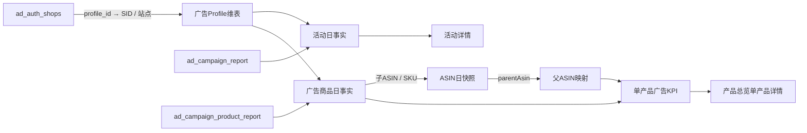

# 产品详情广告 MCP：报告级映射与数据契约

**版本：** v1.1  
**日期：** 2026-09-10  
**状态：** **可进入 P1 设计评审**。已基于最小只读实样确认活动与广告商品报告的真实字段；本文不创建表、不发起同步、不修改业务数据。

## 1. 设计结论

单产品详情中的广告数据应以 **广告商品报告**（`ad_campaign_product_report`）作为产品维度的权威明细来源，以 **广告活动报告**（`ad_campaign_report`）补足活动状态、预算和活动级信息，并通过 **广告授权店铺目录**（`ad_auth_shops`）把广告 Profile 精确关联至系统已有的店铺 SID 与站点。广告源事实保持日粒度保存，但产品详情只按与产品总览完全一致的**完整自然周**消费和展示。

父 ASIN **不由广告报告直接提供，也不从活动名称推断**。父子关系应由现有 ASIN 日表现事实中的 `parentAsin` 回溯获得。具体地说，广告商品的子 ASIN 在同一工作空间、同一 SID、同一规范站点下匹配已确认的 ASIN 日快照，得到该子 ASIN 在报告日对应的父 ASIN。

> **禁止双重累计：** `ops_asin_daily_snapshots` 中的广告指标是商品经营日表现；广告商品报告是广告实体归因明细。两者在详情页并列展示、可做差异解释，但绝不能相加为同一个 KPI。

> **统一周度合同：** 产品总览与产品详情共享同一 `parentAsin × SID × 规范站点 × weekStart` 上下文；`weekStart` 必须是周一，`weekEnd` 固定为该周周日。详情页不得以“近 7 天”“近 30 天”或浏览器本地日期替代总览选中的完整自然周。



## 2. 报告分工总表

| MCP 报告 | 数据粒度 | 是否可直接关联父ASIN | P1/P2 角色 | 主要用途 | 自动写入前置条件 |
| --- | --- | --- | --- | --- | --- |
| `ad_auth_shops` | 广告账户 / 店铺 Profile | 否 | **P1 必需** | 解析 `Profile → SID × 站点`。 | Profile、SID、站点唯一且有效。 |
| `ad_campaign_product_report` | 广告商品 / ASIN / 广告组 / 广告活动 / 日 | **是，先关联子ASIN后回溯父ASIN** | **P1 产品详情主事实** | 子ASIN广告花费、销售、订单、流量及活动关系。 | ASIN、Campaign、广告ID、Profile、站点和报告日完整。 |
| `ad_campaign_report` | 广告活动 / 日 | 否 | **P1 辅助事实** | 活动预算、状态、策略、活动级花费及销售。 | Campaign ID、Profile、站点、报告日完整。 |
| `ad_campaign_group_report` | 广告组 / 日 | 间接 | P2 | 展示广告组与活动下钻。 | 需通过 Campaign ID + Ad Group ID 关联。 |
| `ad_campaign_keyword_report` | 关键词 / 匹配方式 / 广告组或活动 / 日 | 间接 | P2 | 关键词效果和建议草稿。 | 需有活动/广告组实体键，不能只按名称关联。 |
| `ad_campaign_search_term_report` | 搜索词 / 广告对象 / 日 | 间接 | 独立广告分析模块 | 搜索词归因与否词候选。 | 不进入产品详情；需有活动或广告组实体键；只生成建议。 |
| `ad_campaign_targeting_report` | 自动投放或商品投放目标 / 日 | 间接 | P2 | ASIN/类目投放诊断。 | 需有投放实体ID或稳定自然键。 |
| `ad_portfolio_report_shop` | 组合 / 店铺 / 日期范围 | 否 | P3 可选 | 店铺或组合层预算与广告经营概览。 | 仅作店铺/组合视图，不能分摊到产品。 |

## 3. 已核验报告的精确字段映射

### 3.1 `ad_auth_shops` → 广告 Profile 目录

该报告没有业务指标，是所有广告报告与产品事实联接的基础维度。它返回广告 Profile、领星店铺 SID、站点和店铺标识；其中 `sid` 与现有 ASIN 日表现同步使用的店铺身份一致，因此不能使用店铺名称作为主关联键。

**建议目标表：** `ops_ad_mcp_profiles`

**建议唯一键：** `workspaceId × profileId`。同一 Profile 在一个工作空间内只能对应一个有效 SID × 规范站点；发现多对一或一对多时，停止自动应用并进入复核。

| 源字段 | 目标字段 | 转换规则 | 必填 | 说明 |
| --- | --- | --- | --- | --- |
| `profile_id` | `profileId` | 字符串化，保留全量精度。 | 是 | 广告账户身份，禁止转普通 JS 数字后再存储。 |
| `sid` | `lingxingSid` | 字符串化。 | 是 | 与 ASIN 日快照 `sourceStoreId` 对接的店铺证据。 |
| `store_id` | `lingxingStoreId` | 字符串化。 | 是 | 辅助校验字段，不作为产品关联主键。 |
| `country` | `marketplace` | 规范化为系统站点代码，例如 `US`。 | 是 | 与日快照的 `country` 使用同一站点规范化函数。 |
| `marketplace_string_id` | `marketplaceId` | 原样保存。 | 否 | 审计和跨系统排错使用。 |
| `alias` | `storeAlias` | 仅作展示。 | 否 | 不参与唯一键或自动匹配。 |
| `type` | `accountType` | 原样保存。 | 否 | seller/vendor 等账户类型。 |

**Profile 维度校验：**

1. `profile_id`、`sid`、`country` 不得为空。
2. 同一 `profile_id` 在单次目录读取中必须只对应一个 `sid × country`。
3. 同一 `sid × country` 可以存在多个 Profile，但必须明确记录，以免把不同广告账户混为一体。
4. 店铺别名改名不影响历史事实；事实永远保存 Profile、SID 和站点，而非只保存名称。

### 3.2 `ad_campaign_report` → 广告活动日事实

活动报告用于显示活动配置和活动级状态，但不作为父ASIN广告 KPI 的直接归因来源。原因是一个活动可能投放多个广告商品；将活动总花费复制给每一个 ASIN 会导致严重重复累计。

**建议目标表：** `ops_ad_mcp_campaign_daily_facts`

**建议唯一键：** `workspaceId × profileId × marketplace × reportDate × sponsoredType × campaignId`。

| 源字段 | 目标字段 | 转换规则 | 说明 |
| --- | --- | --- | --- |
| 查询窗口 `report_date` | `reportDate` | 请求必须为单日 `D - D`；写入 D。 | 不使用 `updated_at` 充当报告日。 |
| `profile_id` | `profileId` | 字符串化；须与 Profile 目录一致。 | 账户边界。 |
| `store_id` | `lingxingStoreId` | 字符串化。 | 与 Profile 目录交叉校验。 |
| `store_country` | `marketplace` | 规范化。 | 与 Profile 目录交叉校验。 |
| `campaign_id` | `campaignId` | 字符串化。 | **必填；空值即总计行或无效行。** |
| `name` | `campaignName` | 原样保存。 | 仅展示，不能作为身份键。 |
| `sponsored_type` | `sponsoredType` | 大写规范化为 `SP` / `SB` / `SD`。 | 事实粒度组成部分。 |
| `state` / `service_status` / `serving_status` | `campaignState` / `serviceStatus` | 分别存储，不互相覆盖。 | 页面展示“配置状态”和“投放状态”。 |
| `portfolio_id` / `portfolio_name` | `portfolioId` / `portfolioName` | 原样保存。 | 广告组合上下文。 |
| `budget` / `daily_budget` | `budget` / `dailyBudget` | Decimal，空值保持空。 | 预算不是业绩指标。 |
| `impressions` / `clicks` | `impressions` / `clicks` | 整数化；非负。 | 基础流量。 |
| `spends` / `sales` | `spend` / `sales` | Decimal。 | 仅活动级展示。 |
| `orders` / `ad_units` | `orders` / `adUnits` | 整数化；非负。 | 订单与销量分开。 |
| `acos` / `roas` / `ctr` / `cpc` / `cvr` | 对应派生/来源字段 | 建议保存来源值并按分子分母重算展示值。 | 不以格式化字符串作为计算依据。 |
| `direct_*` / `indirect_*` | 直接/间接归因字段 | 分列保存。 | 允许间接数据缺失。 |
| `entity_level_hash` | `sourceRowHash` | 原样保存；如缺失则对规范原始行计算 SHA-256。 | 修订识别与审计。 |

**活动报告行过滤：** `campaign_id`、`profile_id`、`store_country`、`sponsored_type` 等实体字段同时为空的行是源端总计行，不进入事实表。它可用于与已读实体行的总额做批次级对账，但不能作为活动或产品事实写入。

### 3.3 `ad_campaign_product_report` → 广告商品日事实

该报告是**父ASIN详情广告 KPI 的主数据源**。实样已确认其实体行同时提供 `asin`、`sku`、`campaign_id`、`ad_group_id`、`ad_id`、`profile_id`、`store_id`、`store_country` 和商品级广告指标；嵌套 `creative` 中还提供广告 SKU 与解析后的广告 ASIN，可作为一致性校验。

**建议目标表：** `ops_ad_mcp_product_daily_facts`

**建议唯一键：** `workspaceId × profileId × marketplace × reportDate × sponsoredType × campaignId × adGroupId × adId × advertisedAsin`。

| 源字段 | 目标字段 | 转换规则 | 父ASIN归属作用 |
| --- | --- | --- | --- |
| 查询窗口 `report_date` | `reportDate` | 单日窗口的日期 D。 | 决定父子映射的生效日。 |
| `profile_id` | `profileId` | 字符串化。 | 先从目录解析 SID。 |
| `store_id` / `store_country` | `lingxingStoreId` / `marketplace` | 保留并与 Profile 目录交叉校验。 | 防止跨店铺、跨站点错配。 |
| `sponsored_type` | `sponsoredType` | `SP` / `SB` / `SD` 规范化。 | 唯一键组成部分。 |
| `campaign_id` | `campaignId` | 字符串化，必填。 | 关联活动日事实。 |
| `campaign_name` | `campaignName` | 原样保存。 | 仅展示。 |
| `ad_group_id` / `ad_group_name` | `adGroupId` / `adGroupName` | 字符串化 / 原样保存。 | 活动下钻。 |
| `ad_id` | `adId` | 字符串化，必填。 | 广告商品实体身份。 |
| `asin` | `advertisedAsin` | 大写并校验 Amazon ASIN 格式。 | **父ASIN映射主键。** |
| `sku` | `advertisedSku` | 原样保存。 | ASIN 缺失时的唯一回退证据。 |
| `creative.productCreative.productCreativeSettings.advertisedProduct.productId` | `creativeSku` | 原样保存。 | 与 `sku` 一致性核验。 |
| `creative...resolvedProductId` | `creativeResolvedAsin` | 大写。 | 与 `asin` 一致性核验。 |
| `state` / `campaign_state` / `ad_group_state` / `serving_status` | 对应状态字段 | 分列保存。 | UI 显示广告、广告组和活动状态。 |
| `impressions` / `clicks` / `spends` / `sales` / `orders` / `ad_units` | 对应基础指标 | 严格数值归一。 | 产品 KPI 汇总分子。 |
| `direct_*` / `indirect_*` | 对应归因指标 | 分列保存。 | 详情可解释归因构成。 |
| `acos` / `roas` / `ctr` / `cpc` / `cvr` | 对应比率字段 | 存来源值，展示时优先按汇总分子分母重算。 | 不跨事实源累计。 |
| `listing_price` / `afn_fulfillable_quantity` | 观测字段 | 仅保存为来源观测，不替代库存与商品价格权威数据。 | 不参与父ASIN映射或库存规划。 |
| `entity_level_hash` | `sourceRowHash` | 原样保留或兜底哈希。 | 同源修订与去重。 |

**广告商品行过滤：** 只要 `asin`、`campaign_id`、`ad_id`、`profile_id` 中任一为空，均不能作为自动应用的实体事实。实样中存在所有实体键为空、但指标为总额的总计行；该行必须被识别为 `aggregate_row` 并从行级事实排除。

## 4. 子ASIN到父ASIN的确定性映射

### 4.1 关联链路

```text
ad_auth_shops.profile_id
  → profile_map.lingxing_sid + profile_map.marketplace
  → ad_campaign_product_report.asin
  → ops_asin_daily_snapshots
       WHERE workspaceId = 当前工作空间
         AND sourceStoreId = lingxing_sid
         AND normalize(country) = profile_map.marketplace
         AND asin = advertisedAsin
  → parentAsin
```

### 4.2 关联时态规则

父子变体关系可能变化，不能简单地拿“今日最新父ASIN”回填所有历史广告记录。广告商品事实写入时必须保存所使用的父ASIN映射证据及其有效日期。

| 优先级 | 证据 | 规则 | 结果 |
| --- | --- | --- | --- |
| 1 | 同报告日的 ASIN 日快照 | 同工作空间、SID、规范站点、子ASIN唯一命中。 | `exact_asin_same_day`，自动应用。 |
| 2 | 报告日前最近有效快照 | 仅在同一店铺/站点/子ASIN下，选 `reportDate` 当日或之前最近一条具有 `parentAsin` 的日快照；默认回溯窗口 90 天。 | `exact_asin_prior_evidence`，自动应用并记录证据日期。 |
| 3 | 唯一 SKU 证据 | 仅当子ASIN缺失，且 SKU 在同一店铺/站点/有效期内唯一匹配。 | `exact_sku`，自动应用并记录 SKU 证据。 |
| 4 | 人工映射规则 | 超级管理员明确确认父ASIN × SID × 站点 × 广告实体/ASIN。 | `manual_confirmed`，自动应用并留审计。 |
| 5 | 名称或标题相似 | 活动名、广告组名、组合名或商品标题相似。 | `candidate_name_only`，绝不自动应用。 |
| 6 | 无唯一证据 | 无 ASIN、映射多父ASIN、跨店/跨站冲突或超出有效期。 | `unmapped`，进入复核。 |

### 4.3 父ASIN详情 KPI 汇总规则

父ASIN详情的广告 KPI 只汇总状态为 `exact_asin_same_day`、`exact_asin_prior_evidence`、`exact_sku` 或 `manual_confirmed` 的广告商品事实；按产品总览当前选择的**周一至周日完整自然周**、店铺和站点对其**子ASIN级日事实**求和。日事实的父ASIN归属以各自报告日保存的映射证据为准，避免后续变体关系变化篡改历史周归属。

| 指标 | 汇总规则 | 禁止行为 |
| --- | --- | --- |
| 花费、销售额、订单、广告销量、曝光、点击 | 对精确归属广告商品行求和。 | 不将活动级全额再次加入。 |
| ACoS、ROAS、CTR、CPC、CVR | 使用汇总后的分子/分母重新计算。 | 不平均行级百分比。 |
| 活动数 | 以 `campaignId` 去重计数。 | 不把同一共享活动按子ASIN重复计数为多个活动。 |
| 共享活动 | 活动可显示“关联 N 个子ASIN”，但 KPI 只取广告商品实体行。 | 不将活动总额均分或复制给所有商品。 |
| ASIN 日表现广告指标 | 作为“商品经营广告汇总”独立卡片展示。 | 不与广告商品事实相加。 |

### 4.4 产品总览—产品详情的周度上下文合同

| 规则 | 产品总览 | 单产品详情广告区 | 禁止事项 |
| --- | --- | --- | --- |
| 周边界 | `weekStart` 为周一，`weekEnd = weekStart + 6 天`（周日）。 | 复用总览传入的同一 `weekStart`，服务端推导同一 `weekEnd`。 | 客户端自行计算滚动7天或按浏览器时区切周。 |
| 默认周 | 最近一个已完成自然周。 | 打开父ASIN详情时承接总览当前周；没有上下文时同样默认最近完整周。 | 默认“近30天”或当周部分数据。 |
| 当周数据 | 未形成完整周事实时可作为“进行中/待复核”单独标记。 | 不作为正式周度KPI与总览对比；可在后续日趋势区单独查看。 | 将周一至今天伪装为完整周。 |
| 周度指标 | 父ASIN、店铺、站点维度的周汇总。 | 同父ASIN、同店铺、同站点、同周范围汇总广告商品日事实。 | 跨店铺、跨站点、跨周相加。 |
| 比率 | 汇总原子指标后重算。 | 以同一周内商品事实分子/分母重算。 | 平均每日或平均行级ACoS、ROAS、CTR、CPC、CVR。 |
| 数据状态 | 显示权威来源、周范围与完整性。 | 显示相同周范围，外加广告Profile覆盖与映射状态。 | 只显示同步时间，不显示业务周范围。 |

## 5. 数值、日期与源端特殊行处理

| 规则类型 | 规则 | 处理方式 |
| --- | --- | --- |
| 报告日期 | 广告活动/商品实体行不保证包含业务日期字段。 | 原始事实强制单日读取；`reportDate` 写请求窗口 D，不取 `updated_at` 或 `creation_date`。详情消费时仅聚合选定自然周的 7 个日事实。 |
| 总计行 | 源端返回空 Campaign/广告组/广告/ASIN 等实体字段但包含汇总指标。 | `rowKind=aggregate`，仅进批次摘要，不进事实表、不参与映射。 |
| 业务实体行 | Campaign、Profile、广告类型、广告ID、广告ASIN均完整。 | `rowKind=entity`，才可进入标准化与映射。 |
| 非适用哨兵 | `99999999`、`--`、空字符串、非有限数值。 | 归一为 `null` 与 `not_provided` 原因；不写为 0。 |
| 数字字符串 | 金额和比例可能以字符串返回。 | Decimal/整数安全解析；保留原始值摘要用于审计。 |
| 百分比 | 来源可能是百分数字符串，例如 `18.92` 表示 18.92%。 | 存统一小数或百分数时必须注明单位；展示按统一格式。 |
| 迟到归因 | 同一广告实体、同一报告日后续数值变化。 | 仅同源身份生成修订版本，写差异审计；不累计两版。 |

## 6. 数据质量门禁与异常复核

| 门禁 | 判定 | 自动应用动作 | 异常动作 |
| --- | --- | --- | --- |
| Profile 映射 | Profile 在目录中唯一映射为 SID × 站点。 | 进入下一步。 | 批次/行待复核。 |
| 分页完整性 | 已读实体行与源端总数、页数上限和返回窗口一致。 | 进入下一步。 | 阻断部分写入。 |
| 总计行分离 | 总计行已识别且未混入实体行。 | 可处理实体行。 | 阻断并记录源端形态变化。 |
| 实体身份 | Campaign、Profile、广告类型、广告ID、广告ASIN完整。 | 可生成事实身份。 | 行隔离并复核。 |
| ASIN一致性 | `asin` 与创意中解析ASIN一致，或创意缺失但 `asin` 合法。 | 可做父ASIN映射。 | 行待复核。 |
| 父ASIN映射 | 按 SID × 站点 × 子ASIN 唯一命中。 | 可纳入父ASIN KPI。 | 仅在“未映射/共享候选”区显示。 |
| 同源修订 | 同一事实键的新哈希与旧哈希不同。 | 创建修订审计后更新当前版本。 | 异常阈值超限则待复核。 |
| 周度完整性 | 选定周内每个纳入范围的 Profile × 报告日均有成功读取、无分页截断；零实体行必须由源端成功响应证实。 | 允许形成“完整周”广告视图。 | 任一窗口失败或截断时，周视图保持待复核/部分数据，不作为正式周KPI。 |
| 指标异常 | 非负约束、非有限值、日环比异常和来源覆盖不足。 | 正常应用。 | 失败关闭，生成复核摘要。 |

## 7. 单产品详情的读取合同

### 7.1 后端查询输入

```ts
type ProductAdWeeklyDetailInput = {
  parentAsin: string;
  storeSid?: string;
  marketplace?: string;
  childAsin?: string;
  weekStart: string; // 必须是周一；weekEnd由服务端推导为周日
  includeMappingStatuses?: Array<
    "exact_asin_same_day" | "exact_asin_prior_evidence" |
    "exact_sku" | "manual_confirmed" | "unmapped" | "candidate_name_only"
  >;
};
```

默认只读取精确映射和人工确认映射，并严格限制在 `weekStart` 至 `weekStart + 6 天`；必须返回业务周范围、周完整性、数据来源、最新报告日、Profile 覆盖、映射状态分布、批次 ID 和 Trace 引用。未映射行默认不计入 KPI，但可在“映射异常”折叠区域查看。

### 7.2 返回视图

| 视图 | 来源 | 包含范围 | 不包含范围 |
| --- | --- | --- | --- |
| 广告商品周度 KPI | `ops_ad_mcp_product_daily_facts` | 选定完整周内精确/人工确认映射的子ASIN实体行。 | 总计行、名称候选、未映射行、活动级重复金额。 |
| 周度活动列表 | `ops_ad_mcp_campaign_daily_facts` + 商品映射统计 | 同一周内相关活动、状态、预算、关联子ASIN数及周度指标。 | 用活动全额直接算父ASIN KPI。 |
| 周度经营广告汇总 | `ops_asin_daily_snapshots` | 同一自然周内已确认的日表现广告原子指标。 | MCP 广告商品明细金额的再累计。 |
| 关键词周度诊断（后续可选） | MCP 广告关键词事实 | 同一自然周、同父ASIN关联活动/广告组下的关键词事实。 | 搜索词报告、自动否词或广告平台写操作。 |
| 映射复核 | 映射规则与批次异常 | 无ASIN、SKU冲突、共享活动、名称候选、覆盖缺失。 | 直接修改源端广告数据。 |

## 8. 建议的实施顺序

| 阶段 | 实现范围 | 关键验收 |
| --- | --- | --- |
| P1.1 | 新增 Profile 目录、活动日事实、广告商品日事实、批次与修订审计模型。 | 迁移前后表结构一致；不触碰人工上传表。 |
| P1.2 | 实现按单日、单Profile、串行读取的“预览→确认→应用”流程。 | QPS=1；全空总计行被过滤；分页截断阻断写入。 |
| P1.3 | 实现 `Profile → SID → 子ASIN → 父ASIN` 映射与异常队列。 | 跨店/跨站不匹配；名称匹配不可自动应用。 |
| P1.4 | 在统一产品详情新增**周度**广告商品 KPI、周度活动清单、周范围/完整性状态条与映射异常入口。 | 与产品总览使用同一父ASIN×店铺×站点×周一至周日窗口；与 ASIN 日表现广告汇总并列、不双算。 |
| P1.5 | 首先对 SP 实施 7 天只读预览，再由用户选择自动应用或人工一键应用。 | 真实批次覆盖、异常、Trace 和页面联动可验收。 |
| P2 | 增加 SD、广告组、关键词和投放报告的详情诊断；搜索词继续建设于独立广告搜索词分析模块。 | 每类报告先执行 Schema + 最小实样核验，再扩展字段映射；搜索词不得出现在产品详情。 |

## 9. 实施前需要您确认的选择

| 决策 | 选项 | 建议 |
| --- | --- | --- |
| 首期广告类型 | 仅 SP；SP + SD。 | **先仅 SP**。本次实样已验证 SP 的完整实体键；SD 先执行独立 P0 采样后接入。 |
| 应用策略 | A：完整批次自动应用、异常人工复核；B：每日人工一键应用。 | **A**，并先运行 7 天只读预览。 |
| 首批历史范围 | 不回填；上一完整自然周；指定完整自然周。 | 不回填；先对**上一完整自然周**完成7个日窗口的只读预览。 |
| 共享活动处理 | 只展示；按商品明细精确归属；人工分摊。 | 按商品明细精确归属；无商品明细则仅展示、不分摊。 |

## 10. 不可突破的边界

本方案只读取广告报告，不自动写入广告平台的预算、竞价、关键词、否词、投放状态或活动结构。任何后续“优化建议”只能生成结构化草稿、证据与预期影响，必须由用户编辑确认后才可能进入独立的高风险执行流程。

本方案也不会把未映射数据填零，不会以名称匹配覆盖 ASIN/SKU 证据，不会将活动总额复制给多个子ASIN，更不会把广告商品报告与 ASIN 日表现广告指标相加。

## 方案依据

| 依据 | 已核验内容 |
| --- | --- |
| 当前受治理领星 MCP 最小只读样本 | 已读取授权店铺目录、单日报告活动样本和广告商品样本；确认 Profile/SID/站点、活动实体键、广告商品ASIN/SKU、总计行形态、数值字符串与哨兵值。 |
| `drizzle/schema/ops.ts` | `ops_asin_daily_snapshots` 已保存 `sourceStoreId`、`country`、`asin`、`sku` 与 `parentAsin`。 |
| `server/routers/dataImport.ts` | 统一详情按 `parentAsin` 读取子ASIN日事实，并按店铺/站点上下文过滤。 |
| `server/routers/lingxingSync.ts` | 日表现同步以领星店铺 SID 作为 `storeId/sourceStoreId`，适合与广告授权目录中的 SID 形成确定性联接。 |
