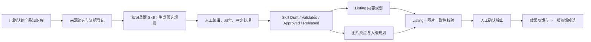
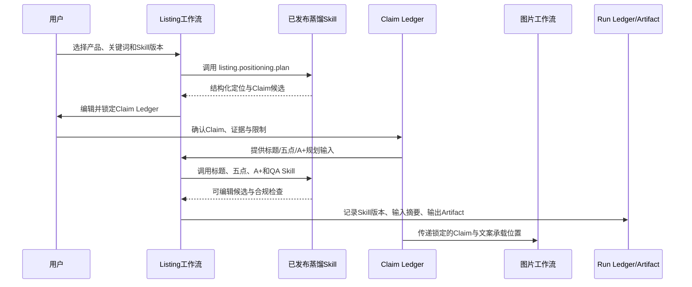
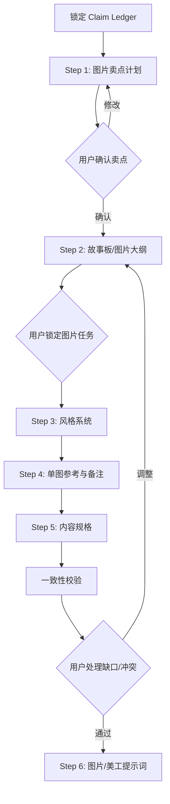

# 产品知识库蒸馏为 Listing 与图片协同 Skill 方案

## 1. 目标与问题边界

当前产品知识库已经分别沉淀了产品创意、Listing 文案、图片集、运营 SOP 和视频知识；其中，Listing 文案保存标题、五点、A+、问答及人工编辑结果，图片库保存图片位置、卖点分类、A+ 模块、构图、风格和人工确认的分析。它们的价值主要仍停留在“可以检索的参考材料”，尚未形成能够稳定约束后续 Listing 与图片工作流的可复用能力。

本方案不采用模型微调，也不将任意知识库文本直接拼接到生成提示词。它采用**知识蒸馏（Knowledge Distillation）**：将人工确认的高质量知识转化为一组有证据、有适用条件、有版本、有审批和可回滚的皇帝 Skill 规则。AI 的职责是提出候选规则和执行建议；人负责选择知识来源、编辑规则、批准发布和确认每次生成的最终内容。

> 蒸馏 Skill 不是“把历史文案重新写一遍”。它是把可复用的方法、约束、结构和视觉叙事关系提炼为机器可执行、人工可审查的规则包。

| 不做的事情 | 原因 |
|---|---|
| 不把皇帝记忆混入蒸馏来源 | 皇帝记忆属于运行上下文，不是产品知识资产，且权限、时效和用途不同。 |
| 不自动吸收草稿、低分内容或未确认分析 | 未经审核的内容会把错误事实、过度承诺或风格噪声放大。 |
| 不让 Skill 直接覆盖 Listing、图片大纲或已锁定模块 | 与“AI 是助手、人是决策者”相冲突，也会破坏已有审核记录。 |
| 不把图片 URL、原文全文或下载链接写进 Skill 提示词 | Skill 应存规则和受控引用，不复制附件，也不传播存储访问路径。 |

## 2. 建议的总体架构：知识资产 → Skill 草案 → 受控工作流



皇帝中台已经具备 Skill Manifest、版本号、状态、运行记录、Run Ledger、Artifact 版本和人工审批能力。因此，建议**复用现有 `emperor_skills`、`emperor_skill_runs`、Artifact 与治理流程**，而不是另建一套不可追溯的“提示词库”。新增的数据只应描述蒸馏来源、规则证据、审核决策和发布关联。

| 层级 | 作用 | 主要产物 | 人工控制点 |
|---|---|---|---|
| 知识资产层 | 选择可相信的案例 | 经过筛选的知识条目与附件摘要 | 选择、排除、标记适用类目 |
| 证据层 | 将每条可复用结论绑定来源 | Evidence Card、内容哈希、可信等级 | 确认事实、删除过度结论 |
| 蒸馏层 | 生成结构化规则候选 | Skill Draft JSON | 编辑、合并、拒绝规则 |
| 发布层 | 受治理地发布能力 | `Draft → Validated → Approved → Released` | 超级管理员发布、回滚 |
| 消费层 | 在 Listing 与图片工作流中提出建议 | 内容规划、图片故事板、一致性报告 | 选择建议、锁定、确认最终稿 |
| 反馈层 | 为下一版提供信号 | 有用/无关/错误、人工改写差异 | 人工评分和解释 |

## 3. 来源准入与可信度规则

### 3.1 首批来源

首批蒸馏只使用当前工作空间内**已确认且已共享**的产品知识资产。Listing、图片和 SOP 均可作为来源，但用途不同：Listing 用于文案结构和表达策略，图片集用于视觉叙事和模块编排，SOP 用于流程或合规约束。产品创意和视频可在第二阶段接入，因为它们当前需要更明确的事实与授权边界。

| 知识模块 | 可蒸馏内容 | 必须满足的条件 | 不进入 Skill 的内容 |
|---|---|---|---|
| Listing 文案 | 标题结构、五点顺序、A+ 叙事、QA 组织、已编辑分析 | `confirmed` 或 `approved`，且为团队/公开可共享 | 原始抓取噪声、未经确认的 AI 分析、原始竞品全文 |
| 图片知识库 | 主图/副图/A+/品牌故事位置、卖点类型、构图、风格、模块类型、人工确认的分析 | 图片集已确认；子图标签或分析已确认 | 仅图片 URL、未确认标签、不可导出的外部附件 |
| 产品创意 | 人群、场景、差异化假设、已确认的产品事实 | 已确认且事实可回溯 | 评分推断、无来源参数、竞品敏感信息 |
| 运营 SOP | 平台约束、审核清单、合规禁忌 | 已确认、对目标角色开放 | 与 Listing/图片无关的流程步骤 |
| 视频知识库 | 演示节奏、视觉证明方式、卖点呈现顺序 | 已确认、视频/关键帧具备可访问证据 | 外部视频链接本身、未确认转录文本 |

### 3.2 Evidence Card（证据卡）

每一条蒸馏规则都必须引用至少一张证据卡。证据卡保存知识条目类型、记录 ID、内容哈希、人工确认状态、适用类目、证据片段摘要和引用原因；不复制原始全文，也不保存签名链接。若来源被归档、撤回共享或内容哈希改变，关联 Skill 自动标记为“来源需复核”，不再默认用于新生成。

```json
{
  "evidenceId": "evd_...",
  "source": {"module": "images", "recordId": 31, "contentHash": "sha256:..."},
  "trust": "human_confirmed",
  "scope": {"category": ["Water Heater Parts"], "marketplace": ["US"]},
  "excerpt": "A+ 对比模块先建立痛点，再给出兼容性边界。",
  "reason": "支撑 A+ 模块的叙事顺序规则"
}
```

## 4. Skill 体系：一个协同核心 + 三个可独立发布的 Skill

不建议用一个巨型提示词同时生成标题、五点、A+、七张图片和品牌故事。该方式不可审查、难以定位问题，并会复现“图片建议与 A+ 大纲不一致”的历史风险。建议采用一个协同核心和三个职责单一的 Skill；它们共享同一份“卖点—证据—视觉承载”计划。

| Skill | 首要职责 | 输入 | 结构化输出 | 风险等级 |
|---|---|---|---|---|
| `listing.positioning.distill` | 从已确认知识提出定位与表达规则草案 | 证据卡、类目、人群、站点 | 规则候选、适用边界、反例、证据引用 | L1 |
| `listing.copy.plan` | 将已发布规则用于标题、五点、A+ 的内容规划 | 产品事实、关键词、选定 Skill 版本 | `claimLedger`、五点角色、A+ 章节、禁用主张 | L1 |
| `image.storyboard.plan` | 将已锁定卖点映射为主图/副图/A+/品牌故事的视觉任务 | `claimLedger`、图片 Skill、素材约束 | 图片编号、承载卖点、场景、模块、构图、文案限制 | L1 |
| `listing.image.coherence.check` | 检查文案、A+ 和图片大纲是否相互支持且不重复 | 已编辑的 Listing 计划和图片大纲 | 覆盖矩阵、冲突、缺口、可选修复建议 | L1 |

其中，`listing.positioning.distill` 是“从知识库到 Skill”的生产能力；其余三个是“Skill 在实际 Listing 与图片工作流中的消费能力”。所有 Skill 通过皇帝中台调用，保留 Skill 版本、Prompt Hash、Manifest Hash、Run ID、输入摘要和结构化输出。任何需要访问外部内容的动作仍必须走 Tool Gateway；蒸馏本身默认不调用外部工具。

## 5. Skill Manifest 与版本发布模型

### 5.1 版本状态

| 状态 | 可执行性 | 允许操作 | 不允许操作 |
|---|---|---|---|
| `Draft` | 不可用于真实生成 | 生成候选、编辑、删除来源 | 自动影响 Listing 或图片工作流 |
| `Validated` | 仅沙盒或对比运行 | 结构校验、来源有效性校验、样本试跑 | 设为默认 Skill |
| `Approved` | 可由人工显式选择试用 | 小范围受控生成、收集反馈 | 自动发布到全部工作流 |
| `Released` | 可供工作流选择 | 版本固定、记录消费、随时回滚 | 覆盖用户锁定内容 |
| `Deprecated` | 不再用于新运行 | 保留历史 Run 可追溯 | 删除历史证据或运行记录 |

发布采用“新版本替换默认版本”的方式，不修改旧版本。回滚只将上一个已发布版本设为默认；历史 Listing、图片大纲和运行记录继续指向当时实际使用的版本。这样能解释“为什么这个五点和图片大纲是这样生成的”。

### 5.2 建议的新增实体

| 实体 | 核心字段 | 说明 |
|---|---|---|
| `knowledge_distillation_projects` | 工作空间、名称、目标类目、站点、状态、创建人 | 一个蒸馏任务的容器，例如“美国站热水器配件文案与图片协同”。 |
| `knowledge_distillation_sources` | 项目、知识模块、源记录、内容哈希、准入状态、选择人 | 指向已有知识，不复制知识正文。 |
| `knowledge_distillation_evidence` | 来源、摘要、适用范围、可信等级、规则引用 | 用于让每条规则可解释、可失效。 |
| `knowledge_skill_drafts` | 草案 Manifest、规则 JSON、评估结果、父版本、状态 | 草案编辑与审批的独立记录。 |
| `knowledge_skill_review_events` | 草案/版本、动作、操作人、原因、前后摘要 | 记录采纳、拒绝、发布、回滚。 |
| `knowledge_skill_feedback` | Skill 版本、消费 Run、评分、人工改写类型、备注 | 只作为下一版候选输入，不自动改写已发布 Skill。 |

现有 `emperor_skills` 承担已发布 Skill 的权威 Manifest 与版本；`ai_artifacts` 承担大尺寸结构化输出和版本化产物；`ai_artifact_consumptions` 记录哪个 Listing 或图片工作流使用了哪个版本。新增表只补足“知识来源—规则—审核”的血缘关系。

## 6. Listing—图片协同的数据契约

### 6.1 统一的 Claim Ledger（主张账本）

Listing 和图片不能各自从知识库自由生成。两条链路必须共享一份经用户确认的 `claimLedger`。每个卖点/主张具有稳定 ID、事实证据、适用条件、文案承载位置和图片承载位置。它是协同的唯一事实源。

```json
{
  "claimId": "CLM-03",
  "type": "functional_benefit",
  "claim": "减少安装后的维护步骤",
  "evidence": ["product_spec:anode_material", "evd_..."],
  "conditions": ["仅适用于兼容型号"],
  "listing": {"bullet": 2, "aPlusSection": "AP-02"},
  "image": {"assetKey": "secondary-03", "imagePosition": "secondary", "aplusModule": null},
  "status": "human_confirmed"
}
```

图片工作流的 Step 1 卖点梳理将读取 `claimLedger`，Step 2 图片大纲只从已确认的 Claim 中选择视觉承载内容。A+ 模块与品牌故事必须使用连续编号并显式引用 `claimId`；如果某个 A+ 模块没有可支撑的主张，系统只显示“缺少承载证据”，不能生成空模块或用虚构内容补齐。

### 6.2 一致性校验矩阵

`listing.image.coherence.check` 不生成最终文案，而是输出一张可编辑矩阵。用户可确认、忽略或重新分配每个建议。

| 检查维度 | 通过条件 | 发现问题时的建议 |
|---|---|---|
| 卖点覆盖 | 每个核心 Claim 至少由一个 Listing 区块或一张图片承载 | 建议补到未占用的副图或 A+ 模块 |
| 证据一致性 | Listing 与图片引用同一事实或同一条件 | 标示冲突，禁止自动合并 |
| 视觉分工 | 图片承担“展示/证明”，文案承担“解释/限制” | 降低重复，不删除用户原文 |
| A+ 编号完整性 | A+ 1–7 连续，品牌故事独立计数 | 标记空模块、重复模块和错位索引 |
| 合规边界 | 没有无证据比较、绝对化承诺或不适用人群声明 | 输出需人工确认的风险项 |

## 7. 提示词与结构化输出规范

### 7.1 蒸馏 Skill 的系统提示词骨架

```text
你是亚马逊美国站的“知识蒸馏编辑”，不是自由创作文案工具。

只根据输入中标记为 human_confirmed 或 approved 的证据卡提出可复用规则。
不得把单一案例的品牌、价格、评分、销量、外部链接或未经验证的效果写成通用事实。
每条规则必须包含：适用条件、正向指导、禁止事项、至少一个 evidenceId、置信度和人工复核问题。
当证据彼此冲突、只适用于单一ASIN，或无法证明可泛化时，输出 rejected_candidate，不得编造补充结论。
输出严格符合 JSON Schema；不要输出 Markdown、解释性前言或未定义字段。
```

### 7.2 蒸馏输出 Schema（摘要）

```json
{
  "skillIntent": {"category": "", "marketplace": "US", "workflow": "listing_image"},
  "rules": [{
    "ruleId": "R-001",
    "domain": "bullet_structure | aplus_story | image_storyboard | visual_style | compliance",
    "instruction": "",
    "applicability": {"categories": [], "productConditions": []},
    "avoid": [],
    "evidenceIds": [],
    "confidence": "high | medium | low",
    "reviewQuestion": ""
  }],
  "claimMappings": [{"claimType": "", "preferredListingRole": "", "preferredImageRole": ""}],
  "rejectedCandidates": [{"reason": "", "evidenceIds": []}],
  "qualityChecks": []
}
```

实际调用必须使用严格 JSON Schema、`additionalProperties: false` 和服务端结构校验。蒸馏模型建议先使用成本受控的结构化模型进行候选抽取，再对用户选择的少量候选用高能力模型做规则合并与冲突审查；不能把整库内容一次性提交给模型。

## 8. 用户交互方案

### 8.1 新页面：知识库 → Skill 蒸馏

页面采用三栏工作台，避免把复杂审核压缩成一次“生成 Skill”按钮。

| 区域 | 内容 | 可操作项 |
|---|---|---|
| 左栏：知识来源 | 已确认的 Listing、图片集、SOP、产品创意筛选器 | 按类目、标签、评分、确认时间选择或排除来源 |
| 中栏：蒸馏草案 | 规则、适用条件、证据卡、冲突和低置信候选 | 编辑、合并、拒绝、要求重新生成、添加人工规则 |
| 右栏：工作流影响预览 | 五点角色、A+ 模块、图片故事板和一致性矩阵 | 勾选将哪些规则发布给 Listing、图片或两者 |

发布前显示“来源数量、规则数量、低置信规则、没有证据的规则、将影响的工作流”，并要求超级管理员填写简短发布说明。默认只生成 `Draft`，不会自动发布。

### 8.2 Listing 与图片工作流中的消费入口

在 Listing 创建/精雕开始前，用户选择“使用哪个已发布 Skill 版本”，默认仅展示与类目和美国站匹配的版本。生成后首先展示**内容规划**，而不是直接覆盖五点；用户可以锁定/修改 `claimLedger` 后再进入五点精雕和图片 Step 1。

图片流程读取锁定的 `claimLedger`。若用户在图片流程中改变卖点、A+ 模块或品牌故事安排，系统提示“此处与 Listing 计划存在差异”，并生成差异清单，要求用户选择同步回 Listing、仅保留图片侧修改，或忽略。系统不自动回写另一条流程。

## 9. 规则优先级、冲突与权限

所有生成都遵循以下优先级，低层规则不能覆盖高层已确认内容：

1. 亚马逊政策和系统安全/合规硬约束；
2. 当前产品的已验证事实、兼容性和用户锁定内容；
3. 当前用户在本次任务中显式编辑/确认的 `claimLedger` 与大纲；
4. 已发布、适用范围匹配的 Skill 版本；
5. 已确认知识库中的通用规则；
6. AI 的本次候选建议。

| 角色 | 来源选择 | 编辑草案 | 发布/回滚 | 使用已发布 Skill | 查看运行与来源 |
|---|---|---|---|---|---|
| 超级管理员 | 是 | 是 | 是 | 是 | 全部工作空间范围 |
| 管理员 | 按工作空间授权 | 是 | 提交发布申请 | 是 | 有权限的运行 |
| 运营/产品/美工 | 按知识权限 | 仅创建个人草案或建议 | 否 | 是，且必须人工确认输出 | 与自身任务相关 |

每次发布、回滚、来源撤销、规则手动编辑和运行消费都写入安全审计与 Run Ledger。对共享 Skill，导出与发布均仅限超级管理员；普通用户看不到无权限的发布/导出入口。

## 10. 分阶段实施建议

### 阶段 P0：知识蒸馏草案与人工审核

先实现来源选择、Evidence Card、蒸馏候选和人工编辑，不接入真实 Listing/图片生成。首批试点限定为一个美国站类目、10–30 条已确认 Listing/图片集、一个协同目标。验收重点是“每条规则都能追溯来源，用户可以逐条删除或改写”。

### 阶段 P1：发布到皇帝 Skill 与 Listing 内容规划

将人工批准草案转换为皇帝 Skill Manifest，接入 Listing 的标题/五点/A+**规划阶段**。输出 `claimLedger` 和文案结构建议，保留用户锁定和精雕流程，不直接改写正式文案。验收重点是 Skill 版本、Run ID、来源哈希和人工编辑都可回查。

### 阶段 P2：接入图片 Step 1–2 与一致性矩阵

让图片卖点和大纲读取已锁定 `claimLedger`，再增加 Listing—图片一致性校验。验收重点是 A+ 1–7 连续、品牌故事独立、每个模块有证据，不再出现空 A+ 模块或无对应卖点的图片建议。

### 阶段 P3：反馈驱动的下一版 Skill

收集“采纳/修改/忽略/错误”的人工反馈，并只为下一版生成候选改进。验收重点是反馈不自动修改已发布 Skill；回滚旧版本后，历史任务仍能精确复现使用版本。

## 11. 首批试点与验收标准

建议首批试点为：**一个美国站细分类目，以已确认 Listing 文案、图片集和运营 SOP 为来源，先蒸馏“卖点顺序—A+叙事—图片承载”协同 Skill**。这条路径最能直接解决文案与图片脱节，同时不会一开始引入视频、竞品抓取或全库自动学习的不确定性。

| 验收项 | 通过标准 |
|---|---|
| 来源可信 | 100% 被采纳的规则至少有一条已确认来源证据；未确认草稿为 0。 |
| 人工可控 | 用户可逐条编辑、拒绝、合并规则，且未发布草案不会改变任何工作流。 |
| 版本可追溯 | 每次运行记录 Skill 版本、Manifest Hash、规则引用和来源内容哈希。 |
| Listing—图片一致 | 每个核心 Claim 的文案与图片承载关系可见；冲突不会自动覆盖。 |
| 回滚安全 | 新版本停用或回滚不会改变已确认的 Listing、图片大纲和历史 Run。 |
| 质量门禁 | 空 A+ 模块、断号、无证据主张、部分匹配的组合负责人式结论均被阻断或列为人工复核。 |

## 12. 需要确认的实施决策

建议按 P0 → P1 → P2 依次实施。开始 P0 前，需要确认以下三点：

1. 首个试点类目与约 10–30 个已确认来源；
2. 首批发布权限是否坚持“超级管理员发布、其他角色可提交草案”；
3. P1 是否先限定为“生成五点/A+内容规划”，暂不直接进入现有逐条精雕生成。

在这三点确认前，不应改动任何现有 Listing 或图片 Skill 的运行时提示词、默认版本或已锁定工作流数据。

## 13. 固定 Skill 分类法：五维标签 + 组合式规则包

### 13.1 设计原则

建议将每个蒸馏 Skill 固定标记为 **“领域 / 描述方式 / 表达方向 / 产品类目 / 风格”** 五个一级维度，再以站点、受众、适用条件和证据等级作二级约束。这比按单个产品或单条提示词建 Skill 更稳定，也避免形成“一个类目 × 一个风格 × 一个卖点就一个 Skill”的组合爆炸。

Skill 不应把 Listing 风格和图片风格合并为同一个枚举。二者可以共同服务同一品牌定位，但文案的“表达风格”与图片的“视觉风格”是不同的专业对象，必须分别选择、分别审核。两者只通过 `claimLedger` 和“表达方向”关联。

```text
Skill Profile = 领域 × 描述方式 × 表达方向 × 产品类目 × 风格
              + 站点/语言 + 目标人群 + 产品条件 + 证据引用
```

| 一级维度 | 固定编码字段 | 作用 | 是否由用户选择 |
|---|---|---|---|
| 领域 | `domain` | `listing`、`image`、`cross_flow` | 是 |
| 描述方式 | `descriptionMode` | 决定如何陈述卖点和证据 | 是，默认由蒸馏建议 |
| 表达方向 | `expressionDirection` | 决定内容承担的营销任务 | 是 |
| 产品类目 | `productCategory` | 复用现有18类产品分类并允许细分类目 | 是 |
| 风格 | `copyStyle` 或 `visualStyle` | 文案语气与视觉语言分别选择 | 是 |
| 二级约束 | `marketplace`、`audience`、`productConditions`、`evidenceGrade` | 防止规则跨站点、跨人群或跨产品误用 | 系统校验 + 人工确认 |

### 13.2 固定描述方式（`descriptionMode`）

描述方式回答的是：**同一个卖点以什么逻辑被说明**。它是 Listing 与图片共享的语义层，不等同于最终写作句式或画面布局。

| 编码 | 中文名称 | 适合解决的问题 | Listing 的主要承载 | 图片的主要承载 |
|---|---|---|---|---|
| `fact_spec` | 事实/规格说明 | 尺寸、材质、兼容性、数量、可验证参数 | 标题中后段、五点、参数表 | 尺寸图、参数图、爆炸图、标注图 |
| `feature_benefit` | 功能—收益 | 产品有什么功能，以及买家得到什么结果 | 五点主体、A+图文 | 功能演示、局部提亮、前后结果 |
| `problem_solution` | 痛点—解决 | 买家痛点、麻烦或风险与解决方法 | 五点开头、A+场景模块、QA | 场景对比、问题可视化、使用前后 |
| `proof_trust` | 证据—信任 | 认证、质保、材质证明、适配边界 | 五点、A+信任区、QA | 证书/质保、材质细节、兼容性清单 |
| `comparison` | 对比—差异化 | 有事实依据的结构、功能或适配差异 | 五点/A+对比表，禁止无依据绝对化 | 对比图、细节对比、参数对比 |
| `scenario_outcome` | 场景—结果 | 谁在什么场景下如何使用 | 五点、A+生活方式内容 | 单/多场景图、使用动作图 |
| `how_to` | 步骤—操作 | 安装、清洁、维护、收纳等操作路径 | 五点、QA、说明区 | 步骤图、使用说明、热点交互 |
| `brand_value` | 品牌—价值观 | 品牌承诺、服务定位和系列叙事 | A+首图、品牌故事 | 品牌故事卡、A+首图、Logo/服务图 |

在默认配置中，一个核心 Claim 只选择一种**主描述方式**，可以有一种辅助方式。例如“兼容性”应以 `fact_spec` 为主、`proof_trust` 为辅；不要同时用“场景、对比、痛点、质保”堆叠到同一个五点或一张图片中。

### 13.3 固定表达方向（`expressionDirection`）

表达方向回答的是：**这一内容在买家决策路径中承担什么任务**。同一描述方式可以投向不同方向。例如“材质”既可以用于技术证明，也可以用于耐久性差异化。

| 编码 | 表达方向 | Listing 优先位置 | 图片优先位置 | 协同要求 |
|---|---|---|---|---|
| `discoverability` | 搜索发现/关键词定位 | 标题、Search Term、五点首句 | 不强制承载 | 图片不能为堆词而塞入无关文字 |
| `value_proposition` | 核心价值主张 | 标题价值层、五点1 | 主图外的首张副图/首个A+模块 | 文案和图片必须指向同一核心 Claim |
| `functional_proof` | 功能证明 | 五点2–3、A+图文 | 细节、特效、功能演示 | 图展示“如何”，文案说明“为什么/何时适用” |
| `painpoint_relief` | 痛点缓解 | 五点、QA、A+场景 | 场景、前后对比 | 不得将未经证实的痛点说成普遍事实 |
| `fit_compatibility` | 适配与边界 | 五点、参数区、QA | 尺寸、兼容性、全家福 | 必须绑定产品条件与适配证据 |
| `ease_of_use` | 易用/安装/维护 | 五点、QA | 步骤图、使用说明、局部动作 | 步骤数量与图片顺序必须一致 |
| `differentiation` | 差异化/对比 | 五点、A+对比模块 | 对比、细节、参数对比 | 比较对象、指标、证据必须明确 |
| `trust_conversion` | 信任/转化消疑 | 五点末位、A+、QA | 质保、认证、品牌故事 | 不能把不完整证据包装成认证或承诺 |
| `brand_narrative` | 品牌叙事 | A+、品牌故事 | A+首图、品牌故事卡 | 与产品卖点分层，品牌故事不占用A+ 1–7编号 |

### 13.4 产品类目（`productCategory`）与细分类目（`subCategory`）

一级产品类目直接复用当前图片系统已定义的18类：家居、餐厨、庭院花园、房车户外、泳池、玩具、个护、大小家电、3C数码、五金工具、家电配件、母婴（儿童）、老人、运动健身、宠物、工业品、农业品和实验室品。Skill 只能在已选择的一级类目与细分类目中匹配，不应以“关键词相似”跨类目自动套用。

`subCategory` 采用受控文本加审核方式，例如 `家电配件 / 热水器阳极棒`，而不是让模型随意生成标签。首批试点可先从 5–10 个常用细分类目开始，每个类目必须有明确的产品条件、禁用主张、视觉禁忌和至少两条人工确认的证据来源。

### 13.5 风格分离：文案风格与视觉风格

#### Listing 文案风格（`copyStyle`）

| 编码 | 风格 | 典型用途 | 禁止事项 |
|---|---|---|---|
| `technical_precise` | 技术精确 | 五金、家电配件、工业品、参数型产品 | 情绪化夸张、无证据性能承诺 |
| `practical_direct` | 实用直接 | 日常家居、消耗品、安装维护类 | 冗长故事化表达、空泛高级感 |
| `warm_reassuring` | 温和安心 | 母婴、老人、家庭护理 | 擅自医疗化、安全绝对化 |
| `premium_refined` | 高端精炼 | 设计、家居、礼品、高客单价产品 | 虚构材质等级、过度奢华承诺 |
| `energetic_motivating` | 活力激励 | 运动、户外、玩具 | 不可证实的成绩/效果承诺 |
| `authority_trust` | 专业可信 | 工具、工业、实验室及高风险兼容性产品 | 假借认证、专家或权威背书 |

文案风格影响句长、词汇、论证顺序和语气，但不覆盖 Listing 的既有关键词放置规则、五点字符限制、事实校验或用户锁定文本。

#### 图片视觉风格（`visualStyle`）

视觉风格直接复用图片知识库现有的16种套图风格和结构化参数，包括大厂工业极简风、现代都市风、大胆图形风、美式复古风、北欧原木风、温馨家居风、INS生活风、轻奢高级风、运动活力风、健康生活风、户外探险风、庭院休闲风、亲和童趣风、工业硬核风、赛博科技风和田园自然风。每一种风格已经有光线、色温、材质、色调、禁忌和 AI 关键词参数，因此不应在蒸馏层重新发明一套视觉词表。

图片蒸馏 Skill 只输出视觉任务和可选风格约束，例如 `visualStyle = 工业硬核风`、`composition = 模块化构图`、`imageType = 细节/多细节`。最终的参考图、构图备注和美工上传素材仍由图片 Step 4/5 的人工锁定版本控制。

## 14. Listing 与图片分别应该蒸馏什么

### 14.1 Listing：蒸馏“决策语言”，而不是历史文案句子

Listing Skill 的重点是抽取可复用的**表达结构和证据门槛**。例如，不是记住某句“Premium X for Y”，而是学习“对于家电配件的兼容性卖点，先给兼容范围，再给安装条件，最后给排除边界，并要求引用规格证据”。

| Listing 蒸馏对象 | 应固化的规则 | 应保留给当前任务的数据 |
|---|---|---|
| 标题 | 关键词角色、价值层顺序、品牌/规格/用途的位置规则 | 当前ASIN的词、品牌、尺寸和字符数 |
| 五点 | 五点角色顺序、FABE表达方式、每点一个核心 Claim、证据门槛 | 当前产品事实、用户锁定卖点、关键词和长度限制 |
| A+ | 从痛点到证明再到信任的叙事顺序、模块适配条件 | 当前产品图文、实际品牌故事和模块选择 |
| QA | 高频异议类型、兼容性/安装/维护的回答结构 | 当前产品的具体答案和任何承诺 |
| 合规 | 绝对化词、无证据比较、认证和医疗化禁区 | 当次审核意见和平台政策变化 |

推荐的 Listing Skill Profile 示例：

```json
{
  "domain": "listing",
  "descriptionMode": "fact_spec",
  "expressionDirection": "fit_compatibility",
  "productCategory": "家电配件",
  "subCategory": "热水器配件",
  "copyStyle": "technical_precise",
  "marketplace": "US",
  "appliesTo": ["bullet", "aplus", "qa"]
}
```

### 14.2 图片：蒸馏“视觉证明与信息编排”，而不是复制参考图

图片 Skill 的重点是从已确认图片集抽取“哪个卖点应该由哪类视觉来证明、什么风格与构图适用、什么信息不能塞进主图”。它不复制参考图的元素、品牌、文案或素材。

| 图片蒸馏对象 | 应固化的规则 | 应保留给当前任务的数据 |
|---|---|---|
| 主图 | 产品识别、纯背景、套装边界、禁止信息 | 实物外观、套装内容和主图合规审核 |
| 副图 | 卖点到图片类型的映射、信息密度和构图 | 本产品的 Claim、素材和备注 |
| A+ 图片 | 模块类型、叙事顺序、文字/图片分工 | A+模块选择、实际文案和素材 |
| 品牌故事 | 品牌叙事与产品论证的分层规则 | 真实品牌资产和品牌许可内容 |
| 风格 | 光线、色温、材质、配色、禁忌、构图 | 当前品牌偏好、参考图锁定版本 |

推荐的图片 Skill Profile 示例：

```json
{
  "domain": "image",
  "descriptionMode": "proof_trust",
  "expressionDirection": "functional_proof",
  "productCategory": "家电配件",
  "subCategory": "热水器配件",
  "visualStyle": "大厂工业极简风",
  "imageBelong": "套图",
  "imageType": "细节/多细节",
  "marketplace": "US"
}
```

## 15. 两条工作流的协同机制

协同的固定顺序应该是：**产品事实与关键词 → Claim Ledger → Listing 内容规划 → 图片大纲 → 一致性检查 → 人工锁定**。不要反过来让图片风格决定产品承诺，也不要让 Listing 文案临时改动覆盖已锁定的图片大纲。

| 阶段 | Listing 输出 | 图片输入/输出 | 用户决策 |
|---|---|---|---|
| 1. 卖点建模 | 5个核心 Claim、证据、关键词角色、风险边界 | 读取同一 Claim 列表 | 锁定或调整核心 Claim |
| 2. 内容规划 | 标题、五点、A+ 各自承载的 Claim | 将 Claim 分配到主图/副图/A+/品牌故事 | 选择哪些 Claim 需要视觉证明 |
| 3. 视觉规划 | 不改变 Claim，只提供文本限制 | 图片类型、场景、构图、风格、备注、A+ 模块 | 锁定 Step 2/4 的单图或模块版本 |
| 4. 一致性检查 | 检查未覆盖或重复 Claim | 检查空模块、错号、无证据图片任务 | 选择修复在哪一侧发生 |
| 5. 最终生成 | 以锁定文案计划进入五点精雕 | 以锁定图片任务进入图片建议/提示词 | 确认最终稿，不自动跨流程覆盖 |

建议将当前图片系统的 `imagePosition`（主图/副图/A+/品牌故事）、`tagImageTypeMain`、`tagSellingPointCategory`、`aplusModuleType`、`tagComposition` 和 `setStyle` 直接映射到图片 Skill Profile；将 Listing 的标题、五点、A+、QA、关键词词根和锁定步骤映射到 Listing Skill Profile。两者都引用同一个 `claimId`，而不是靠 ASIN 或自然语言相似度去猜关联。

## 16. 可执行的首批固定模板

为降低首批落地复杂度，建议不是开放所有组合，而是先提供下列六个固定模板；用户只能在模板内选择类目、风格和证据来源。

| 模板编码 | 模板名称 | 适用领域 | 描述方式 / 方向 | 推荐类目与风格 |
|---|---|---|---|---|
| `L-01` | 规格兼容型五点 | Listing | `fact_spec` / `fit_compatibility` | 家电配件、五金工具、工业品；技术精确 |
| `L-02` | 痛点解决型五点 | Listing | `problem_solution` / `painpoint_relief` | 家居、餐厨、个护；实用直接或温和安心 |
| `L-03` | 信任转化型 A+ | Listing | `proof_trust` / `trust_conversion` | 高客单、工具、母婴；专业可信或高端精炼 |
| `I-01` | 规格与适配证明套图 | Image | `fact_spec` / `fit_compatibility` | 家电配件、五金、工业；工业极简或工业硬核 |
| `I-02` | 场景化收益套图 | Image | `scenario_outcome` / `value_proposition` | 家居、庭院、运动、宠物；相应生活方式风格 |
| `X-01` | Listing—图片一致性校验 | Cross-flow | 全部 / 覆盖、冲突、重复检查 | 所有类目；不生成最终内容 |

首批仅需从 `L-01 + I-01 + X-01` 开始，尤其适合家电配件、五金工具和工业品。这套组合会先解决“兼容性、规格、安装、功能证明”的一致性问题，风险最低；场景/品牌故事/高情绪化风格可在验证后再开放。

## 17. 建议进入皇帝中台的蒸馏 Skill 清单

下表中的内容不是立即创建的一组“自动执行 Skill”，而是**知识蒸馏完成后可被批准发布的 Skill 类型目录**。每一个实际 Skill 都带有五维 Profile、来源 Evidence Card、固定 JSON 合同和版本；例如 `listing.bullet.fabe.tech-us.v1` 是一个具体版本，而不是泛化的无边界提示词。

### 17.1 A 组：知识蒸馏工厂 Skill

这组只生成候选、证据和评估结果，不改写 Listing、图片大纲或最终资产。它们应先以 `Draft` 状态运行。

| 建议 Slug | 主要蒸馏对象 | 固定分类重点 | 输出 | 发布前人工动作 |
|---|---|---|---|---|
| `knowledge.evidence.curate` | Listing、图片集、SOP、产品创意中的可用来源 | 类目、站点、确认状态、证据等级 | 来源准入清单、排除原因、Evidence Card 候选 | 选择来源、删除不可信片段 |
| `listing.structure.distill` | 标题、五点、A+、QA 中已确认的表达方法 | 描述方式、表达方向、`copyStyle` | 文案结构规则、禁用模式、适用条件 | 编辑每条规则，确认不可泛化案例被排除 |
| `image.visual-system.distill` | 图片集、单图标签、人工分析、参考图备注 | 图片类型、视觉风格、构图、图片归属 | 视觉证明规则、风格参数、图片分工规则 | 确认参考图仅作为方法证据而非素材复用 |
| `listing.image.pattern.distill` | 同一产品/类目的文案与图片成功组合 | Claim、叙事顺序、A+模块、品牌故事 | 文案—图片承载模式、覆盖规则、反例 | 确认关联由人工认可，而非ASIN相似度推断 |
| `knowledge.rule.conflict.review` | 同方向或同类目下相互冲突的候选规则 | 适用条件、证据强度、站点 | 冲突组、推荐保留/拆分/拒绝动作 | 对冲突做最终取舍，不允许模型自行覆盖旧规则 |
| `knowledge.skill.evaluation` | 已发布 Skill 与人工改写/反馈 | Skill 版本、类目、描述方式、方向 | 质量门禁结果、下一版本候选，不直接改动当前版本 | 确认反馈是否足以进入下一版蒸馏 |

### 17.2 B 组：Listing 工作流消费 Skill

这组将已发布的蒸馏规则用于**内容规划与候选生成**。所有输出先进入现有可编辑数据结构，再由用户确认；不直接覆盖 `listings`、`sellingPointDrafts` 或已锁定步骤。

| 建议 Slug | 对应工作流节点 | 读取的 Skill Profile | 固定输入 | 固定输出 | 自动写入边界 |
|---|---|---|---|---|---|
| `listing.positioning.plan` | Listing 开始前的定位规划 | 类目 + 方向 + 文案风格 | 产品事实、关键词、证据引用、用户目标 | 定位陈述、目标人群、核心 Claim 候选、风险边界 | 只创建规划 Artifact |
| `listing.title.structure.plan` | 标题/Item Highlights | 搜索发现 + 核心价值 + 文案风格 | 锁定 Claim、关键词分层、标题限制 | 标题槽位结构、关键词位置、候选标题 | 只生成候选，不替换现有标题 |
| `listing.bullet.fabe.plan` | 五点 Step 1 与逐条精雕前 | 功能收益/痛点解决/适配边界 | 锁定 Claim、证据、关键词、已确认五点角色 | 五点角色表、FABE 结构、每点禁用词、证据引用 | 只更新待审核卖点规划 |
| `listing.aplus.narrative.plan` | A+ 内容规划 | 信任转化/品牌叙事/比较差异 | 锁定 Claim、可用素材摘要、模块偏好 | A+ 1–7 连续章节、模块建议、每节 Claim、品牌故事独立卡 | 空模块或无证据模块必须被阻断 |
| `listing.qa.objection.plan` | QA 内容规划 | 痛点解决/适配与边界/易用操作 | 买家问题、产品事实、已发布规则 | 问题分类、回答大纲、需要人工补充的事实 | 不发布买家回复，不生成无证据答案 |
| `listing.compliance.claim.gate` | 所有文案候选提交前 | 合规规则 + 类目条件 | 文案候选、Claim Ledger、证据卡 | 通过/阻断/需人工复核项及原因 | 只改变候选状态，不能自动删改用户文本 |

### 17.3 C 组：图片工作流消费 Skill

图片消费 Skill 与当前图片 Step 1–6 一一对应。它们读取已锁定的 Claim 与已发布的图片规则，输出可编辑 JSON；任何“生成图片”或外部工具调用仍需经皇帝 Tool Gateway 和用户确认。

| 建议 Slug | 对应图片步骤 | 固定分类 | 输入 | 输出 | 人工锁定点 |
|---|---|---|---|---|---|
| `image.selling-point.plan` | Step 1：卖点梳理 | 功能收益、痛点解决、适配与边界 | Claim Ledger、类目、图片规则 | 图片可承载卖点、不可视觉化内容、优先级 | 用户锁定 Step 1 卖点后才可进入 Step 2 |
| `image.outline.storyboard.plan` | Step 2：图片大纲 | 图片归属、图片类型、表达方向 | 锁定卖点、套图数量、A+模块需求 | 主图/副图/A+/品牌故事的连续编号任务卡 | 用户逐项锁定，A+ 1–7 与品牌故事分开管理 |
| `image.style-system.plan` | Step 3：风格确认 | `visualStyle`、配色、构图、风格禁忌 | 锁定图片任务、品牌偏好、图片库风格证据 | 1–2 个风格候选、灯光/材质/色温/禁忌 | 用户确认单一套图风格与例外图 |
| `image.reference-brief.plan` | Step 4：参考图与备注 | 构图、效果、信息密度、风格 | 锁定任务、风格、用户上传/已确认参考摘要 | 每张图的构图 Brief、效果 Brief、备注问题 | 单图参考及备注分别锁定，绝不覆盖上传资产 |
| `image.content-spec.plan` | Step 5：图片结构与内容建议 | 图片类型、卖点、A+模块 | Step 2/3/4 锁定版本、对应 Claim | 中英文图片建议、文本层级、场景、道具、禁忌、A+内容规格 | 无 Claim 或无模块类型时只能报缺口，不生成空内容 |
| `image.prompt-brief.plan` | Step 6：提示词生成 | 视觉风格、构图、素材限制 | 已确认的 Step 5 内容规格、锁定参考版本 | 图片生成/美工 Brief、负面约束、素材清单 | 只生成可编辑提示词，最终调用由用户另行确认 |

### 17.4 D 组：跨工作流协同与治理 Skill

这组不负责产出最终文本或图片，它们专门防止 Listing 和图片各自演化后脱节。

| 建议 Slug | 触发点 | 输入 | 输出 | 必须由谁决定 |
|---|---|---|---|---|
| `listing.image.claim-ledger` | Listing 定位计划确认后 | 产品事实、证据、选定规则、关键词 | 统一 Claim Ledger 与稳定 `claimId` | 产品/运营人员确认 Claim、证据和适用条件 |
| `listing.image.coherence.check` | Listing 规划、图片 Step 2 或 Step 5 修改后 | 当前 Listing 计划、图片任务、Claim Ledger | 覆盖矩阵、冲突、重复、空模块、错号、缺证据清单 | 用户决定在文案侧还是图片侧修复 |
| `listing.image.change-impact` | 用户解锁、修改或替换已锁定内容后 | 变更前后 Artifact、Skill 版本、Claim Ledger | 受影响的五点、A+模块、图片任务和需重新确认项 | 用户选择同步、仅保留当前侧或放弃变更 |
| `knowledge.skill.source-health` | 来源撤回、归档、哈希变化或定期复核时 | Evidence Card、Skill 版本、来源状态 | 受影响 Skill、运行和待复核清单 | 超级管理员决定停用、回滚或重新蒸馏 |

## 18. 与现有工作流的精确联动方式

### 18.1 Listing 链路



Listing 的关键改变是新增一个**“内容规划”前置阶段**，而不是替换现有逐条精雕。固定联动顺序如下：

| Listing 节点 | 被调用 Skill | 输入来源 | 输出存放 | 是否允许自动进入下一步 |
|---|---|---|---|---|
| 定位规划 | `listing.positioning.plan` | 产品事实、关键词、选定 Skill | 规划 Artifact | 否，需确认 Claim Ledger |
| 标题规划 | `listing.title.structure.plan` | 锁定 Claim、词根、标题限制 | 标题候选 | 否，用户选择/编辑 |
| 五点规划 | `listing.bullet.fabe.plan` | 锁定 Claim、当前五点角色 | `sellingPointDrafts` 的待审核规划 | 否，继续沿用逐条锁定/精雕 |
| A+ 规划 | `listing.aplus.narrative.plan` | 锁定 Claim、素材摘要 | A+ 章节 Artifact | 否，用户确认模块和品牌故事 |
| QA 规划 | `listing.qa.objection.plan` | 买家问题、产品事实 | QA 候选 Artifact | 否，用户确认 |
| 提交检查 | `listing.compliance.claim.gate` | 用户编辑后的候选 | 阻断/风险说明 | 仅通过时允许提交待审核 |

### 18.2 图片 Step 1–6 链路



| 图片阶段 | 自动读取什么 | 必须人工确认什么 | 回写什么 | 不允许做什么 |
|---|---|---|---|---|
| Step 1 | Claim Ledger、图片规则 | 图片要承载的卖点和优先级 | Step 1 可编辑卖点计划 | 不得扩写无证据 Claim |
| Step 2 | 锁定卖点、图片归属/类型规则 | 每张图片、A+模块、品牌故事任务 | Step 2 大纲与 `claimId` 引用 | 不得让品牌故事占用 A+ 1–7编号 |
| Step 3 | Step 2任务、视觉风格规则 | 套图风格、配色、例外图 | 风格选择结构化参数 | 不得用风格改变产品事实 |
| Step 4 | 单图任务、风格、参考摘要 | 每张图的构图、效果、用户备注 | 单图版本与备注 | 不得覆盖用户上传的参考图 |
| Step 5 | 已锁定 Step 2–4、对应 Claim | 结构、文字层级、场景、模块内容 | 可编辑图片内容规格 | 无证据/无模块时不得生成空白建议 |
| Step 6 | 已确认 Step 5 | 最终提示词与负面约束 | Prompt Brief Artifact | 不得自动发起生成或覆盖设计稿 |

### 18.3 A+ 和品牌故事的特殊规则

A+ 的 1–7 是内容模块编号；品牌故事是独立区域。蒸馏 Skill 必须以两个不同集合输出：`aPlusModules[1..7]` 与 `brandStoryCards[]`。任何模块若无 `claimId`、无证据或无用户选择的模块类型，必须以 `missing_evidence` 返回，不能填入空对象以凑够数量。

## 19. 固定输入输出合同（示例）

### 19.1 所有工作流消费 Skill 的公共输入

```json
{
  "skillProfile": {
    "domain": "listing | image | cross_flow",
    "descriptionMode": "fact_spec",
    "expressionDirection": "fit_compatibility",
    "productCategory": "家电配件",
    "subCategory": "热水器配件",
    "copyStyle": "technical_precise",
    "visualStyle": null,
    "marketplace": "US"
  },
  "productFacts": [{"factId": "F-01", "value": "", "evidence": ""}],
  "claimLedger": [],
  "knowledgeEvidence": [{"evidenceId": "", "contentHash": "", "excerpt": ""}],
  "lockedArtifacts": [{"artifactId": "", "version": 1}],
  "userInstructions": ""
}
```

### 19.2 所有工作流消费 Skill 的公共输出

```json
{
  "skillVersion": "listing.bullet.fabe.tech-us.v1",
  "recommendations": [],
  "claimReferences": ["CLM-01"],
  "evidenceReferences": ["evd_..."],
  "confidence": "high | medium | low",
  "requiredHumanDecisions": [],
  "blockedReasons": [],
  "downstreamImpact": []
}
```

输出 Schema 必须使用严格 JSON Schema，并要求 `additionalProperties: false`。当来源不足、类目不匹配、锁定版本已失效或组合负责人式证据无法完整映射时，Skill 必须返回 `blockedReasons` 或 `requiredHumanDecisions`，而不是靠自然语言补全。

## 20. 发布与联动治理

每次蒸馏发布形成一个新的 `emperor_skills` 版本，Manifest 中至少应记录 Profile、规则摘要、证据卡 ID/哈希、适用范围、输入/输出 Schema、质量门禁和回滚父版本。业务工作流只接收 `Released` 状态的版本；`Draft`、`Validated` 与 `Approved` 版本只能在蒸馏工作台或明确选择的试点项目中使用。

| 事件 | 必须记录的追溯字段 | 允许的自动行为 | 禁止的自动行为 |
|---|---|---|---|
| 蒸馏运行 | 来源内容哈希、规则草案、Skill Run ID | 创建 Draft Artifact | 自动发布 |
| 规则编辑 | 操作人、前后差异、原因、证据变更 | 创建新草案版本 | 覆盖已发布版本 |
| 发布/回滚 | 操作人、版本、原因、影响范围 | 切换默认已发布版本 | 改写历史项目输出 |
| Listing/图片消费 | Skill版本、Manifest Hash、输入摘要、Claim Ledger版本 | 生成可编辑候选 | 覆盖锁定内容 |
| 来源失效 | 来源哈希、受影响Skill/Run | 标记需复核、阻止新默认调用 | 删除历史记录或静默继续使用 |

## 21. 推荐上线顺序与验收标准

| 阶段 | 交付 | 先不做什么 | 关键验收 |
|---|---|---|---|
| P0 | A组知识蒸馏工厂、Evidence Card、固定五维 Profile、草案工作台 | 不创建真实Released Skill；不影响生成 | 每条规则有证据；用户可编辑/拒绝；未确认来源为0 |
| P1 | `listing.positioning.plan`、`listing.bullet.fabe.plan`、`listing.aplus.narrative.plan`、Claim Ledger | 不替换逐条精雕，不直接写最终Listing | 每个五点/A+建议引用 Claim 和证据；锁定内容不被改写 |
| P2 | 图片 Step 1–6 六项消费 Skill 和 `listing.image.coherence.check` | 不自动触发图片生成 | A+ 1–7连续、品牌故事独立、无空模块、每张图有Claim |
| P3 | `knowledge.skill.evaluation`、反馈与版本健康检查 | 不用反馈自动修改生产版本 | 反馈只产生新草案；回滚可恢复默认版本且历史Run可追溯 |

建议首先实施 **P0 + P1 中的 `listing.positioning.plan`、`listing.bullet.fabe.plan`、`listing.image.claim-ledger`**。只有当 Claim Ledger 的人工确认与版本回溯稳定后，再接入图片 Step 1–6。这样既可以尽快让知识库指导 Listing，又不会把图片工作流的复杂状态一次性引入。
