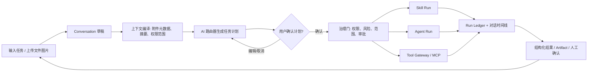

# 皇帝中台通用对话式 AI 任务管理器：架构与交互方案

**版本：** v1.0（待确认）  
**日期：** 2026-08-22  
**定位：** 皇帝中台的通用任务入口，而不是第二套绕过治理的聊天机器人。

## 1. 目标与设计边界

该能力将新增为皇帝中台的“**对话任务**”页面。运营人员通过对话描述任务、上传文件或图片、选择或授权系统推荐的能力，然后查看一个可编辑的执行计划。确认后，系统才调度已登记的 Skill、Agent 或 MCP Tool；每次实际执行均复用现有 Job/Run、Tool Gateway、Run Ledger、审批协议和权限目录。

> **AI 是调度助手，人是决策者。** 对话可自动形成计划与建议，但不会自动调用高风险工具、不会自动提交外部系统、不会自动覆盖业务数据。

本期不重新实现模型调用、任意 Shell、自由网络访问、秘密存储、独立附件存储或平行的工作流引擎。现有皇帝能力已经分别提供 Skill、Agent、Tool、Artifact、Storage、Run Ledger 和人审协议；新页面只负责将它们组织成可理解、可编辑、可审计的通用任务体验。

| 层级 | 既有能力 | 对话任务管理器新增职责 |
|---|---|---|
| **Skill** | 已发布 Skill manifest、模型策略、版本快照、Skill Run | 在对话内选择/推荐 Skill，传入受控附件上下文与任务输入 |
| **Agent** | Agent DAG、节点状态机、Checkpoint、人工确认 | 将用户确认的多步计划转换为 Agent Run 或已有 Agent 执行入口 |
| **Tool / MCP** | Tool Gateway、权限、白名单、速率限制、密钥引用、Tool Run | 仅显示/调用已登记、当前状态允许的 Tool；不暴露原始密钥或未治理的连接器 |
| **Job / Run** | AI Job、Skill Run、Agent Run、Run Ledger Trace | 将每轮消息、计划步骤与实际 Run 建立可查询关联 |
| **文件 / 图片** | `ai_storage_objects`、`ai_artifacts`、S3 | 接收附件元数据，生成受权的 Context Manifest，而非直接持久化文件内容到消息表 |

## 2. 参考设计结论

Codex Symphony 将任务状态作为编排控制面：任务可被拆解、有依赖、有状态，并为停滞或失败留下可恢复的执行单元。[1] 皇帝应采用相同的“**Conversation → Plan → Step → Run**”分层，而不是把所有对话折叠成不可追溯的一次模型输出。

Manus 的公开上下文工程强调稳定提示词前缀、追加式上下文、状态机约束工具可用性，以及将大文件作为可恢复的外部化上下文而非无限拼接进提示词。[2] 因此本方案采用**附件引用 + Context Compiler 载入摘要/受权片段**，并让 Tool Gateway 在执行时作最终授权决定。

Skills 是可复用、可组合的专长工作流，适合在对话里通过斜杠选择、AI 推荐或计划步骤绑定按需加载。[3] 但对话中只能使用已发布、当前用户有权限、版本可快照的 Skill；草稿或废弃 Skill 不进入候选集。

## 3. 用户流程



关键体验包含以下六步：

1. **创建会话。** 用户输入自然语言任务，选择业务项目（可选）和任务模式：分析、生成、执行计划或继续已有运行。
2. **添加上下文。** 用户可拖拽图片、PDF、Excel、CSV、DOCX、TXT 或粘贴链接。前端先校验大小和类型；服务端将二进制上传到现有受控对象存储，创建 `ai_storage_objects` 引用和对话附件元数据。
3. **选择能力。** 输入框支持 `/` 选择已发布 Skill，`@` 选择已启用 Agent，`#` 选择已登记 Tool/MCP。若用户不选，路由器只建议最多三个候选能力，不直接执行。
4. **审阅计划。** AI 将返回结构化计划：目标、所需上下文、计划步骤、每步能力、风险等级、是否需要审批、预计输出。用户可删除步骤、切换已允许能力、补充备注，或取消。
5. **受控执行。** 用户确认后，低风险只读步骤可开始执行；有审批需求、写入或高风险步骤转为 `waiting_human`，沿用既有审批协议。每个步骤产生或关联 Skill Run、Agent Run 或 Tool Run。
6. **查看结果。** 对话消息显示简洁摘要，右侧时间线显示计划、状态、工具、Trace、错误、附件引用与 Artifact。用户可以确认/跳过结果、重试失败步骤，或基于结果继续追问。

## 4. 页面结构

页面路由建议为：`/emperor/conversations`，并在皇帝左侧导航紧邻 Skill、Agent、MCP、Trace 增加“对话任务”。采用三栏 SaaS 布局，避免把 Agent Canvas 的复杂性强加给日常运营用户。

| 区域 | 内容 | 关键交互 |
|---|---|---|
| 左栏：会话列表 | 最近会话、状态、项目、最后运行时间、筛选 | 新建、搜索、归档、继续会话 |
| 中栏：对话与输入 | 用户消息、AI 计划卡、结果卡、附件卡、结构化表单 | 上传、拖拽、`/ @ #` 能力选择、发送、计划编辑、确认/取消 |
| 右栏：执行面板 | 计划步骤、风险/审批标记、Run 状态、Trace、Artifact、Context 引用 | 查看 Run、查看附件摘要、批准/跳过、重试、打开 Trace |

状态色严格区分：草稿为灰色、待确认/待人审为琥珀色、运行中为蓝色、成功为绿色、失败为红色、已取消/跳过为中性灰。对话结果不以纯长文本为唯一载体；计划、参数、候选版本、表格与附件引用必须是可编辑或可操作的数据块。

## 5. 数据模型与关联

本期新增五张表，不复制现有 Job、Run、Artifact 和 Storage 数据。所有新表含 `workspaceId`，采用单公司单工作空间但继续沿用现有范围过滤，避免破坏权限目录。

| 表 | 关键字段 | 用途 |
|---|---|---|
| `emperor_conversations` | `conversationId`、`workspaceId`、`userId`、`projectId`、`title`、`status`、`activePlanId`、`lastTraceId` | 会话容器；不直接存大附件或秘密 |
| `emperor_conversation_messages` | `messageId`、`conversationId`、`role`、`content`、`structuredContent`、`status`、`createdBy` | 用户、助手、系统和工具摘要消息；保留计划与错误证据 |
| `emperor_conversation_attachments` | `attachmentId`、`conversationId`、`messageId`、`storageObjectId`、`artifactId`、`mimeType`、`contextPolicy`、`scanStatus` | 附件到既有 Storage/Artifact 的受控引用；`contextPolicy` 决定摘要/原文件/禁止载入 |
| `emperor_conversation_plans` | `planId`、`conversationId`、`version`、`status`、`goal`、`planJson`、`approvedBy`、`approvedAt` | 可版本化、可编辑的计划；确认后冻结当前版本 |
| `emperor_conversation_plan_steps` | `stepId`、`planId`、`sequence`、`capabilityType`、`capabilitySlug`、`input`、`riskLevel`、`approvalState`、`runRef`、`status` | 每步与 Skill/Agent/Tool 的关系，关联 Skill Run、Agent Run、Tool Run 或 Trace |

`planJson` 和 `structuredContent` 必须满足 JSON Schema；输入消息、附件元数据、能力建议、审批结果与执行输出都以追加式记录，避免覆盖历史决策。表内仅保存附件引用、哈希、派生摘要与访问策略，附件二进制仍由现有对象存储管理。

## 6. 调度与治理状态机

会话状态：`draft → planning → awaiting_plan_confirmation → running ↔ waiting_human → completed | failed | canceled | archived`。计划状态：`draft → proposed → approved → executing → completed | failed | canceled | superseded`。步骤状态：`pending → ready → running → waiting_human → succeeded | skipped | failed | canceled`。

调度规则如下：

| 能力类型 | 允许直接执行的条件 | 必须暂停并等待人工确认的条件 |
|---|---|---|
| Skill | 已发布、用户有 `execute` 权限、输入通过 schema、风险 L0/L1 | 风险 L2/L3、Skill manifest 声明 approval、访问敏感附件 |
| Agent | 已激活、DAG 校验通过、项目范围存在、节点依赖满足 | Agent 或节点进入既有 `waiting_human`；变更计划或选取 Artifact |
| Tool / MCP | Tool Gateway 允许、已登记、白名单命中、范围与限流通过、只读 | 写入/资金/提交类、治理策略要求 approval、连接器状态异常、参数越权 |

任何被拒绝的调用都必须在对话中生成一条可读的“策略拒绝”消息，同时写入 Tool Run 和 Run Ledger。对话管理器不得用重试或替代调用掩盖拒绝原因。

## 7. AI 路由与计划提示词

对话路由器是独立的**计划 Skill**，只输出结构化任务计划，不能直接调用业务 Tool。建议复用质量优先的皇帝模型策略，并使用以下不可变 system prompt 前缀：

```text
你是皇帝中台的任务计划路由器。你只生成可审阅的结构化执行计划，绝不直接执行工具。
Skill 是能力，Agent 是流程，Tool/MCP 是外部能力，Job/Run 是执行记录。
只能从提供的允许能力目录中选择；不得编造能力、秘密、文件内容、权限或外部结果。
附件仅可按 contextPolicy 使用其摘要、提取文本或图像说明；未知附件必须标记为需要人工确认。
凡是写入、提交、资金、账号、权限、外部发布或不可逆操作，必须将 approvalRequired=true。
输出严格匹配 conversation_task_plan JSON Schema。
```

用户输入模板将包含：会话目标、最近消息摘要、可见附件清单、项目范围、已选择能力、受权能力目录、可用知识索引摘要与当前审批约束。计划的 JSON Schema 核心字段为 `goal`、`assumptions`、`steps[]`、`requiredAttachments[]`、`risks[]`、`approvalSummary` 和 `expectedArtifacts[]`。

当计划被批准并执行后，单个步骤由已有 Skill Runner、Agent Runner 或 Tool Gateway 接管。对话管理器只负责构建经过 Context Compiler 处理的输入包，并把真实 Run 引用写回计划步骤。

## 8. 附件与隐私规则

附件上传接受图片和业务常用文档类型；首期建议允许 PNG、JPG、WEBP、PDF、XLSX、CSV、DOCX、TXT、MD，单文件大小和总会话配额沿用当前存储策略。前端显示文件名、类型、大小、上传状态与“上下文使用方式”，但不显示存储密钥或直接暴露内部对象键。

| 附件策略 | 模型可见内容 | 典型用途 |
|---|---|---|
| `summary_only`（默认） | 脱敏摘要、列名、页数、图像说明 | 计划路由与能力推荐 |
| `extracted_text` | 受限长度的文本提取、表格结构 | 文档分析、表格理解 |
| `image_vision` | 图片预览引用与视觉说明 | 图片、设计、Listing 视觉任务 |
| `blocked` | 仅文件存在状态 | 敏感文件，必须人工确认后再授权 |

系统必须在上传后计算内容哈希并创建 Storage/Artifact 引用；后续对话继续使用相同附件时复用引用，避免重复上传和上下文重复。对于任何包含密钥、令牌、个人隐私或未授权店铺数据的附件，默认 `blocked`，且需要管理员审批才能载入执行上下文。

## 9. MVP 验收标准

第一版可上线的最低标准如下：

1. 用户能创建、重命名、继续和归档会话；会话及消息按工作空间/权限隔离。
2. 用户能上传图片与常用文档；附件进入现有对象存储和 Artifact 体系，不存 BLOB 到数据库。
3. 用户可在对话中选择已发布 Skill、已激活 Agent 和已登记 Tool/MCP；未登记能力不可被路由器建议或调用。
4. 路由器只能生成可编辑结构化计划；确认前不得创建业务 Run 或调用 Tool。
5. 已批准的低风险只读步骤能通过现有 Skill Runner、Agent Runner 或 Tool Gateway 执行；每个步骤显示真实 Run/Trace。
6. 需要审批的步骤进入既有人审状态机；批准、跳过、拒绝、失败和重试都保留 Ledger 事件。
7. 附件访问、能力选择、计划确认、Tool 拒绝和实际运行至少各有一条可查询审计证据。

## 10. 本期不做与后续扩展

本期不做自动外部发布、任意代码执行、跨工作空间协作、多人实时光标、语音输入、长时后台自动重排，或未审计的 Agent 自主创建 Tool。后续可在已验证的基础上增加：对话模板、计划复用、计划 DAG 可视化、会话级成本/时延分析、知识库检索预览和已批准的定时“只生成草稿”任务。

## 11. 请确认的框架决策

请确认以下四项后再进入数据表和实现：

1. 对话任务只调度**已登记且已授权**的 Skill、Agent、Tool/MCP，禁止任意 Shell 与自由外部连接。
2. 上传文件/图片只写入既有对象存储和 Artifact 引用；默认只以摘要进入计划上下文，敏感附件默认阻止载入。
3. 每次执行先生成可编辑计划；确认前不创建业务 Run，写入/提交类步骤始终进入人工审批。
4. 首期页面采用三栏会话 + 执行时间线，而不是直接复刻 Codex 的开发者命令行界面。

## 参考资料

[1] [OpenAI, *An open-source spec for Codex orchestration: Symphony*](https://openai.com/index/open-source-codex-orchestration-symphony/)

[2] [Manus, *Context Engineering for AI Agents: Lessons from Building Manus*](https://manus.im/blog/Context-Engineering-for-AI-Agents-Lessons-from-Building-Manus)

[3] [Manus Documentation, *Manus Skills*](https://manus.im/docs/features/skills)
