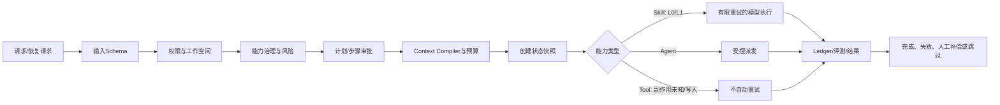

# 皇帝 Harness P1：执行恢复与生命周期治理设计

**日期：** 2026-08-22  
**范围：** 皇帝对话任务的 Plan / Step / Skill / Agent / Tool 调度边界。  
**不变量：** Skill 是能力、Agent 是流程、Tool 是外部能力、Job/Run 是执行记录；所有模型调用仍经皇帝 Skill Runner，所有外部能力仍经 Tool Gateway，所有高风险与写入步骤仍经人工审批。

## 1. 设计目标

P1 不把已失败或中断的执行“盲目重跑”。系统必须先记录可脱敏重建的执行快照，再以一次性恢复请求和乐观版本比较保护状态转换。恢复时，服务端重新校验当前用户权限、工作空间范围、能力版本、计划审批状态及上下文策略哈希；任何一项不一致都拒绝恢复并将原因写入 Run Ledger。对于可能产生副作用的 Tool，P1 只记录补偿建议或人工跳过，不自动补偿、更不自动重试。

| 对象 | P1持久化信息 | 作用 | 禁止保存的信息 |
|---|---|---|---|
| 执行快照 | 目标类型/ID、状态版本、计划/步骤版本、能力标识与版本、审批状态、Context Manifest哈希、输入哈希、执行策略、原因码 | 为恢复前一致性比较与审计提供不可变基线 | 模型密钥、Storage URL、附件二进制、完整敏感上下文 |
| 恢复请求 | 归一化幂等键、快照引用、请求者、恢复动作、状态、结果/拒绝原因 | 同一请求只被接受一次，重复提交返回同一结果 | 原始凭据、业务写入参数明文 |
| Ledger事件 | 固定生命周期阶段、快照哈希、决策、错误分类、有限重试与补偿建议 | 在Trace内重建执行决策序列 | 未脱敏Prompt、密钥、Cookie |

## 2. 生命周期契约

对话步骤是P1的首个受控接入面。Skill、Agent与Tool通过相同的执行契约进入，但实际调用仍由已有的 `runEmperorSkill`、`startAgentRun` 与 `invokeEmperorTool` 完成。

| 生命周期阶段 | 服务端检查 | 允许自动化 | Ledger事件前缀 |
|---|---|---|---|
| `input_validated` | 输入Schema、长度、恢复动作合法性 | 是 | `lifecycle.input_validated` |
| `access_checked` | 用户、工作空间、能力目录 | 是 | `lifecycle.access_checked` |
| `risk_resolved` | 登记风险为下限，默认串行 | 是 | `lifecycle.risk_resolved` |
| `approval_checked` | 计划批准与L2/L3单步批准 | 是，但只做拒绝/放行 | `lifecycle.approval_checked` |
| `context_compiled` | 脱敏摘要、预算、策略哈希 | 是 | `lifecycle.context_compiled` |
| `snapshot_created` | 状态版本、输入/上下文/能力哈希 | 是 | `lifecycle.snapshot_created` |
| `execution_started` | 幂等键已占用，执行类型与自动重试策略 | 是 | `lifecycle.execution_started` |
| `error_classified` | 可重试、策略拒绝、版本冲突或副作用失败 | 是 | `lifecycle.error_classified` |
| `retry_scheduled` | 仅幂等且只读的Skill；最多两次 | 是 | `lifecycle.retry_scheduled` |
| `compensation_required` | 写入/未知副作用失败 | 仅记录建议，不执行 | `lifecycle.compensation_required` |
| `completed` | 状态比较成功后完成 | 是 | `lifecycle.completed` |

## 3. 恢复与补偿规则

> **恢复不是重试。** 恢复仅从已持久化快照重建一次请求，并在重新验证后执行；它绝不复用过期的权限、审批、模型策略或上下文。

| 场景 | 自动动作 | 人工动作 | 最终状态 |
|---|---|---|---|
| L0/L1只读Skill遇到暂态模型错误 | 最多2次指数退避重试；每次均写事件 | 无 | 成功或失败 |
| L2/L3、任何写入Tool | 不自动重试 | 再次单步批准后，用户显式重新执行 | `waiting_human` 或失败 |
| 重复恢复请求 | 返回已有恢复记录，不重复执行 | 无 | 原结果 |
| 快照版本/审批/能力/Context变化 | 拒绝恢复，记录`version_conflict` | 用户重新生成或新建计划 | `waiting_human` |
| Tool失败且副作用不确定 | 记录补偿建议、目标与原因 | 人工选择补偿或跳过 | `compensation_required` |

## 4. 前向数据结构

新增一项前向迁移，不修改既有Trace、Skill Run、Tool Run或对话历史数据。

| 表 | 核心索引 | 说明 |
|---|---|---|
| `emperor_execution_state_snapshots` | `snapshotId`唯一；`(workspaceId,targetType,targetId,stateVersion)`唯一；Trace索引 | 记录每次可恢复状态转换的脱敏快照与哈希。 |
| `emperor_execution_recovery_requests` | `recoveryId`唯一；`idempotencyKey`唯一；快照/Trace索引 | 固化恢复动作的幂等性和拒绝/完成结果。 |

## 5. 验收边界

验收仅使用归档测试会话与无副作用的 `emperor.conversation.plan`。需证明重复恢复不会重复执行、版本冲突和未批准高风险恢复被拒绝、每个生命周期阶段均在Trace写入、写入Tool失败只产生补偿事件而不自动执行补偿。部署前后均执行定向Vitest、ESLint、生产构建和ECS健康核验。
