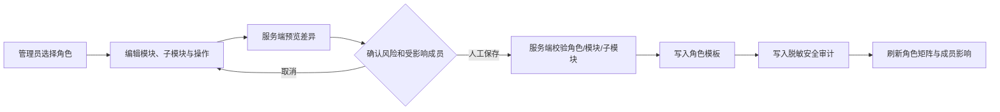

# 单工作空间权限管理页面升级设计

## 目标与约束

本次升级面向单公司、单默认工作空间的内部运营团队。页面必须让管理员同时理解角色模板、成员归属、模块/操作、资源动作、路由实际强制状态和例外策略，但不得因查看、筛选或预览而改变任何成员的有效权限。系统保留现有角色与后端资源授权模型，不引入租户切换。

> **AI不是权限决策者。** 权限页面只对规则、影响和风险做结构化说明；角色变更始终由管理员提交，服务端验证并写入脱敏审计。

## 页面信息架构

| 页签 | 数据来源 | 用户目的 | 写入边界 |
|---|---|---|---|
| 权限总览 | 角色、活跃成员、目录汇总 | 识别公司授权规模与高风险角色 | 只读 |
| 角色矩阵 | 角色模板、模块和二级操作 | 按角色查看、筛选、编辑模板 | 管理员人工保存 |
| 成员影响 | 成员—角色映射、角色成员数 | 在修改前确认受影响的公司成员 | 只读；成员编辑仍走用户管理 |
| 资源授权字典 | 资源、后端动作与UI操作映射 | 解释`run`、`confirm`、`sync`等授权含义 | 只读 |
| 权限目录 | 模块、子模块、路由与enforcement | 区分已强制拦截和目录观察路由 | 只读 |

## 角色变更流程

预览数据必须包含新增/移除的模块操作、受影响成员数量、是否触及管理模块/皇帝中台/删除操作，以及路由是否已强制。预览仅计算，不写入数据库。

## 后端契约

| Procedure | 权限 | 行为 |
|---|---|---|
| `roleManagement.governanceSnapshot` | 管理员 | 返回角色成员数、模块目录、路由强制状态、资源动作字典和例外策略计数；只读 |
| `roleManagement.previewUpdate` | 管理员 | 验证输入并计算变更与风险；只读 |
| `roleManagement.update` | 管理员；超级管理员限制修改自身模板 | 复用预览验证，写入角色模板并记录脱敏前后摘要；不修改成员角色或资源例外 |

## 风险口径

| 等级 | 判定 | 页面反馈 |
|---|---|---|
| 低 | 只增加或移除普通业务模块的读权限 | 常规变更摘要 |
| 中 | 涉及编辑、批量受影响成员或运营导入/同步 | 黄色提示与受影响成员数 |
| 高 | 涉及删除、系统管理或皇帝AI中台能力 | 红色提示、需明确确认 |
| 严重 | 涉及超级管理员模板 | 仅超级管理员可保存，明确显示公司范围影响 |

## 验收标准

页面必须在桌面与窄屏下可浏览；角色编辑必须先显示服务端预览；所有目录和资源均来自共享权限注册表；观察态路由不能被误展示为强制保护；无管理员会话不得读取矩阵或提交变更；一次角色保存必须产生可追溯、无敏感字段的审计记录。
