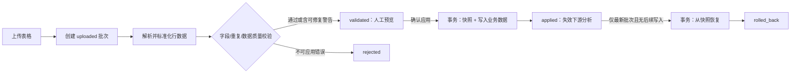

# 模块一表格导入批次治理设计

## 目标与边界

产品开发模块的表格上传不再直接等同于业务数据生效。每个上传文件先形成一个**导入批次**，经历解析、校验、人工确认、应用或回滚。上传文件仍保存在对象存储；数据库只记录批次元数据、校验摘要、影响范围和可追踪的应用快照。

该设计保留既有“同名文件替换”体验，但把替换动作改为受控的批次状态迁移。知识库不增加审批节点；本设计仅适用于模块一的产品、评论及其基础数据文件。

| 状态 | 含义 | 可执行动作 | 人工角色 |
|---|---|---|---|
| `uploaded` | 文件已保存，尚未解析 | 解析、取消 | 上传人 / 有写权限成员 |
| `validated` | 解析完成，校验结果可审阅 | 确认应用、拒绝、重新上传 | 有写权限成员 |
| `applied` | 批次内容已写入业务表 | 回滚、查看影响范围 | 项目编辑者 |
| `rolled_back` | 已恢复至应用前快照 | 查看审计 | 所有人（按权限） |
| `rejected` | 校验或人工决策拒绝 | 查看原因、重新上传 | 有写权限成员 |

## 数据契约

`dev_import_batches` 将以 `workspaceId + projectId + fileType` 为范围键，记录上传文件、文件哈希、行数、有效行数、错误数、校验结果 JSON、状态、确认人、应用人和回滚信息。`dev_import_batch_rows` 仅保存可回放的标准化行快照与行级校验错误；不存文件二进制。

应用批次前，系统在同一事务内保存受影响的产品或评论记录快照，并写入 `dev_import_apply_snapshots`。回滚只允许针对最新的已应用批次，且以快照恢复为准；若随后已有人工编辑或新批次修改同一记录，系统必须阻止自动回滚并要求用户新建修正批次，避免覆盖后续决策。

## 流程

## 校验与审计要求

系统应把必填列缺失、ASIN 格式错误、重复 ASIN、数值范围异常和未知映射字段区分为阻断错误或可确认警告。确认和回滚均写入产品开发审计日志，并关联批次 ID、用户、工作空间、项目、文件类型、行数、快照 ID 和决策说明。

## 分阶段实施

第一阶段先治理 `sales` 与 `reviews` 两类上传：提供批次列表、校验摘要、确认应用、最近批次安全回滚。现有前端解析器可继续工作，但必须将标准化结果写入批次而不是直接调用 `saveProducts` 或 `saveReviews`。第二阶段再覆盖 `bullet_points`、`history_sales`，并接入导入前后差异预览与批次级下载。

> 人始终决定是否应用与是否回滚；AI 或解析器只产出结构化校验结果和影响范围。
