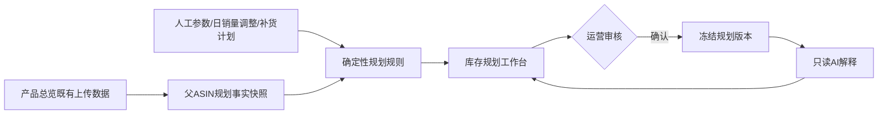

# 模块三库存规划工作台替代方案

> **方案状态：待业务确认，尚未实施。** 本文定义的库存规划工作台将**完整替代**模块三当前的“库存预警中心”方案与页面；其产品、库存、销量和店铺数据只读取“产品总览”既有上传并已融合的数据，**不新增重复上传入口**。

## 一、结论与边界

库存规划不应再是以旧库存表、物流批次页或独立 AI 预测为中心的预警集合，而应成为产品总览的一个**可解释、可编辑、可确认**的下游决策工作台。产品总览负责提供事实数据，库存规划负责将事实数据、人工设置的货期参数和人工确认的补货计划组合为订单时间与建议补货量。系统只生成建议，不自动创建采购单、物流单或修改源数据。

| 项目 | 确认设计 |
|---|---|
| 唯一业务事实来源 | 模块三产品总览已上传并融合的领星/赛狐数据；当前实际有数据的是领星产品表现表 |
| 当前实际数据覆盖 | 领星表共有 **6,078** 条记录、**506** 个父 ASIN、最新报告截止日为 **2026-08-09**；赛狐表当前为空 |
| 规划主粒度 | `父ASIN + 站点 + 店铺`。领星当前为父 ASIN 粒度，子 ASIN 在详情中展示，不将父级库存错误拆分到子 ASIN |
| 页面替代范围 | `/ops/inventory` 保留为入口路径，但其当前“库存总览、全渠道库存、AWD、本地仓、物流流水线、AI 补货预测”旧页面整体下线，替换为“库存规划工作台” |
| 不新增的内容 | 不新增库存/销量的重复上传入口；不引入基于猜测的 AI 补货计算；不自动下单 |
| 可以新增的内容 | 派生计算快照、人工日销量调整、货期参数、人工补货计划与确认版本。这些是决策数据，不是重复上传的业务事实数据 |

产品总览的现有领星模型已经包含 `sales_qty`、`fba_available`、`available_stock`、`fba_inbound`、`fba_in_transit`、`fba_total`、仓储库存和 `stockout_date` 等字段。[1] 现有总览接口也已经按父 ASIN 聚合并计算 7 天日均销量，但目前将产品状态固定写为 `active`，且尚未输出 30 天日销和可售天数证据。[2] 因此，库存规划需要复用原始总览数据，并补齐**计算口径与数据可信度提示**，而不是建立平行的数据入口。

## 二、模板逻辑的继承与修正

用户提供的模板以“销量、补货数量、生产货期、物流、缓冲、到货日期、库存、总库存、倒推订货时间”为主线。该主线将被保留，但从单产品 Excel 日历迁移为以 ASIN 为中心的可筛选工作台。

| 模板概念 | 工作台字段 | 计算或使用方式 | 人工交互 |
|---|---|---|---|
| 销量 | 7 天日销、30 天日销、加权日销、最终日销 | 只以可售日期作为分母；最终日销优先采用人工调整值 | 可将例如 `3` 套/天调整为 `5` 套/天，并填写原因和生效范围 |
| FBA 库存 | 当前可售库存 | `available_stock` 优先；无有效值时回退 `fba_available` | 只读，显示数据日期与来源 |
| 总库存 | 总库存（展示）与规划可用库存（计算） | 总库存用于全局认知；补货计算只使用可在预计到货日前确定可用的库存 | 人工确认在途/计划到货日期后，才可计入计算库存 |
| 生产货期、物流、缓冲 | 生产天数、物流天数、流购缓冲天数 | `总货期 = 生产 + 物流 + 流购缓冲` | 工作空间、店铺/站点、产品三级可覆盖配置 |
| 到货时间 | 预计到货日 | `下单日 + 总货期` | 对每一笔人工补货计划可编辑 |
| 倒推订货时间 | 建议下单日 | `预计断货日 - 总货期` | 显示逾期天数并由运营确认 |

> **关键修正：** “总库存”不等于“今天可消费的库存”。在途、调拨中、海外仓和待采购数量只有拥有已确认的到货日期后，才能在预测日历中作为供给发生。这样可以避免把尚未可售的库存提前抵扣，造成虚假的“库存充足”。

## 三、唯一数据源的数据契约

### 3.1 事实字段映射

| 规划字段 | 领星产品总览字段 | 处理规则 | 可信度要求 |
|---|---|---|---|
| 规划主键 | `parent_asin`、`country`、`store_name` | 父 ASIN 为空时回退 `asin`；以站点和店铺隔离 | 缺任一维度时标记“待核对” |
| 子 ASIN | `asin` | 仅作为展开详情和追溯信息；不切分父 ASIN 库存 | 逗号拼接的子 ASIN 仅展示 |
| 7 天销量 | 最近完整报告周期的 `sales_qty` | 以实际可售天数作为分母，而非无条件除以 7 | 最近周期必须完整且数据不过期 |
| 30 天销量 | 最近 30 个日历日覆盖的连续周报 `sales_qty` | 按周报与 30 天窗口的重叠天数折算；显示覆盖天数 | 覆盖不足 21 天时降级为“样本不足” |
| 当前可售库存 | `available_stock`，回退 `fba_available` | `available_stock > 0` 时优先；否则使用 `fba_available` | 报告日期必须可见 |
| 总库存（展示） | `fba_total`、`awd_available`、`local_available`、`overseas_available` | 优先使用来源中的 FBA 总库存；其他位置库存单列展示，避免与 FBA 明细重复累计 | 字段关系有歧义时显示“待核对” |
| 物流/在途线索 | `fba_inbound`、`fba_in_transit`、`fba_transfer_pending`、`fba_transferring`、`fba_plan_inbound` | 仅作为待确认供给线索，默认不提前计入预计可用库存 | 需人工补齐预计可售日 |
| 上架起点 | `created_time` | 可解析时作为可售日期下限；无法解析时按报告窗口处理并标识 | 不把创建时间错误视为实际在售状态 |
| 数据时点 | `week_start_date`、`week_end_date` | 所有计算均以最近报告截止日为“截至日” | 超过 8 天未更新则显示“数据陈旧” |

### 3.2 已确认的数据缺口与处理原则

产品总览现有领星数据为周粒度，当前没有日粒度 `inventory_snapshots` 记录；数据库核验结果为 0 行。因此不能把周数据伪装成“连续三天”的真实事实。赛狐虽具备 `sales_7d` 与 `sales_30d` 字段，但当前没有已上传记录。[1]

| 业务要求 | 当前能否严格计算 | 工作台的诚实处理方式 |
|---|---|---|
| 7 天/30 天各 50% 的加权日销 | 可以 | 由产品总览历史周报计算；数据覆盖不足时不生成高可信建议 |
| 仅计算在售日期 | 可以部分实现 | 以 `created_time` 与人工“停售区间”覆盖值扣除不可售日期；若未有可验证状态，显示“在售状态待核对” |
| 库存为 0 连续 3 天且没有销量即断货 | **当前不能回溯严格计算** | 不伪造判断。只有产品总览中已有连续 3 个日粒度报告日时才显示“已确认断货”；否则只显示“预测断货风险/待观察” |
| 当前库存为 0 | 可以 | 即时显示“无可售库存”；这不是“连续三天已确认断货” |

此设计不要求新上传入口。后续只要运营继续通过**既有产品总览上传路径**导入日粒度领星或亚马逊下载数据，系统会自然累计三日观察证据；在此之前，断货标签保持为“待观察”，不会误导用户。

## 四、计算口径

### 4.1 销量与可售日期

设 `D7`、`D30` 分别为最近 7 天、30 天窗口内的实际可售天数，`Q7`、`Q30` 为窗口内销量，`A` 为最终日销量。

```text
日销7 = Q7 / D7
日销30 = Q30 / D30
系统加权日销 = 0.5 × 日销7 + 0.5 × 日销30
最终日销量 A = 人工调整日销量（若已确认）；否则为系统加权日销
```

`D7` 和 `D30` 不包含上架前日期，也不包含用户在规划工作台中明确设置为停售的日期。对于由周报覆盖的部分区间，系统会按照报告期间的重叠天数折算销量，并将该行标识为“周报折算”；该标识不能被隐藏。

### 4.2 货期、预计断货与建议订货日期

设 `P` 为生产货期、`L` 为物流时间、`B` 为流购缓冲、`T` 为目标覆盖天数、`S0` 为当前可售库存、`R(t)` 为在日期 `t` 已确认可售的补货到货量。

```text
总货期 H = P + L + B
预计到货日 = 下单日 + H
预计断货日 = 预测日历中首次使 [S0 + ΣR(t) - A × 已过天数] ≤ 0 的日期
原始建议下单日 = 预计断货日 - H
展示建议下单日 = max(今天, 原始建议下单日)
逾期天数 = max(0, 今天 - 原始建议下单日)
```

建议订货量将在预计到货日上保持目标覆盖天数，而不是简单地把全部“总库存”当成可售库存：

```text
预计到货时可用库存 = max(0, S0 - A × H) + 在预计到货日前已确认可售的到货量
建议补货量 = 向上取整至包装倍数(max(0, A × T - 预计到货时可用库存))
最终建议量 = max(建议补货量, MOQ)；当建议补货量为 0 时不触发 MOQ
```

工作台将同时显示“货期消耗量 `A × H`”和“目标覆盖量 `A × T`”，使运营能一眼解释建议补货量来源。若用户确认更适合使用“总库存含已下采购”作为补货基数，可在数据口径中将已确认采购计划纳入 `R(t)`；没有到货日期的在途或采购量不会被自动抵扣。

### 4.3 状态体系

| 状态 | 判断条件 | 前台动作 |
|---|---|---|
| 已确认断货 | 有 3 个连续日粒度产品总览观察日，且每日可售库存为 0、销量为 0 | 高优先级红色；查看三日证据，不自动下单 |
| 无可售库存待观察 | 当前可售库存为 0，但没有连续三天日粒度证据 | 橙色；提示补齐既有产品总览数据后自动确认 |
| 已逾期订货 | 原始建议下单日早于今天 | 红色；显示逾期天数、推荐数量和计算链路 |
| 7 日内应订货 | 原始建议下单日在未来 7 天内 | 橙色；加入本周行动清单 |
| 规划正常 | 建议下单日超过 7 天且数据完整 | 绿色 |
| 数据待核对 | 30 天覆盖不足、在售状态不可验证、数据陈旧或参数缺失 | 灰色；禁止显示为“安全库存充足” |

## 五、参数、人工调整与确认版本

库存规划的所有人工内容都必须具备来源、操作者、时间和版本；任何编辑只影响规划计算，不回写产品总览源数据。

| 参数层级 | 参数 | 覆盖规则 | 初始状态 |
|---|---|---|---|
| 工作空间默认 | 生产天数、物流天数、流购缓冲、目标覆盖天数、MOQ、包装倍数 | 可被店铺/站点和产品覆盖 | 显示“未配置”，不得静默套用猜测值 |
| 店铺/站点 | 同上 | 覆盖工作空间默认 | 运营负责人可维护 |
| 父 ASIN | 同上、停售日期区间 | 覆盖店铺/站点设置 | 产品负责人可维护 |
| 日销量调整 | 调整后日销量、原因、有效起止日 | 优先于系统加权日销 | 示例：冲销量计划将 `3` 调整为 `5` |
| 补货计划 | 数量、下单日、生产/物流/缓冲、预计到货日、状态 | 只有“已确认”的计划才计入 `R(t)` | 草稿不影响计算 |

每次用户点击“确认本次规划”后，系统将冻结一个规划快照：源数据截至日、字段值、参数版本、调整值、计算结果和用户备注必须一并保存。后续源数据更新或参数变化会生成“需要重新确认”状态，历史确认版本仍可追溯和比较。

## 六、替代后的页面结构

库存规划工作台的数据流与审核闭环如下图所示。产品总览是唯一事实来源；人工参数、日销量调整和已确认补货计划是可审计的决策输入；AI 仅在确认版本上做解释，不参与库存数值计算。



### 6.1 页面信息架构

| 区域 | 内容 | 目的 |
|---|---|---|
| 顶部状态栏 | 产品总览数据截至日、数据新鲜度、来源、最后计算时间、刷新按钮 | 让用户先判断数据是否可用于决策 |
| 规划概览卡 | 已确认断货、无可售库存待观察、已逾期订货、7 日内应订货、数据待核对数量 | 代替旧“紧急/偏低/正常/滞销”饼图 |
| 筛选与批量区 | 站点、店铺、运营、品牌、类目、状态、数据可信度、只看已调整；批量确认/导出 | 符合运营人员多 ASIN 工作习惯 |
| ASIN 规划主表 | 一行一个父 ASIN 规划单元，支持展开子 ASIN 与计算明细 | 日常决策主界面 |
| 规划详情抽屉 | 数据证据、日销调整、货期参数、补货计划、计算追溯、版本历史 | 让分析结果可编辑、可审核、可确认 |
| 参数中心 | 工作空间/店铺/产品三级货期与补货规则 | 集中维护，避免散落在表格里 |
| 已确认版本 | 当期确认批次、比较差异、撤销为草稿、导出 | 实现人工审核闭环 |

### 6.2 ASIN 规划主表

| 字段组 | 字段 |
|---|---|
| 产品识别 | 父 ASIN、子 ASIN 数、产品名称、站点、店铺、运营、数据截至日 |
| 需求证据 | 7 天销量/可售天数、30 天销量/可售天数、系统加权日销、人工调整日销、最终日销 |
| 库存证据 | 当前可售、FBA 总库存、海外/本地/AWD、待确认在途、已确认到货 |
| 计划参数 | 生产、物流、缓冲、总货期、目标覆盖、MOQ/包装倍数 |
| 决策结果 | 预计断货日、建议下单日、逾期天数、建议补货量、状态、数据可信度 |
| 操作 | 编辑日销、编辑参数、登记补货计划、查看计算、确认规划 |

旧页面中的物流批次管理仍作为独立导航页保留；库存规划工作台只使用用户明确确认的到货计划，不再把旧物流页或 AI Job 结果作为库存事实来源。原库存标签如仍有其他模块用途可保留为通用筛选能力，但不再决定库存规划的核心结果。

## 七、AI 的定位、结构化输出与提示词

库存数量、日销、货期、补货量、断货和下单日期均由上述确定性规则计算。AI 只可作为“解释与异常提示助手”，不得替代公式、修改人工值或自动确认结果。

| AI 能力 | 输入 | 结构化输出 | 禁止行为 |
|---|---|---|---|
| 规划解释 | 已确认的计算快照、数据可信度、人工调整原因 | `summary`、`evidence[]`、`risks[]`、`questions[]` | 不改数量、不下单、不虚构来源数据 |
| 异常核对 | 7/30 日销差异、人工调整幅度、货期变更、数据陈旧信号 | `anomalies[]`、`recommendedChecks[]` | 不把推测标为事实，不覆盖人工调整 |
| 批量运营摘要 | 已确认规划列表 | 优先级、需关注 ASIN、待补参数 | 不输出新的补货量和日期 |

建议接入内置皇帝 Skill 的系统提示词如下：

```text
你是“库存规划解释助手”，不是下单代理，也不是库存计算器。

你只能解释输入中已给出的、由系统公式计算的事实；不得重算、修改或臆造销量、库存、货期、到货日期、补货量和断货状态。
若 dataConfidence 不是 verified，必须先说明数据限制，并将相关结论标记为“待核对”。
人工调整的最终日销量和已确认的补货计划优先级最高，不得建议自动覆盖。
不得提出自动采购、自动发货、自动改价或自动修改产品总览数据。

仅返回符合 JSON Schema 的对象：
{
  "summary": "不超过120字的业务解释",
  "evidence": [{"field":"字段名","value":"输入原值","meaning":"为何影响规划"}],
  "risks": [{"severity":"high|medium|low","type":"数据|库存|参数","message":"风险说明","evidenceFields":["字段名"]}],
  "questions": [{"question":"需要运营确认的问题","reason":"确认原因"}],
  "recommendedChecks": [{"action":"人工检查动作","priority":"high|medium|low"}]
}
```

## 八、实施清单与验收标准

| 阶段 | 实施内容 | 可验证验收标准 |
|---|---|---|
| A. 数据读取层 | 基于产品总览融合查询建立 `InventoryPlanningSource`；输出数据截至日、7/30 天证据、库存分层和可信度 | 不出现第二个上传接口；空赛狐数据不影响领星规划；父 ASIN 不被错误拆分库存 |
| B. 规划数据层 | 新建参数、日销调整、补货计划、规划快照四类领域表，并按 workspace/父 ASIN/站点/店铺隔离 | 编辑不回写 `lingxing_product_weekly`；每次确认均可读取完整版本 |
| C. 规则引擎 | 实现加权日销、可售天数、预计断货、下单日、建议量、状态与可信度规则 | 覆盖 7/30 数据不足、人工从 3 调整为 5、货期变更、MOQ/包装倍数、已确认到货抵扣等单元测试 |
| D. 页面替代 | 将 `/ops/inventory` 替换为库存规划工作台，删除旧预测页和旧库存预警 UI 依赖 | 页面无旧“AI 补货预测”标签；可以筛选、编辑、确认、查看版本和导出 |
| E. 人工审核与 AI 解释 | 加入详情抽屉、确认批次、差异比较与只读 AI 解释面板 | AI 输出可追溯且不改变公式结果；未确认草稿不影响正式计划 |
| F. 数据质量与发布 | 执行迁移、补齐 Vitest、类型检查、最小样本回归和上线检查 | 数据库迁移与代码版本同步；产品总览源数据无重复写入；工作台可回溯历史确认 |

## 九、需要确认后再进入开发的业务决定

本方案已经确认“只读产品总览数据、无需重复上传、完全替代旧库存预警”。进入实施前，仍需由业务方确认以下三项参数政策，避免系统暗中替运营做决策：

| 待确认项 | 建议原则 | 不确认时系统行为 |
|---|---|---|
| 货期/目标覆盖默认值 | 建议先由店铺/站点负责人配置，再按产品覆盖 | 标记“参数缺失”，不输出可确认的补货数量 |
| 总库存展示范围 | FBA 总库存与 AWD/本地/海外库存分开展示；仅已确认到货供给进入计算 | 未确认在途只展示，不抵扣建议量 |
| 三日断货证据策略 | 只接受既有产品总览中的连续日粒度数据；周报数据只能给出预测风险 | 当前数据不显示“已确认断货”，仅显示“待观察/预测风险” |

## 参考资料

[1]: ../drizzle/schema/ops.ts "产品总览、库存与赛狐字段模型"
[2]: ../server/routers/dataImport.ts "产品总览领星/赛狐融合逻辑"
