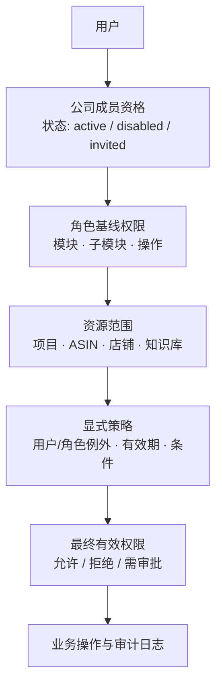

# 全链路权限治理与权限管理页面升级方案

**适用环境：** 青岛ECS独立站（`amz_listing`），单公司、单工作空间  
**状态：** 待确认设计标准，尚未改变任何用户权限、角色配置或数据访问结果。  
**原则：** AI 是助手，人是决策者；权限变更必须可预览、可审计、可回滚。

## 1. 当前盘点结论

| 维度 | 当前事实 | 主要问题 |
|---|---:|---|
| 活跃用户角色 | `super_admin` 2人、`ops_specialist` 5人、`product_dev` 4人、`designer` 2人 | 角色定义、真实分配和页面说明没有统一视图 |
| 公司成员 | 13名活跃成员（2名 owner、11名 member） | 成员身份、用户全局角色与角色权限页面之间缺少清晰关系说明 |
| 角色模板 | 8个动态角色模板 | `role_permissions.role` 全局唯一与单公司实际相符，但页面没有把角色模板、成员和资源范围统一展示 |
| 模块权限 | 6个一级模块，支持读/编辑/删除及二级子模块 | 页面默认把没有细节配置的已启用模块视作完整权限，风险不透明 |
| 资源授权 | 3条项目分配，均为只读 | 项目权限与角色权限分散在不同页面，无法一屏判断某人对某项目的最终有效权限 |
| 显式访问策略 | 0条 `security_access_policies` | 用户例外、ASIN范围、有效期、拒绝优先等规则尚无管理入口 |
| 审计 | 816条安全审计记录，其中拒绝668条、失败20条 | 现有页面未提供权限变更、拒绝原因和高风险操作的集中解释 |

> **核心诊断：** 当前系统已具备角色、模块、子模块、项目分配、公司成员、策略表和审计表等基础能力，但它们分散在不同页面与不同判定路径中。新的页面应以“最终生效权限”为中心，而非仅编辑角色模块勾选框。

## 2. 目标权限架构

权限采用**“角色基线 + 公司成员身份 + 资源范围 + 显式策略”**的四层模型；任何层级的显式拒绝优先于允许。系统不提供租户或工作空间切换。

| 层级 | 作用 | 数据来源 | 管理入口 |
|---|---|---|---|
| 角色基线 | 定义岗位的默认最小权限 | `role_permissions` | 角色模板 |
| 公司成员 | 确定用户是否可用、担任什么角色 | `workspace_memberships` | 成员与授权 |
| 资源范围 | 限制可访问的项目、ASIN、店铺、知识库资产 | `project_assignments` 与后续资源范围表 | 资源范围 |
| 显式策略 | 为个别用户或角色增加允许/拒绝、条件、到期时间 | `security_access_policies` | 例外策略 |
| 审计 | 记录授权变更与关键允许/拒绝决定 | `security_audit_logs` | 审计与风险中心 |

## 3. 操作标准与兼容策略

当前 `read / edit / delete` 不删除，作为兼容层继续支持；页面和新策略使用更清晰的业务动作组。

| 动作组 | 标准动作 | 对现有权限的兼容映射 | 风险级别 |
|---|---|---|---|
| 浏览 | `view`、`export` | `read` | 低 |
| 生产 | `create`、`edit`、`run_ai`、`submit_review` | `edit` | 中 |
| 审核发布 | `approve`、`publish`、`unlock` | 现有审核/编辑路径，需显式配置 | 高 |
| 破坏性操作 | `delete`、`reset`、`revoke_access` | `delete` | 高 |
| 管理 | `manage_members`、`manage_roles`、`manage_policies`、`manage_system` | `admin` 模块 + 管理员守卫 | 关键 |

**兼容原则：** 已有角色和用户的当前实际访问不会因页面升级被自动收紧或放宽。迁移期间继续读取旧的模块权限；仅在管理员确认某角色模板后，才写入扩展动作配置。

## 4. 建议角色基线

| 角色 | 默认职责 | 可管理范围 | 默认限制 |
|---|---|---|---|
| 超级管理员 | 公司治理、紧急恢复 | 全公司系统、角色与资源 | 不允许被普通管理员修改 |
| 管理员 | 公司配置与成员管理 | 公司成员、角色、审核和项目分配 | 不可修改超级管理员 |
| 运营主管 | 团队运营与审核 | 运营、Listing、知识库、团队项目 | 不可管理成员角色或系统配置 |
| 运营专员 | 自己被分配的运营任务 | 已授权项目、运营/Listing工作台 | 默认不可删除、不可发布、不可变更他人项目 |
| 产品开发 | 产品开发及相关知识库 | 自己/团队授权的开发项目 | 不可访问未经授权的运营数据 |
| 财务 | 利润、采购、资金规划 | 经授权的店铺/ASIN财务数据 | 不可修改Listing、图片或AI策略 |
| 采购 | 供应商、BOM、采购计划 | 经授权的产品与采购数据 | 不可查看无授权的经营分析 |
| 设计师 | 图片资产、人审协作 | 被授权项目的图片工作流和图片知识库 | 默认仅查看/导出；编辑、锁定、重新生成需单独授予 |

## 5. 权限管理页面信息架构

页面改为一个“权限治理中心”，使用五个工作区，而不是当前单一角色表格加编辑弹窗。

| 工作区 | 主要内容 | 管理动作 |
|---|---|---|
| 总览 | 角色数、活跃成员、高风险授权、最近拒绝、待到期例外 | 跳转风险项、查看最终生效权限 |
| 角色模板 | 角色矩阵；模块、子模块、动作组视图；内置角色保护 | 克隆模板、批量套用、差异对比、预览影响 |
| 成员与授权 | 用户、工作空间成员身份、实际角色、项目/ASIN范围、例外策略摘要 | 批量分配角色、启停成员、查看某成员有效权限 |
| 资源范围 | 项目、ASIN、店铺、知识库与图片工作流授权范围 | 批量授权、设置只读/协作/负责人、设定有效期 |
| 审计与风险 | 授权变更、拒绝、失败、高风险动作、策略到期 | 按成员/资源/动作筛选、导出、回滚至上一版本 |

### 关键交互规则

1. 每次保存前显示**变更影响预览**：受影响成员数量、将新增/移除的模块和高风险动作。
2. `delete`、`publish`、`approve`、`manage_*`、权限收回均要求二次确认，并写入审计日志。
3. 模板编辑采用“最小权限优先”开关：新启用模块默认仅 `view`，管理员可明确扩展为生产、审核或管理动作。
4. 成员详情优先展示“最终有效权限”，并可展开查看权限来自角色、资源范围或显式例外的依据。
5. 支持按多人、多个项目或多个ASIN批量授权；批量动作需提供可下载的影响清单。

## 6. 实施路径

| 阶段 | 范围 | 是否改变现有访问结果 |
|---|---|---|
| A. 治理基础 | 统一资源目录、动作字典、角色模板快照与权限计算服务 | 否 |
| B. 页面升级 | 构建治理中心、角色矩阵、成员有效权限与风险总览 | 否 |
| C. 资源范围 | 将项目分配统一为资源范围；补充ASIN/店铺范围 | 仅在管理员保存后生效 |
| D. 例外策略与审计 | 启用允许/拒绝、有效期、变更对比、审计筛选 | 仅新策略生效 |
| E. 回归与独立部署 | 角色边界、跨工作空间、项目范围、图片美工只读和高风险操作测试 | 否 |

## 7. 需要确认的标准

请确认以下四项，确认后再进入数据模型和页面实现：

1. 是否采用上文的**五工作区权限治理中心**作为新页面结构？
2. 是否采用**角色基线 + 公司成员身份 + 资源范围 + 显式策略（拒绝优先）**四层判定模型，并且不提供租户或工作空间切换？
3. 是否同意把 `view / create / edit / run_ai / submit_review / approve / publish / delete / manage_*` 作为新页面动作字典，同时兼容旧 `read / edit / delete`？
4. 设计师是否保持默认只读；只有被显式授权时才能编辑、重新生成、锁定或上传图片工作流资产？

确认后，我会先实现**不改变现有访问结果**的角色模板、成员有效权限和风险总览，再分阶段纳入项目/ASIN范围与例外策略。
