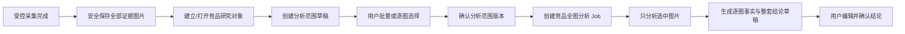

# 品牌故事图片的分析范围治理方案

**日期：** 2026-10-06  
**状态：** 待确认；本文件仅定义方案，不创建任务、不调用模型、不重爬、不修改现有图片。  
**适用位置：** 智能图片建议 → Step 0 → 竞品全图分析。

## 1. 问题与结论

当前受控采集会把公开可获得的主图、副图、A+ 和品牌故事图片作为**竞品研究证据**安全保存。现有“分析整套图片”则把该竞品的全部已确认资产逐张送入模型，因此品牌故事中与当前商品无关或重复的素材（例如品牌售后承诺、全品类系列卡、其他规格/颜色、交叉销售卡、泛品牌场景）也会进入逐图事实与整套结论。

这不是图片下载错误，也不应通过删除品牌故事图片来解决。它们应保留为可追溯证据；真正需要新增的是一个位于“安全入库”和“创建 AI 分析 Job”之间的、由人确认的**分析范围选择版本**。

> **推荐决策：** 默认纳入主图/副图与 A+，默认不纳入 `brand_story`；用户可逐张、按角色或批量重新纳入。只有已确认范围内的图片才会被发送给模型和用于证据引用。未纳入图片仍会保存、显示，并可随时在下一版本重新加入。

这符合“AI 是助手，人是决策者”的原则，并不会把竞品图片转为我方生成素材。

## 2. 推荐用户流程



### 2.1 首次打开图库时的默认值

| 图片角色 | 默认是否纳入 | 原因 | 用户可否修改 |
|---|---:|---|---:|
| 主图 / 副图（`main`、`secondary`） | 是 | 通常直接反映该 ASIN 的商品展示、卖点与构图 | 可以 |
| A+（`aplus`） | 是 | 可能承载与该商品有关的详情叙事、场景和证明 | 可以 |
| 品牌故事（`brand_story`） | **否** | 经常包含品牌层售后、全系列、其他产品或重复素材，未必服务于当前 ASIN | 可以 |

默认值只是一个可见、可编辑的起点，不是隐藏规则。界面明确显示“已保存但未参与本次分析”的品牌故事图片。

### 2.2 页面交互

在主要竞品卡片中，将现在的单个 **“分析整套图片”** 按钮替换为以下两步：

1. **配置分析范围**：打开“分析范围”抽屉/面板，按主图副图、A+、品牌故事分组展示缩略图和计数。
2. **确认范围并分析**：显示本次将分析的总张数及角色构成；只有用户保存并确认范围版本后才能创建 AI Job。

面板提供以下操作：

| 操作 | 规则 |
|---|---|
| 全选 / 全不选某一角色 | 对当前角色组批量生效，且立即展示图片计数。 |
| 仅选主图副图 | 一键回到最保守、最相关的商品展示范围。 |
| 纳入已选 A+ | 用户决定是否把商品详情视觉叙事加入。 |
| 默认排除品牌故事 | 不删除、不隐藏；以“已保存，未参与本次分析”呈现。 |
| 逐张纳入 / 排除 | 用户可针对真正与该 ASIN 有关的品牌故事图点击纳入。 |
| 仅看未纳入 / 仅看已纳入 | 便于快速审阅长品牌故事列表。 |
| 保存草稿 | 可继续调整，不调用模型。 |
| 确认范围并分析 | 锁定不可变版本后才创建 Job；按钮显示例如“分析 14 张图片”。 |

每张未纳入卡片保留 `brand_story`、图位、缩略图和“已保存证据，不参与本次分析”的说明；不显示为失败、缺失或被删除。

## 3. AI 分析逻辑与提示词边界

### 3.1 发送给模型的材料

逐图 Skill 只接收确认范围版本中选中的资产，不能通过任何备用路径读取未选中图片。整套总结 Skill 只接收这些图片的逐图事实，以及范围摘要。

新增到整套总结上下文的范围说明如下：

```text
本次分析范围由用户确认，不代表该竞品全部已保存资产。
纳入范围：主图/副图 X 张、A+ X 张、品牌故事 X 张；共 X 张。
未纳入资产仅为保留研究证据，不得作为分析结论、缺失判断或证据引用。
不得因未选品牌故事推断该品牌不存在某项能力、保障、产品线或营销信息。
```

逐图提示词继续遵循现有硬约束：只分析可观察图片事实、不虚构商业事实、不将竞品图片用作我方素材。整套总结新增两个结构化字段：

| 字段 | 用途 |
|---|---|
| `analysisCoverage` | 展示本次分析的范围、按角色计数、用户是否主动包含品牌故事。 |
| `scopeLimitation` | 明确结论仅覆盖已选图片，不能解释为品牌故事或整个品牌的完整审计。 |

页面在结果标题处展示例如：**“基于用户确认的 14/76 张图片：主图副图 7、A+ 6、品牌故事 1”**。每条结论继续只能引用本次范围内的 `assetId`。

### 3.2 成本与复用

- 保存或调整范围草稿：**零模型调用、零 Provider 调用、零费用**。
- 确认范围后首次分析：仅为范围中新加入且没有可复用逐图事实的图片调用逐图 Skill；仍需生成一次新的整套总结草稿。
- 已分析且内容哈希未变的选中图片：默认复用已有逐图事实，不重复调用逐图模型；界面在启动前显示“复用 X 张，新增分析 Y 张”。
- 范围变更：创建新的范围版本和新的结论版本；旧结果与旧证据范围保留，可追溯，但不得冒充新范围的结果。

可选的后续 P1 能力是“AI 筛选建议”：模型仅给出“可能是泛品牌/售后/其他产品/重复素材”的建议，**不自动排除**，且必须由用户确认。该能力会有独立 AI Job 与潜在费用，不纳入本期 P0。

## 4. 数据与审计设计

### 4.1 新增对象（建议迁移 `0202`）

新增 `image_competitor_gallery_selection_versions`，语义与现有表达方式的 `image_expression_selection_versions` 一致，但专用于单个竞品的“整套图片分析范围”。

| 字段 | 含义 |
|---|---|
| `workspaceId` / `projectId` / `subjectId` | 工作空间、项目和竞品研究对象隔离。 |
| `version` / `status` | `draft → confirmed → superseded` 的不可变范围版本。 |
| `filterState` | 当时的角色开关、视图筛选等可解释选择条件。 |
| `selectedAssetIds` | 本版本唯一允许进入 AI 分析的安全资产 ID 列表。 |
| `selectionHash` | 范围、图片内容哈希与角色组成的稳定哈希，用于幂等和复用。 |
| `createdBy` / `confirmedBy` / `confirmedAt` | 人工决策审计。 |

分析 Job 输入新增 `selectionVersionId` 和 `selectionHash`。现有 `image_competitor_gallery_analysis_versions.evidenceAssetIds` 只写入该已确认选择版本的资产；不改写旧版本。

### 4.2 关键状态规则

| 情况 | 系统动作 |
|---|---|
| 用户排除品牌故事图 | 资产仍为已保存/已批准的采集证据；不删除、不取消采集确认。 |
| 排除曾分析过的图片 | 旧逐图事实保留并标记为“非当前范围”；新版本不允许引用它。 |
| 用户重新纳入同一原图 | 内容哈希未变时可复用逐图事实；否则重新分析该图。 |
| 当前范围变更 | 旧整套结论、Step 0 竞品图库 Artifact 和依赖该范围的综合结论转为 `superseded`，避免下游继续使用失效结论。 |
| 分析范围为空 | 失败关闭，不能创建 Job。 |
| 选中资产不属于当前已确认 Snapshot、没有安全存储键或内容哈希 | 失败关闭，不能创建 Job。 |
| 历史已确认结论 | 只读保留原来的“历史全量范围”证据，不自动重算或改写。 |

## 5. 实施范围与文件

### P0：人工范围筛选（本次建议实施）

| 层 | 变更 |
|---|---|
| 数据库 | 新增 `0202_competitor_gallery_analysis_scope.sql` 和 Drizzle schema；仅新增表/索引，不修改、删除或批量重写历史图片。 |
| 后端 | 新建范围版本 Repository/Service；新增 `get/save/confirm` tRPC API；启动分析 API 必须接收已确认范围版本。 |
| Job | 根据 `selectedAssetIds` 读取资产；执行前二次校验工作空间、项目、Snapshot、S3证据和内容哈希；只对新增图片调用逐图 Skill，随后生成新的总结版本。 |
| UI | 竞品图库增加分析范围面板、角色分组、缩略图多选、批量按钮、范围计数和“已保存但不分析”标识。 |
| 结果 | 显示范围覆盖摘要；结论与证据只能来自选中资产。 |
| 回归 | 覆盖默认品牌故事排除、手动纳入、越权资产拒绝、空范围拒绝、重复保存幂等、范围变更失效下游、逐图事实复用、旧版本只读保留。 |

### P1：可选 AI 筛选建议（不包含在 P0）

在用户点击后，以独立、可审计、可取消的 Job 对品牌故事做“相关性建议”。输出只允许是候选标签和理由，例如“泛品牌售后承诺”“展示其他产品系列”“与当前商品功能直接相关”。用户仍需逐张或批量确认；建议不会修改图片保存状态，也不会自动创建整套图片分析。

## 6. 验收标准

1. 品牌故事图片继续安全保存、可查看、可在之后纳入，且不会被当成删除或采集失败。
2. 默认打开范围时，主图/副图和 A+ 已选，品牌故事未选；所有默认值对用户可见、可修改。
3. 未确认范围、空范围、无安全证据范围、跨项目资产范围均无法创建 AI Job。
4. Job 和每个分析版本均能追溯至一个确认的范围版本；所有 `evidenceAssetIds` 必须是当时的已选图片子集。
5. 变更范围后，旧结论和依赖综合结果不会继续作为当前有效决策使用；历史仍可查看。
6. 未选择的品牌故事图片永不进入逐图模型附件、整套总结上下文、卖点表达候选或下游引用。
7. 竞品图片仍只作内部研究证据，不进入我方图片生成、参考图或外部发布。
8. P0 不运行真实 Provider、不重爬、不批量重分析历史图片；生产发布后只做静态健康验证。实际点击分析仍是用户发起的、可能产生模型费用的业务动作。

## 7. 需要确认的实施决策

请确认以下推荐组合：

1. **范围模型：** 采用“保存全部证据 + 人工确认分析范围版本”，不删除品牌故事图片。
2. **默认范围：** 默认选中主图/副图与 A+；默认排除全部品牌故事；用户可以逐张/批量纳入。
3. **P0 边界：** 先实施人工选择、版本审计、范围内分析和逐图事实复用；不在本期自动调用 AI 对品牌故事作筛选建议。
4. **历史数据：** 不批量改写已确认历史分析；仅在用户主动新建范围并再次分析时应用新逻辑。

确认后，才进入数据库迁移、前后端实现、测试和青岛发布计划。
