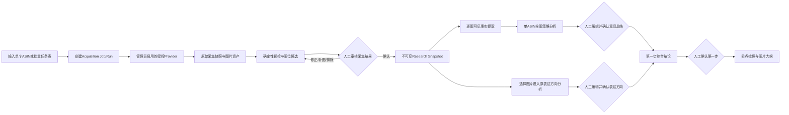

# 智能图片建议第一步：竞品全图总结分析优化方案

**版本：** v1.0 方案评审稿  
**日期：** 2026-09-13  
**作者：** Manus AI  
**本轮范围：** 只评审和优化方案；不启用采集连接器、不运行竞品采集、不修改代码、不迁移数据库、不发布。

## 1. 结论

方案**可行**，但不能在现有“卖点表达方向分组”上直接增加一个大文本总结。正确做法是在智能图片建议的用户侧第一步内建立两条并行、可分别编辑确认的分析轨道：新增的**竞品全图策略分析**按单个ASIN理解整套主图和可获取的A+图片；原有的**单一卖点表达方式分析**继续按表达方向横向比较不同竞品图片。两条轨道确认后，再生成第一步的综合结论，供后续卖点梳理和图片大纲使用。

> **推荐产品结构：纵向看一个竞品怎样用整套图片讲故事，横向看多个竞品怎样表达同一个卖点。两者不能互相替代。**

| 判断项 | 结论 | 说明 |
|---|---|---|
| 输入ASIN后采集公开基础信息和图片 | 有条件可行 | 必须通过管理员启用的受控Provider；禁止复用项目现有的直连页面、代理、UA轮换式抓取器。 |
| 获取完整主图组 | 可行，但需Provider实样验收 | 候选Provider公开说明支持图片或附加图片，但当前选定Apify Actor的公开输出示例没有证明完整主图数组。 |
| 获取A+图片 | 部分可行，不能承诺100% | A+可能不存在、未返回或因Provider被阻断而缺失；必须区分状态，不能把空值当成“商品没有A+”。 |
| 分析该竞品的所有图片 | 可行 | 采用“逐图事实卡 → 分区聚合 → 整套叙事总结”的分层分析，确保所有已确认图片都进入分析，不随机抽样。 |
| 参考图片知识库的展示形式 | 可行且推荐 | 复用ASIN套图卡片、缩略图拼图、状态徽标、详情抽屉和分组图库交互；数据、权限和用途必须与图片知识库隔离。 |
| 保留原单一卖点表达方式分析 | 必须保留 | 现有功能解决跨竞品同类表达比较，新功能解决单竞品整套策略理解，职责不同。 |

## 2. 现有系统与新增需求的差距

当前用户侧第一步在代码内部名为Step 0。它以“表达方向”为中心：每个表达方向上传1–5张不同竞品图片，AI分析图片类型、构图、配色、卖点表达方式和亮点，再形成跨表达方向总结。现有执行链使用`image.step0.competitor.analysis`逐组分析，并将最终汇总写入会话的`step0AiResult`。它不是按ASIN组织，也没有竞品基础信息、整套图片顺序、采集快照或竞品级确认版本。

| 当前能力 | 现状 | 新需求带来的缺口 |
|---|---|---|
| 数据组织 | `expression_groups`按卖点表达方向组织图片 | 需要按`marketplace × ASIN × snapshot`组织完整图组。 |
| 图片来源 | 人工上传图片并填写竞品名称 | 需要受控Provider采集基础信息、主图和可获取A+；人工上传改为补充与纠错。 |
| AI分析 | 对同一表达方向的多张图做综合分析 | 需要先逐图提取可见事实，再总结一个竞品的整套叙事。 |
| 人工确认 | 编辑每个表达方向，再确认一个Step 0总结 | 需要分别确认采集快照、竞品全图总结、表达方式分析和最终综合结论。 |
| 页面展示 | 三栏表达方向卡片 | 需要增加图片知识库式的ASIN套图卡片、完整图库和分析详情。 |
| 数据安全 | 图片URL直接存于表达组 | 新采集图片必须保留Provider、Run、来源、哈希、图位、状态，并禁止进入我方素材池。 |

因此，**不得把竞品全图分析塞入现有`step0AiResult`或用竞品名称字符串拼接图片**。这会丢失ASIN身份、快照版本、图片顺序、来源与人工确认状态，也会让后续无法判断AI到底分析了哪一版图片。

## 3. 第一部页面的推荐信息架构

用户仍看到一个“第一步：竞品图片分析”，内部不调整后续步骤编号。页面改为三个页签，保持原有流程连续性。

| 页签 | 定位 | 主要输入 | 结构化输出 | 确认对象 |
|---|---|---|---|---|
| **竞品全图分析（新增，默认）** | 纵向理解每个竞品整套图片策略 | 已确认的单ASIN采集快照 | 单竞品全图策略Artifact | 每个竞品独立确认 |
| **卖点表达方式（原功能保留）** | 横向比较不同竞品如何表达同一卖点 | 人工上传图片，或从已确认竞品图库选图 | 表达方向分析Artifact | 每个表达方向独立确认 |
| **综合结论** | 合并纵向与横向结论，形成后续输入 | 已确认的竞品全图与表达方向Artifact | 第一部综合结论 | 第一部最终确认 |

### 3.1 竞品全图分析页签

顶部保留站点选择、单ASIN输入、批量任务表上传和最近采集批次。下方使用图片知识库式ASIN卡片，每张卡片展示主图拼图、ASIN、标题、品牌、站点、图片数量、A+覆盖、采集时间、分析状态和竞品角色。

竞品角色建议增加三种：`主要竞品`、`对标竞品`、`补充样本`。同一研究项目必须指定一个主要竞品；其他竞品仍可执行全图分析，但主要竞品在综合结论中获得更高叙事权重，而不是被当成唯一事实来源。

点击卡片后打开右侧大抽屉或全屏详情，布局参考图片知识库，但内容改为研究工作台。

| 详情区域 | 展示与交互 |
|---|---|
| 左侧：竞品身份 | 标题、品牌、ASIN、站点、变体、类目、采集时间、Provider、字段覆盖和风险提示；支持人工修订但不覆盖原快照。 |
| 中部：完整图库 | 按`主图组 / A+ / 品牌故事 / 未归位`分组，保留原始顺序；支持排除、归位、排序修正、重复标记和大图预览。 |
| 右侧：全图策略 | 展示AI结构化总结；每个区块可编辑、接受、退回重跑或标记“证据不足”。 |
| 底部：版本与证据 | 显示Snapshot版本、分析Run、Prompt/Skill版本、确认人、确认时间和Revision历史。 |

所有竞品图片卡片必须显示**“仅限内部研究证据，不可作为我方素材或生成参考图”**。即使视觉组件复用图片知识库，也不能写入`kb_image_sets`/`kb_images`的共享素材池，不能出现在后续“选择我方参考图”列表中。

### 3.2 卖点表达方式页签

当前三栏表达方向卡片完整保留，包括图片类型、构图、配色、卖点表达方式和亮点标签。只增加一个输入入口：除人工上传外，可点击“从已确认竞品图库选图”，按ASIN和图位选择图片。

选入表达方向时保存的是资产引用和来源快照，不复制图片为我方素材。原有“最多5张不同竞品的同类图片”规则继续保留。现有历史项目、历史图片和历史分析结果按原方式显示，不强制迁移。

### 3.3 综合结论页签

综合结论不再只显示整体趋势、常见构图、配色和差异化机会。建议升级为以下六块：主要竞品叙事摘要、市场共性表达、卖点覆盖与首现图位、证明方式与顾虑处理、视觉同质化、可考虑的差异化机会。

综合结论只能读取**已确认**的竞品全图Artifact和表达方向Artifact。若某个竞品A+没有返回，结论必须显示覆盖限制，不得推断其没有A+，也不得用模型补造。

## 4. 端到端流程



这条链路明确区分四种状态：**采集成功不等于快照确认，快照确认不等于AI结论正确，AI草稿不等于业务确认，竞品可见主张不等于我方可用主张。**

## 5. “所有图片分析”的AI逻辑

### 5.1 为什么不能一次把所有图片丢给一个Prompt

竞品可能包含主图、副图、A+模块、品牌故事和重复资产。一次性多图总结容易忽略中间图片、混淆图位、把OCR推断当事实，也无法证明是否覆盖了全部图片。推荐采用分层Run，每层都有结构化结果和证据引用。

| 分层 | Skill | 输入 | 输出 |
|---|---|---|---|
| 逐图层 | `dev.image.visible-fact-extraction.v1` | 单张已确认资产、图位、竞品身份 | OCR、可见对象、主张、场景、构图、证明方式、事实/推断/问题、置信度、证据引用 |
| 分区层 | `dev.image.gallery-section-analysis.v1` | 同一ASIN的主图组或一个A+分区的全部事实卡 | 图位顺序、卖点首现、内容递进、重复、缺口、分区结论 |
| 全图层 | `dev.image.gallery-narrative-analysis.v1` | 该ASIN所有分区结论与事实卡 | 整套叙事、卖点层级、证明体系、受众/场景、顾虑处理、视觉系统、品牌一致性、缺口与机会 |
| 综合层 | `dev.image.competitor-step1-synthesis.v1` | 已确认全图总结和原表达方向分析 | 第一部综合结论及后续卖点梳理输入 |

如果某竞品图片很多，系统按`主图组 / A+模块批次 / 品牌故事`切分处理，再用确定性清单核对每个`assetId`均被一个事实卡覆盖。**不允许随机抽图，不允许只分析评分高的图，不允许因模型上下文限制静默遗漏。**

### 5.2 单竞品全图策略Artifact

输出必须是可编辑JSON，而不是长篇Markdown。推荐核心结构如下。

```json
{
  "competitor": {
    "asin": "B0XXXXXXX",
    "marketplace": "US",
    "researchRole": "primary",
    "snapshotId": "snapshot_xxx"
  },
  "coverage": {
    "confirmedAssetCount": 12,
    "analyzedAssetCount": 12,
    "mainGalleryStatus": "complete",
    "aPlusStatus": "not_returned",
    "limitations": ["Provider未返回可确认的A+资产"]
  },
  "galleryStrategy": {
    "oneSentenceSummary": "",
    "narrativeSequence": [],
    "sellingPointHierarchy": [],
    "proofPatterns": [],
    "audienceAndScenes": [],
    "objectionHandling": [],
    "visualSystem": {},
    "brandConsistency": {},
    "contentGaps": [],
    "abstractLearnablePatterns": []
  },
  "evidenceRefs": [],
  "openQuestions": [],
  "confidence": "high"
}
```

其中`abstractLearnablePatterns`只能描述抽象策略，例如“先场景后结构证明”，不能输出“复制第3张图的布局、文案或素材”。每一项主要结论必须附`assetId`或事实卡引用；无证据的结论进入`openQuestions`。

### 5.3 提示词硬约束

系统提示词必须包含以下规则：只分析已确认Research Snapshot；区分`visible_fact`、`inference`和`open_question`；不把竞品图片、数字、认证、文案转成我方产品主张；不得评价真实转化效果；不得要求访问外部URL、浏览器或Provider；图片缺失时显示覆盖限制；输出必须符合JSON Schema。

现有`image.step0.competitor.analysis`继续服务原表达方向分析。建议新增版本化Skill，而不是直接改写旧Skill的输入输出，这样历史Run可复现，旧项目不会因Schema变化而无法打开。

## 6. 受控采集方案

### 6.1 可行路线比较

| Approach | Tradeoffs | Cost | Setup Complexity |
|---|---|---|---|
| **完整受控采集链（推荐）**：管理员启用Provider，建立Job/Run、快照、资产预检、人工确认和全图分析 | 产品体验完整，支持单个与批量ASIN、可追溯和可替换Provider；开发量较大，必须先做Actor字段验收 | Provider按量/订阅费用 + 多图AI分析费用；每个Run记录估算成本 | 中高 |
| **轻量试点**：只做单ASIN按需采集，先保证基础信息和主图，A+允许人工补充；不做批量队列 | 上线快、风险和成本低；暂时不能承诺自动获取A+，也不适合大批量研究 | 较低，按用户主动操作产生 | 中 |
| **Amazon官方目录补充**：在有合格卖家授权时接入Catalog Items | 官方、结构化，可补基础目录和catalog images；不能当作任意竞品A+读取接口 | 依赖既有卖家/开发者资格和维护成本 | 高 |

推荐执行“完整架构、轻量上线”：数据模型、Provider Adapter和审计一次设计正确，但首个生产版本只开放US、单ASIN、主动采集、基础信息和主图；A+只有在实样验收通过后才打开。批量上传在单ASIN质量稳定后再启用。

### 6.2 Provider选择结论

当前任务配置中存在Apify连接器，但均未启用，本轮没有修改配置或调用Provider。用户方案指定的`junglee/amazon-asins-scraper`可以作为第一个候选，但公开输出示例只证明基础信息和缩略图，未证明完整主图数组或A+字段。[1]

Apify同厂商另一个Amazon Product Scraper的公开Issue说明，A+字段可能因为Amazon静默阻断而返回`null`；维护者后来增加了额外重试选项，但这仍意味着空值不能被解释为“商品无A+”。[2] Bright Data公开说明了primary image、additional images、thumbnail和image count，可作为主图组备选Provider，但其公开页面同样没有明确承诺A+模块。[3]

因此，**不要在产品需求中绑定某个Actor，也不要把A+写成必达字段**。Provider验收必须先验证三类ASIN：有A+商品、无A+商品、存在变体的商品。每类至少核对基础信息、主图数量与顺序、A+模块、清晰度、变体一致性、空值语义、错误码和成本。未通过的采集范围在UI中保持关闭。

Amazon Catalog Items API可以按ASIN和marketplace读取目录信息，并选择返回images、summaries、attributes和relationships等数据；A+ Content API则面向获得卖家授权的内容创建与管理，不是任意竞品公开A+的通用读取接口。[4] [5]

### 6.3 禁止复用的旧采集链

项目现有图片知识库ASIN导入会直接请求Amazon页面，并使用代理、UA/指纹轮换、反自动化重试和页面选择器解析。该实现与当前项目“仅管理员启用受控Provider”的约束冲突。新功能只能复用知识库的展示组件、图片预览、标签和审核交互，**不能调用旧`scrapeAmazonProduct`或`crawlCompetitorData`**。

## 7. 数据模型建议

新功能应落在产品开发/竞品研究域，不能直接复用知识库表，也不能只增加几个会话JSON字段。

| 对象 | 核心字段 | 关键约束 |
|---|---|---|
| `competitor_research_subjects` | workspace、project、marketplace、ASIN、variant、researchRole、sampleWeight、status | 同项目同站点同ASIN唯一；主要竞品唯一约束由服务端校验 |
| `competitor_acquisition_jobs` | requester、Provider、范围、缓存策略、状态、预算 | Job表达用户意图，不承载采集事实 |
| `competitor_acquisition_runs` | Job、Provider Run、attempt、状态、错误类别、耗时、成本 | 每次重试生成新Run，不覆盖旧Run |
| `competitor_source_snapshots` | Run、ASIN、站点、capturedAt、rawEvidenceRef、fieldStatus、contentHash | 原始快照不可原地修改 |
| `competitor_image_assets` | snapshot、assetKey、sourceUrlRef、storageKey、hash、尺寸、原始顺序、candidateSlot、status | 竞品证据资产与知识库素材隔离 |
| `competitor_snapshot_revisions` | snapshot、字段/图位修订、before/after、reason、editor | 人工修订不覆盖原始值 |
| `competitor_research_snapshots` | sourceSnapshot、selectedAssetIds、revisionIds、confirmedBy、version | 只有confirmed版本可进入AI |
| `competitor_image_fact_cards` | researchSnapshot、asset、AI结果、userEdit、status、Skill版本 | 每张已纳入图片必须有且仅有一个当前事实卡 |
| `competitor_gallery_analyses` | subject、researchSnapshot、AI结果、userEdit、coverage、status、version | 单竞品全图总结独立确认 |
| `expression_group_asset_links` | expressionGroup、competitorAsset、sortOrder | 让原功能从图库选图，同时保留历史手工图片 |
| `step1_synthesis_artifacts` | session、galleryAnalysisIds、expressionGroupVersions、result、userEdit、confirmed | 第一部综合结论的可追溯输入清单 |

当前`image_workflow_sessions.step0AiResult`继续保存旧版综合结果或兼容投影；新的全图分析应使用独立表和Artifact版本。确认第一部时可以写入一个轻量的兼容摘要，但不能把全部资产和明细塞入会话字段。

## 8. 皇帝AI中台映射

| 层级 | 建议ID | 职责 | 禁止事项 |
|---|---|---|---|
| Tool | `amazon.catalog.acquire` | 调用管理员启用的Provider，返回原始响应引用 | 不确认数据，不写分析，不访问其他工作空间 |
| Tool | `amazon.catalog.asset-store` | 将Provider合法返回的图片写入对象存储并生成哈希 | 不将竞品图片放入我方素材库 |
| Tool | `amazon.catalog.preflight` | 执行尺寸、哈希、图位、重复、可读性预检 | 不替代人工审核 |
| Skill | `dev.image.visible-fact-extraction.v1` | 单图可见事实与证据提取 | 不访问外部页面，不生成我方主张 |
| Skill | `dev.image.gallery-section-analysis.v1` | 分析主图组或A+分区叙事 | 不静默丢图 |
| Skill | `dev.image.gallery-narrative-analysis.v1` | 生成单ASIN全图策略 | 不复制独特版式或文案 |
| Skill | `image.step0.competitor.analysis` | 保留原单一卖点表达方式分析 | 不改写旧Schema |
| Skill | `dev.image.competitor-step1-synthesis.v1` | 合并已确认的纵向/横向分析 | 不读取未确认快照 |
| Agent | `dev.asin-acquisition-agent` | 协调采集Job、Run、快照和问题队列 | 不自动确认快照 |
| Agent | `dev.competitor-image-analysis-agent` | 协调事实卡、全图总结和综合结论 | 不批准结果，不自动推进后续步骤 |

每次Job和Run必须保存Tool、Skill、Agent版本、输入快照ID、输出Artifact ID、耗时、错误类别和成本估算。修改AI能力时，前台字段、服务端Schema、后台Skill目录和Artifact版本必须同步调整。

## 9. 人工确认与兼容策略

对于新建研究项目，第一部最终确认建议要求：至少一个标记为“主要竞品”的全图分析已确认；至少一个原表达方向分析已确认；综合结论已被用户审核。其他竞品可以处于未分析或待补充状态，但必须在覆盖说明中列出。

对于已有项目，不强制补采ASIN或重新分析。历史`expression_groups`和`step0AiResult`按兼容模式继续打开和导出；只有用户主动选择“升级为全图分析”时才创建新的Research Subject和采集Job。

| 动作 | 是否自动 | 是否可编辑 | 是否形成新版本 |
|---|---|---|---|
| Provider采集 | 用户触发后异步执行 | 原始快照不可编辑 | 每次Run形成新快照 |
| 图位/基础字段修订 | 否 | 是 | 是，保存Revision |
| 逐图事实卡生成 | 确认快照后可一键启动 | 是 | 重跑形成新版本 |
| 单竞品全图总结 | 事实卡齐全后可一键启动 | 是 | 重跑形成新版本 |
| 表达方向分析 | 保持现有手动/后台分析 | 是 | 保持现有版本兼容 |
| 第一部综合结论 | 两轨有确认结果后生成 | 是 | 确认形成Artifact版本 |
| 进入后续卖点梳理 | 否 | 用户确认后推进 | 记录所引用Artifact版本 |

## 10. 批量任务表优化

用户提供的18列表格可以继续使用，但为了区分“主要竞品全图分析”和原表达方向分析，建议增加两个用户输入列，不改动现有系统状态列。

| 新增列 | 取值 | 用途 |
|---|---|---|
| `Research Role*` | `primary / benchmark / supplementary` | 指定主要竞品和样本角色；每个研究项目只能有一个primary |
| `Analysis Tracks*` | `gallery / expression / both` | 决定该ASIN进入全图分析、表达方式选图池或两者 |

现有`Include in Analysis`表示是否纳入本次研究，`Sample Weight`表示跨竞品综合时的权重，不能代替新增的角色和分析轨道。`Collection Scope`继续控制采集字段范围；即使选择A+，Provider未返回时也只能记录部分成功。

## 11. 分阶段实施方案

| 阶段 | 实施内容 | 退出条件 |
|---|---|---|
| **P0-A：Provider资格验证** | 管理员启用一个受控Provider；使用经批准的3类试点ASIN验证基础信息、完整主图、A+、变体、错误语义和成本 | 形成字段覆盖报告；只开放实测通过的采集范围 |
| **P0-B：采集与审核底座** | 单ASIN表单、Job/Run、原始快照、资产入库、预检、人工确认、24小时缓存 | 单ASIN可形成不可变Research Snapshot；部分失败真实展示 |
| **P1-A：竞品全图分析** | ASIN卡片/详情抽屉、逐图事实卡、分区分析、全图策略、编辑确认 | 一个主要竞品的全部确认图片均有证据卡并形成已确认全图Artifact |
| **P1-B：双轨整合** | 原表达方向页签保留；增加从竞品图库选图；综合结论与后续输入契约 | 全图与表达分析可分别确认，综合结果可追溯到具体版本 |
| **P1-C：批量能力** | 批量表新增角色/轨道列、父Job/子Run、仅重试失败项、批量审核 | 10行混合任务可准确显示成功、部分失败、待确认和失败 |
| **P2：多Provider与官方补充** | Provider路由、SP-API Catalog补充、字段比对、预算治理 | 切换Provider不改变快照、资产和分析Artifact契约 |

不建议先做“定时刷新”。首期保持用户主动采集和24小时缓存，避免持续产生Provider费用、重复图片和待审核队列。

## 12. 验收标准

| 编号 | 验收标准 |
|---|---|
| GAL-01 | 输入US站ASIN后创建真实异步Run；前端不会把等待中显示为成功或空数据。 |
| GAL-02 | 每个字段和图片能追溯到Provider、Run、采集时间、来源、哈希和字段状态。 |
| GAL-03 | `A+为空`能区分已确认无A+、Provider未返回和疑似被阻断；AI不补造。 |
| GAL-04 | 所有纳入Research Snapshot的图片均生成事实卡；`analyzedAssetCount = confirmedAssetCount`才允许生成全图总结。 |
| GAL-05 | 用户可以编辑每张图的OCR/事实和全图总结，每次修改保留Revision。 |
| GAL-06 | 图片知识库式卡片、图库分组和详情抽屉可用，但竞品资产不会进入共享知识库、我方参考图或生成素材选择器。 |
| GAL-07 | 原表达方向页面、历史数据、最多5张图片规则、字段编辑和确认流程保持可用。 |
| GAL-08 | 可从已确认竞品图库选择图片进入表达方向，且保留资产与快照引用。 |
| GAL-09 | 第一部综合结论只读取已确认版本，并显示输入竞品、图片覆盖和限制。 |
| GAL-10 | 后续卖点梳理只能把竞品结论当市场证据，不能自动变成我方产品事实或可用主张。 |
| GAL-11 | 未启用Provider、权限不足、额度不足、429、超时、无商品和变体冲突分别显示固定错误类别。 |
| GAL-12 | 旧直连页面抓取器不被新路由调用；AI Skill没有浏览器、Provider或外部发布权限。 |

## 13. 建议确认的产品决策

| 决策 | 推荐值 | 影响 |
|---|---|---|
| 第一部是否采用三个页签 | **采用：竞品全图 / 卖点表达 / 综合结论** | 最清楚地保留旧功能并新增纵向分析。 |
| 是否要求一个主要竞品 | **要求** | 确保“主要竞争对手”有明确对象；其他竞品仍可分析。 |
| A+未返回是否阻塞全图分析 | **不阻塞，但必须显示覆盖限制** | 主图可先分析，避免把Provider能力问题伪装成业务空数据。 |
| 新项目第一部确认门槛 | **主要竞品全图已确认 + 至少一个表达方向已确认 + 综合结论已确认** | 保证两条分析轨道都真正参与后续。 |
| 首期上线方式 | **完整架构、单ASIN主动采集先上线** | 先验证质量，再开放批量，降低失败和成本风险。 |
| Provider选择 | **先做资格验收，不把产品绑定到某个Actor** | 当前Apify候选Actor未公开证明完整主图/A+；保留替换能力。 |

## 14. 最终推荐

建议批准本方案，但实施时严格按照以下顺序：先完成受控Provider资格验收，再做独立采集快照与审核链，然后新增竞品全图页签和分层AI分析，最后把已确认图库接入原表达方式页签。不要先把ASIN输入框直接接到旧爬虫，也不要把采集结果直接写入图片知识库或`step0AiResult`。

该方案同时满足用户的两个核心要求：竞品图片和基础信息由受控Provider直接采集；展示形式借鉴图片知识库。同时保留了原单一卖点表达方式分析，并让两种分析在第一部形成明确的纵向/横向互补关系。

## References

[1]: https://apify.com/junglee/amazon-asins-scraper "Amazon ASINs Scraper · Apify"
[2]: https://apify.com/junglee/amazon-crawler/issues/a-content-remElFJa1Oa0MLzx0 "A+ Content Issue · Amazon Product Scraper · Apify"
[3]: https://brightdata.com/products/web-scraper/amazon "Amazon Scraper API · Bright Data"
[4]: https://developer-docs.amazon.com/sp-api/docs/catalog-items-api-v2022-04-01-reference "Catalog Items API v2022-04-01 Reference · Amazon Selling Partner API"
[5]: https://developer-docs.amazon.com/sp-api/docs/a-plus-content-api-use-case-guide "A+ Content API Use Case Guide · Amazon Selling Partner API"
[6]: https://developer-docs.amazon.com/sp-api/docs/create-edit-publish-aplus-content "Create, edit, and publish A+ content · Amazon Selling Partner API"
