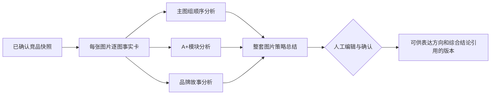
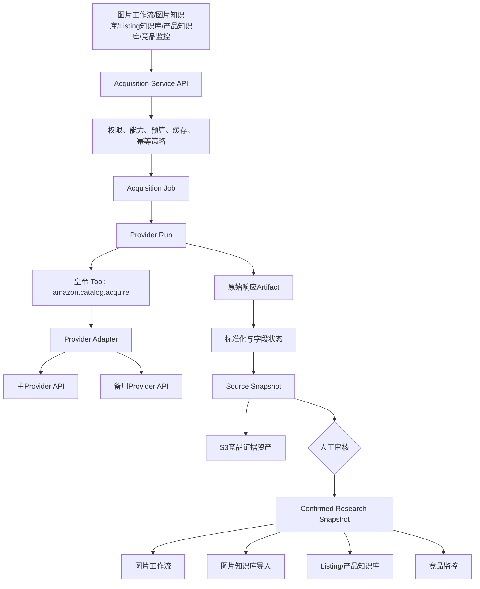

# 智能图片建议竞品分析与统一受控采集平台：完整实施方案

**版本：** v2.0 待确认实施稿  
**日期：** 2026-09-13  
**作者：** Manus AI  
**方案状态：** 待产品确认；当前不实施代码、连接器、采集、数据库迁移或生产发布。

## 1. 方案摘要

本方案同时解决两个问题。第一，在智能图片建议第一步中新增**主要竞争对手整套图片分析**，并保留原有**卖点表达方式分析**；用户可以从所有已确认的竞品图库中，按卖点和表达方式筛选、批量点选同类图片，并与现有表达方向分析双向联动。第二，建设一个面向全系统的**统一受控Amazon公开商品采集平台**，以外部Provider API替代当前不稳定的内嵌HTML爬虫，统一服务智能图片建议、图片知识库、Listing知识库、产品知识库、竞品分析、竞品监控和其他合格消费者。

> **核心产品原则：一个受控采集底座，多模块消费同一份已确认快照；纵向理解主要竞品整套图片，横向比较不同竞品对同一卖点的表达。**

新平台采用“外部Provider API + 系统Provider Adapter + 皇帝Tool/Agent/Job/Run + Acquisition Snapshot + 人工审核”的结构。它不是浏览器插件，不要求运营人员安装任何组件；也不是继续维护旧爬虫。普通用户仍在系统页面内操作，只有超级管理员配置公司的Provider账号和费用预算。

## 2. 已确认需求与实施边界

| 需求 | 方案响应 |
|---|---|
| 分析主要竞争对手的所有图片 | 以主要竞品的已确认Research Snapshot为唯一输入，覆盖全部主图、副图及可获取的A+、品牌故事图片；逐图分析后再做整套叙事总结。 |
| 保留原竞争对手单一卖点表达方式分析 | 原表达方向卡片、人工上传、构图、配色、卖点表达和亮点标签继续保留，并增加从竞品图库选图的入口。 |
| 点选所有同一表达方式的卖点图片并联动 | 新增跨竞品图库选择工作台，支持AI推荐、筛选、批量全选、人工增删和确认；确认后的资产链接直接成为表达方向分析输入。 |
| 采集竞品图片和基本信息 | 只能通过管理员启用的受控Provider采集；进入独立Acquisition Job/Run/Snapshot，人工确认后才能被AI消费。 |
| 参考图片知识库展示 | 复用ASIN套图卡片、缩略图拼图、完整图库、状态标签和详情抽屉交互；竞品证据资产与知识库素材严格隔离。 |
| 新爬虫替代全系统旧爬虫 | 建设统一Provider Adapter和标准数据合同，分阶段迁移所有旧调用入口；迁移完成后禁止旧爬虫作为自动降级。 |
| 用户确认后再实施 | 本文只提供开发级方案；未启用Provider、未运行采集、未改代码、未迁移、未发布。 |

## 3. 当前系统现状与根因

当前系统存在两套直接访问Amazon页面的内嵌实现：`server/scraper.ts`负责标题、五点、价格、评分、图片和A+解析；`server/crawlerEngine.ts`负责竞品价格/排名/评论监控及关键词排名。二者都依赖`server/antiBot.ts`的代理池、User-Agent/浏览器指纹轮换、CAPTCHA识别、延迟和重试，并使用Cheerio按页面选择器解析。

该方式失败频繁，不是某一个选择器的孤立缺陷，而是执行架构本身不稳定：页面结构、地区跳转、反自动化、验证码、异步模块、变体页和代理质量都会改变返回内容；同时旧代码无法可靠区分“商品无该字段”和“请求被阻断后字段未加载”。

### 3.1 旧内嵌爬虫消费者清单

| 现有消费者 | 旧入口 | 当前用途 | 新平台目标能力 | 迁移优先级 |
|---|---|---|---|---|
| 图片知识库 | `kbImages.processImport/processPartialReCrawl` | ASIN导入完整图片、A+、品牌故事并做AI标签 | `catalog_basic + image_gallery + aplus + brand_story` | P1 |
| Listing知识库 | `kbListings`三个导入/刷新入口 | 标题、五点、描述等Listing内容 | `catalog_basic + listing_content` | P2 |
| 产品知识库 | `kbProducts`三个导入/刷新入口 | 标题、品牌、价格、评分、图片及产品创新分析 | `catalog_basic + offers + ratings + image_gallery` | P2 |
| 项目竞品分析 | `analysis.analyzeSingleAsin` | 抓取后调用竞品Listing与评论Skill | `catalog_basic + listing_content`；评论另设能力 | P2 |
| 转化率对比采集 | `conversionDataCollector` | 同时调用两套旧爬虫并拼接广告数据 | 目录采集改用统一Snapshot；广告继续使用领星受治理事实 | P3 |
| 竞品价格/排名监控 | `crawlerRouter/crawlerEngine` | 价格、BSR、评分、评论、库存和主图快照 | `offers + rankings + ratings + availability` | P3 |
| 关键词排名监控 | `crawlerEngine.crawlKeywordRank` | 搜索结果自然位和广告位 | 独立`search_rank`Provider能力，不能假设商品详情Provider支持 | P4 |
| 系统设置爬虫测试 | `systemSettings.testScrape` | 用固定ASIN测试代理与旧爬虫 | 改为Provider连接测试、能力探测和配额检查 | P1 |
| 图片AI分析器 | 仅引用旧`ProductImage`类型 | 单图视觉分析 | 类型迁移至共享标准Asset合同，不需要采集权限 | P1 |

`KBVideos`当前把Amazon商品页URL当作视频URL或转写输入，但它不属于可靠的视频采集链。统一平台首期不宣称支持Amazon视频下载；只有Provider明确返回合法视频资产且完成合规审核后，才新增`product_video`能力。

## 4. 总体产品结构

用户侧仍保留“Step 0：竞品图片分析”的名称，以免影响现有项目和后续步骤。Step 0内部升级为三个页签。

| 页签 | 核心问题 | 分析方向 | 与后续关系 |
|---|---|---|---|
| **主要竞品全图分析** | 一个主要竞品如何用整套图片建立认知、证明卖点和处理顾虑？ | 单竞品纵向分析 | 为卖点优先级、图位叙事和视觉策略提供输入 |
| **卖点表达方式分析** | 不同竞品如何表达同一个卖点？ | 跨竞品横向比较 | 保留原功能，并从完整竞品图库批量选图 |
| **综合结论** | 我方应该学习哪些抽象规律，避免哪些同质化？ | 纵向与横向合并 | 经人工确认后供卖点梳理、图片大纲和后续设计使用 |

### 4.1 主要竞品与竞品样本角色

每个图片工作流项目至少指定一个`主要竞品（primary）`。其余ASIN可以标记为`对标竞品（benchmark）`或`补充样本（supplementary）`。主要竞品不是唯一数据来源，而是整套图片叙事分析的主对象。

| 角色 | 全图分析 | 参与表达方向选图 | 综合权重 |
|---|---:|---:|---:|
| 主要竞品 | 必须 | 必须 | 高，但不得覆盖市场共性证据 |
| 对标竞品 | 推荐 | 必须 | 中 |
| 补充样本 | 可选 | 可选 | 低，只用于补充表达证据 |

系统不通过销量、评论数或模型主观评分自动指定主要竞品。用户必须显式选择，后续可改，但改动会使综合结论失效并要求重新确认。

## 5. 主要竞争对手整套图片分析

### 5.1 页面布局

默认页签使用与图片知识库一致的ASIN套图卡片。每张卡片展示主图拼图、ASIN、标题、品牌、站点、竞品角色、主图数量、A+数量、采集时间、快照状态和全图分析状态。

点击主要竞品卡片打开全屏工作台，分为四区。

| 区域 | 内容 | 人工动作 |
|---|---|---|
| 商品身份区 | ASIN、站点、标题、品牌、类目、变体、价格/评分可用状态、Provider、采集时间 | 修正分类或标记变体不一致；不覆盖原始快照 |
| 完整图库区 | 按主图、副图、A+、品牌故事、未归位分组，保留原始顺序和大图预览 | 排除、归位、调整顺序、标记重复、上传补充图片 |
| 逐图事实卡 | OCR、可见卖点、表达方式、证明方式、场景、构图、配色、文字密度、事实/推断/疑问 | 编辑、接受、退回重跑、标记证据不足 |
| 整套策略区 | 卖点层级、图位顺序、叙事、证明体系、顾虑处理、受众场景、视觉系统、重复和缺口 | 编辑、确认、创建表达方向或转入待讨论 |

竞品图片始终显示“仅供内部研究，不可作为我方素材”。竞品图片不能进入后续生成工具的图像输入，除非未来另行建立合规授权机制；本方案不包含该能力。

### 5.2 全图分析的数据处理

系统不一次性让模型概括全部图片，而是按三层分析。



每张纳入分析的图片必须有一个事实卡；只有`analyzedAssetCount = confirmedAssetCount`时才允许生成全图总结。图片较多时按分区和批次处理，但不能随机抽图或静默跳过。

### 5.3 全图总结字段

| 维度 | 结构化字段 | 业务问题 |
|---|---|---|
| 一句话策略 | `oneSentenceStrategy` | 该竞品整套图片最核心的说服逻辑是什么？ |
| 图位叙事 | `narrativeSequence[]` | 每个图位承担什么任务，先后顺序如何递进？ |
| 卖点层级 | `sellingPointHierarchy[]` | 核心卖点、支持卖点和补充信息分别是什么？ |
| 证明方式 | `proofPatterns[]` | 数据、结构、对比、场景、细节、认证或使用步骤如何证明？ |
| 顾虑处理 | `objectionHandling[]` | 尺寸、兼容、安装、耐用、安全等顾虑在哪张图被处理？ |
| 人群与场景 | `audienceScenes[]` | 图片在指向哪些用户、场景和使用时刻？ |
| 视觉系统 | `visualSystem` | 配色、字体、图标、构图、留白、信息密度和品牌一致性如何？ |
| 重复与缺口 | `repetitionAndGaps` | 哪些卖点重复，哪些高价值问题没有回答？ |
| 可学习规律 | `abstractPatterns[]` | 只输出抽象方法，不复制竞品素材、文案或独特版式。 |
| 证据覆盖 | `evidenceRefs[]` | 每项结论引用对应Asset和事实卡；无证据则进入开放问题。 |

## 6. 与原“卖点表达方式分析”的点选联动

### 6.1 核心交互

用户在“卖点表达方式分析”页签点击`新建方向`或打开已有方向后，新增`从竞品图库选图`按钮。按钮打开“同表达图片选择工作台”。

| 布局 | 功能 |
|---|---|
| 左侧筛选器 | 竞品角色、ASIN、主图/A+/品牌故事、卖点类别、表达方式、证明方式、场景、图位和AI置信度 |
| 中间图片墙 | 按竞品ASIN分组展示全部已确认图片；每张显示图位、卖点标签、表达标签和勾选框 |
| 顶部批量操作 | 选择AI推荐、选择当前筛选全部、按ASIN全选、清空、只看已选 |
| 右侧已选托盘 | 按竞品统计图片数，支持拖动排序、删除、备注和确认选择 |
| 底部联动摘要 | 显示当前表达方向、覆盖竞品数、图片数、主图/A+比例、卖点覆盖和待补样本提示 |

用户操作顺序如下：先定义`卖点主题`，再选择或创建`表达方式`，系统依据逐图事实卡给出候选图片；用户可以一键选择全部推荐图片，也可以继续筛选和人工增删；确认后，图片与表达方向建立资产链接，原分析按钮分析全部已选图片。

### 6.2 “同一卖点”和“同一表达方式”必须分开

卖点是**说什么**，表达方式是**怎么说**。例如“耐用”是卖点；“数据对比”“结构剖面”“使用场景”“前后对比”是表达方式。选择器必须先选卖点，再选表达方式，避免把不同信息维度混在一个标签里。

| 字段 | 示例 | 是否人工可改 |
|---|---|---:|
| `sellingPointTopic` | 耐用性、兼容性、易安装、尺寸容量 | 是 |
| `expressionMethod` | 数据对比、结构拆解、场景使用、步骤示意、痛点对比 | 是 |
| `proofMethod` | 测量数字、材料细节、兼容型号、用户操作过程 | 是 |
| `imageRole` | 主视觉、问题提出、功能证明、顾虑处理、总结 | 是 |

AI可以推荐标签，但只能作为候选。用户确认后的标签和选图版本才进入表达方向分析。

### 6.3 选图规则

原功能的手工上传模式继续保留并维持“1–5张不同竞品图片”的历史行为。新增图库联动模式需要支持用户选择**所有符合条件的图片**，因此不能沿用5张硬上限。

| 模式 | 数量规则 | 分析方式 |
|---|---|---|
| 历史手工上传 | 继续最多5张 | 保持现有分析与数据兼容 |
| 竞品图库联动 | 不设置5张硬上限；超过30张显示成本和耗时提示 | 按批次提取共性与差异，再合并为完整表达方向结果 |

同一Asset在同一个表达方向内只能出现一次；如果一张图同时表达两个卖点，可以被不同表达方向引用，但UI必须显示多方向引用状态。删除表达方向链接不能删除原始竞品资产或快照。

### 6.4 双向联动

| 起点 | 联动动作 | 结果 |
|---|---|---|
| 主要竞品全图总结 | 点击某卖点或表达方式的“创建分析方向” | 自动创建表达方向草稿并预选该竞品的证据图片 |
| 逐图事实卡 | 点击标签 | 打开表达方向选择器并显示所有竞品的同标签候选 |
| 表达方向卡片 | 点击“从竞品图库选图” | 进入跨竞品筛选和批量点选 |
| 表达方向分析 | 点击某个差异结论 | 回到原图片和对应竞品全图上下文 |
| 综合结论 | 点击证据数量 | 展开来源ASIN、图位、快照版本和人工选择记录 |

### 6.5 表达方向分析升级但保持兼容

现有字段`imageType`、`composition`、`colorScheme`、`sellingPointExpression`和`highlights`继续输出。图库联动模式新增以下结构化字段：

```json
{
  "sellingPointTopic": "耐用性",
  "expressionMethod": "数据对比",
  "selectionVersion": 3,
  "selectedAssetIds": [101, 102, 205],
  "competitorCoverage": 3,
  "commonPatterns": [],
  "variationPatterns": [],
  "proofMethods": [],
  "visualHierarchyPatterns": [],
  "textDensityPatterns": [],
  "strongExamples": [{ "assetId": 101, "reason": "" }],
  "risks": [],
  "differentiationOpportunities": [],
  "evidenceRefs": []
}
```

分析只描述表达规律和证据，不评价实际销量或转化效果，不把竞品主张自动转换为我方产品事实。

## 7. 第一部综合结论

综合结论只读取已确认的主要竞品全图Artifact和已确认表达方向Artifact，不能直接读取原始Provider响应，也不能读取待审核的AI草稿。

| 综合模块 | 来源 |
|---|---|
| 主要竞品整套叙事 | 主要竞品全图分析 |
| 市场卖点覆盖矩阵 | 各竞品逐图事实卡与已确认卖点标签 |
| 同一卖点表达方法对比 | 表达方向分析 |
| 卖点首次出现图位与重复程度 | 全图顺序 + 表达方向资产链接 |
| 市场共性与同质化 | 多竞品确认结果 |
| 可考虑的差异化机会 | AI候选 + 人工编辑；不得自动承诺产品能力 |
| 数据限制 | 缺失A+、未确认竞品、Provider未返回字段和样本偏差 |

用户可以逐项选择哪些结论进入后续卖点梳理。只有被人工勾选并确认的结论，才能作为后续图片大纲的市场证据。

## 8. 统一受控采集平台架构

### 8.1 目标架构



### 8.2 形式与账号费用

统一平台采用外部Provider API。公司或超级管理员注册一个Provider账号并配置凭证和预算；普通用户不需要注册Provider账号。多数Provider提供有限试用，但生产使用通常按结果、计算资源或套餐付费。系统必须记录每个Run的估算与实际成本，并实施缓存、幂等和预算上限。

当前配置中存在但未启用的Apify连接器，本方案不默认启用。候选Provider必须先做资格验收。Apify候选Actor公开示例证明可以返回部分商品基础数据，但未充分证明完整主图组和A+覆盖。[1] 同厂商公开Issue也说明A+字段可能因Amazon阻断而返回空值。[2] Bright Data公开页面说明可返回primary image、additional images、thumbnail和image count，可作为主图能力备选，但仍需实样确认A+。[3]

### 8.3 Provider能力拆分

不同Provider不一定支持全部能力。平台不能用一个`fetchProduct()`布尔成功值覆盖所有字段，而应声明能力矩阵。

| Capability | 数据 | 首期用途 |
|---|---|---|
| `catalog_basic` | ASIN、标题、品牌、类目、变体摘要 | 所有目录消费者 |
| `listing_content` | 五点、描述、可见文本 | Listing与竞品分析 |
| `image_gallery` | 主图、副图、顺序、清晰图片 | 图片工作流与图片知识库 |
| `aplus_content` | A+模块、文本、图片、顺序 | 全图分析与图片知识库 |
| `brand_story` | 品牌故事模块与图片 | 全图分析与图片知识库 |
| `offers` | 价格、优惠、库存可用性 | 产品知识库与竞品监控 |
| `ratings` | 评分和评论数 | 产品知识库与竞品监控 |
| `reviews` | 公开评论内容 | 独立高风险能力，首期不默认开启 |
| `sales_rank` | BSR与类目 | 竞品监控 |
| `search_rank` | 自然位和广告位 | 独立搜索结果Provider，不能由目录采集器推断 |
| `product_video` | 可合法获取的视频及元数据 | 暂不承诺，后续单独评审 |

Amazon Catalog Items API可按ASIN和marketplace读取目录信息，并选择返回images、summaries、attributes和relationships等数据；A+ Content API主要用于有卖家授权的A+内容管理，不是任意竞品A+的通用读取接口。[4] [5]

### 8.4 Provider Adapter接口

```ts
interface AmazonAcquisitionProvider {
  providerKey: string;
  capabilities(): Promise<ProviderCapability[]>;
  estimateCost(request: NormalizedAcquisitionRequest): Promise<CostEstimate>;
  start(request: NormalizedAcquisitionRequest): Promise<ProviderRunHandle>;
  poll(handle: ProviderRunHandle): Promise<ProviderRunStatus>;
  fetchResult(handle: ProviderRunHandle): Promise<ProviderRawResult>;
  normalize(raw: ProviderRawResult): Promise<NormalizedAmazonSnapshot>;
  cancel?(handle: ProviderRunHandle): Promise<void>;
}
```

Provider凭证只保存在系统连接器/Secret层，不写入业务表、日志、Artifact或前端响应。Adapter只负责Provider协议和标准化，不负责人工确认或业务表写入。

### 8.5 标准化数据合同

```ts
interface NormalizedAmazonSnapshot {
  identity: {
    marketplace: string;
    asin: string;
    canonicalUrl?: string;
    parentAsin?: string;
    variationAttributes?: Record<string, string>;
  };
  catalog: {
    title?: FieldValue<string>;
    brand?: FieldValue<string>;
    category?: FieldValue<string>;
    bulletPoints?: FieldValue<string[]>;
    description?: FieldValue<string>;
  };
  commerce: {
    price?: FieldValue<string>;
    rating?: FieldValue<number>;
    reviewCount?: FieldValue<number>;
    bsr?: FieldValue<Array<{ rank: number; category: string }>>;
    availability?: FieldValue<string>;
  };
  assets: NormalizedAssetCandidate[];
  coverage: CapabilityCoverage[];
}

type FieldStatus =
  | "returned"
  | "confirmed_absent"
  | "not_returned"
  | "provider_unsupported"
  | "provider_blocked_suspected"
  | "invalid"
  | "pending_review";
```

每个字段都必须保存状态、Provider、采集时间和证据引用。`null`不能统一解释为“没有”。

## 9. Job、Run、Snapshot与资产治理

| 对象 | 作用 | 不可混淆的边界 |
|---|---|---|
| Acquisition Job | 用户要采集什么、用于哪个模块、需要哪些能力 | 不代表Provider已经执行成功 |
| Provider Run | 一次真实Provider调用、轮询和结果拉取 | 重试创建新Run，不覆盖失败Run |
| Raw Artifact | 原始Provider响应的受控存储引用和哈希 | 不直接暴露给普通前端或AI |
| Source Snapshot | 标准化后的不可变来源快照 | 仍未获得业务确认 |
| Snapshot Revision | 人工对字段、图位、排除状态的修订记录 | 不修改原快照 |
| Confirmed Snapshot | 原快照 + 修订 + 选中资产的确认版本 | 只有它能被下游模块消费 |
| Consumer Link | 哪个模块引用了哪个确认版本 | 下游删除引用不删除共享快照 |

### 9.1 状态机

```text
draft → queued → running → provider_succeeded
      → normalizing → pending_review → confirmed
      → partial_review / failed / cancelled / expired
```

`provider_succeeded`只表示Provider有响应，不表示字段完整；`partial_review`表示部分能力成功、部分失败；`confirmed`必须由用户完成审核。系统不得将采集成功自动标记为知识库已确认或AI分析完成。

### 9.2 缓存与成本

同一工作空间、站点、ASIN和能力集合在24小时内默认复用最新Source Snapshot；用户可选择强制刷新，系统必须先显示费用估算和上次采集时间。批量任务设置单Job预算和单日工作空间预算，超过预算进入`budget_blocked`，不调用Provider。

## 10. 数据库设计

建议新增独立`acquisition`域，不把通用采集状态塞入知识库或图片工作流表。

| 表 | 主要字段与索引 |
|---|---|
| `acquisition_provider_profiles` | workspace、providerKey、enabled、capabilityJson、budgetPolicy、secretRef；不存真实Token |
| `acquisition_jobs` | workspace、requester、purpose、consumerType、consumerId、requestJson、status、estimatedCost、createdAt |
| `acquisition_runs` | job、provider、attempt、providerRunRef、status、errorCategory、cost、startedAt、finishedAt |
| `acquisition_raw_artifacts` | run、storageKey、contentHash、schemaVersion、size、retentionClass |
| `amazon_source_snapshots` | run、marketplace、ASIN、parentAsin、normalizedJson、coverageJson、contentHash、capturedAt |
| `amazon_asset_candidates` | snapshot、assetType、sourceRef、storageKey、contentHash、width、height、sortOrder、moduleType、status |
| `amazon_snapshot_revisions` | snapshot、targetType、targetId、beforeJson、afterJson、reason、editor、createdAt |
| `amazon_confirmed_snapshots` | sourceSnapshot、version、selectedAssetIds、revisionIds、confirmedBy、confirmedAt、status |
| `acquisition_consumer_links` | confirmedSnapshot、consumerType、consumerId、purpose、linkedBy、linkedAt |
| `competitor_research_subjects` | imageWorkflowProject、confirmedSnapshot、researchRole、sampleWeight、status |
| `competitor_image_fact_cards` | subject、asset、AI结果、userEdit、status、SkillVersion、runId |
| `competitor_gallery_analyses` | subject、snapshotVersion、AI结果、userEdit、coverage、status、version、runId |
| `expression_group_asset_links` | expressionGroup、subject、asset、selectionVersion、sortOrder、selectedBy |
| `expression_group_analysis_versions` | expressionGroup、selectionVersion、selectedAssetHash、AI结果、userEdit、status、runId |
| `step0_synthesis_artifacts` | session、galleryVersionIds、expressionVersionIds、AI结果、userEdit、status、runId |

唯一键建议以`workspaceId + marketplace + asin + contentHash`保护同一快照去重，以`expressionGroupId + assetId + selectionVersion`保护同一版本内图片不重复。所有图片字节写入S3，对象表只保存Key、哈希、尺寸、来源和访问策略。

## 11. 服务端API设计

### 11.1 通用采集API

| Procedure | 权限 | 作用 |
|---|---|---|
| `acquisition.capabilities` | 工作空间成员只读 | 显示管理员已启用能力和当前Provider健康，不暴露Provider名称也可配置 |
| `acquisition.estimate` | 有对应模块创建权限 | 估算缓存命中、费用、字段覆盖和预计等待 |
| `acquisition.createJob` | 有对应模块创建权限 | 创建单ASIN或批量父Job；不等待Provider完成 |
| `acquisition.getJob` | 同工作空间且有消费者资源权限 | 查看Job、子Run、固定错误类别和覆盖 |
| `acquisition.retryFailed` | 创建者或管理员 | 只重试失败的ASIN/能力，创建新Run |
| `acquisition.getReview` | 有消费者资源编辑权限 | 返回标准化字段与已入库图片，不返回原始响应正文 |
| `acquisition.saveRevision` | 编辑权限 | 保存字段、图位、排除和补图Revision |
| `acquisition.confirmSnapshot` | 编辑/审核权限 | 生成不可变确认版本 |
| `acquisition.linkConsumer` | 目标模块编辑权限 | 把确认版本链接到图片工作流或知识库 |

### 11.2 图片工作流API

| Procedure | 作用 |
|---|---|
| `competitorResearch.listSubjects` | 列出项目竞品卡片、角色、快照和分析状态 |
| `competitorResearch.setPrimary` | 设置主要竞品并使旧综合结论失效 |
| `competitorResearch.generateFactCards` | 为全部确认资产创建逐图AI Job |
| `competitorResearch.saveFactCardEdit` | 保存单图人工修订 |
| `competitorResearch.generateGalleryAnalysis` | 在事实卡覆盖完整时创建全图分析Job |
| `competitorResearch.confirmGalleryAnalysis` | 确认单竞品全图Artifact |
| `expressionGroups.searchAssets` | 按卖点、表达、ASIN、图位等筛选确认资产 |
| `expressionGroups.saveAssetSelection` | 保存选图草稿和selectionVersion |
| `expressionGroups.generateFromSelection` | 基于选定图片分批分析并写入新版本 |
| `step0Synthesis.generate` | 合并已确认双轨Artifact |
| `step0Synthesis.confirm` | 确认第一部并发布给后续步骤 |

## 12. 皇帝中台设计

| 类型 | ID | 输入 | 输出 | 权限边界 |
|---|---|---|---|---|
| Tool | `amazon.catalog.acquire` | 标准化采集请求 | Provider Run引用 | 仅允许配置的Provider和站点 |
| Tool | `amazon.catalog.poll` | Provider Run引用 | 固定状态和进度 | 不返回凭据 |
| Tool | `amazon.catalog.result` | 已成功Run引用 | 原始Artifact引用 | 仅标准化服务可读取 |
| Tool | `amazon.asset.ingest` | 合法图片URL和来源 | S3 Key、哈希、尺寸 | 禁止把竞品资产标为我方素材 |
| Skill | `dev.image.visible-fact-extraction.v1` | 单图与图位 | 事实卡JSON | 无浏览器/Provider权限 |
| Skill | `dev.image.gallery-section-analysis.v1` | 一个分区的事实卡 | 分区策略JSON | 不静默丢图 |
| Skill | `dev.image.gallery-narrative-analysis.v1` | 全部已确认事实卡/分区 | 全图策略JSON | 不复制竞品素材或主张 |
| Skill | `image.step0.competitor.analysis` | 原表达方向图片 | 现有字段 + 新结构投影 | 保持旧版本兼容 |
| Skill | `dev.image.expression-cross-competitor.v1` | 选图版本与事实卡 | 横向比较Artifact | 引用全部选定资产 |
| Skill | `dev.image.competitor-step0-synthesis.v1` | 已确认双轨Artifact | 第一部综合结论 | 不读取待审核结果 |
| Agent | `amazon-acquisition-agent` | Job | Run、Snapshot、Review任务 | 不自动确认 |
| Agent | `competitor-image-research-agent` | Confirmed Snapshot | 事实卡和全图分析Run | 不自动进入后续步骤 |

## 13. 全系统替换策略

### 13.1 迁移原则

统一采集平台替换的是**执行能力**，不是删除历史业务数据。现有`kb_image_sets`、`kb_images`、`kbListings`、`kbProducts`、`competitorSnapshots`和`keywordSnapshots`继续保留；新采集通过Consumer Adapter投影到这些模块，或由模块逐步改为读取`acquisition_consumer_links`。

旧内嵌爬虫不能作为Provider失败后的自动回退，否则系统仍会产生无法审计的页面解析数据。Provider失败时必须显示固定失败类别并允许人工补充或切换管理员批准的备用Provider。

### 13.2 模块替换矩阵

| 模块 | 第一期处理 | 最终状态 |
|---|---|---|
| 图片知识库 | 将ASIN导入、批量导入、链接导入和局部重抓改为Acquisition Job；确认后再创建知识库图片集 | 知识库仍可编辑/标签/共享，但来源指向Confirmed Snapshot |
| 智能图片建议 | 新建竞品Research Subject并链接确认快照 | 全图分析和表达方向共用资产，不重复采集 |
| Listing知识库 | 从确认快照投影标题、五点、描述；保持人工审核 | 移除三个旧`scrapeAmazonProduct`调用 |
| 产品知识库 | 从确认快照投影目录、价格、评分、图片等可用字段 | 原`crawledData`改存snapshot引用，不再存一份大JSON副本 |
| 项目竞品分析 | 输入确认快照给Listing/评论Skill | 不再在AI调用前同步抓页面 |
| 转化率采集 | 目录部分读取统一快照；广告部分继续领星事实 | 移除重复调用两套旧爬虫 |
| 竞品监控 | 使用带offers/rankings能力的Provider生成历史快照 | 调度迁移到受治理持久化Job，不用内存`setInterval` |
| 关键词排名 | 单独选择search-rank Provider或保持停用 | 不与商品详情采集混用 |
| 系统设置 | 改为Provider账号、能力、预算、健康和测试ASIN页面 | 删除代理、UA、重试等旧爬虫配置入口 |

### 13.3 历史兼容

历史记录不批量重采，不自动回填新快照。页面可把历史来源标记为`legacy_embedded_scraper`，继续只读展示；用户主动刷新时创建新的Provider Job和Confirmed Snapshot。历史知识库图片仍保留原S3对象和标签，不因旧采集源而删除。

## 14. 管理后台

超级管理员新增“受控采集Provider”页面。

| 面板 | 内容 |
|---|---|
| Provider连接 | 启用/停用、连接器引用、支持站点、能力矩阵、健康状态；不显示完整凭据 |
| 路由策略 | 每种Capability的主Provider和备用Provider；默认失败关闭 |
| 预算 | 单Run、单用户、单工作空间日/月预算和超额处理 |
| 缓存 | 各用途TTL、强制刷新权限、缓存命中统计 |
| 运行审计 | Job/Run、调用者、用途、ASIN数、状态、耗时、费用、错误类别 |
| 能力验收 | 测试ASIN集合、字段覆盖、图片数量、A+状态、变体一致性和批准状态 |
| 旧爬虫退役 | 当前调用数、剩余消费者、禁用开关和历史配置只读归档 |

普通用户只看到系统能力是否可用、预计费用是否需要管理员批准、采集进度和业务错误；不接触Provider账号、Token、代理或底层Actor名称。

## 15. 错误分类与失败关闭

| 错误类别 | UI语义 | 是否自动重试 |
|---|---|---:|
| `provider_not_configured` | 管理员尚未启用采集服务 | 否 |
| `capability_not_supported` | 当前Provider不支持所选字段 | 否 |
| `budget_blocked` | 已达到预算上限 | 否 |
| `rate_limited` | Provider限流 | 有界重试 |
| `provider_timeout` | Provider任务超时 | 有界重试 |
| `product_not_found` | 站点下未找到该ASIN | 否，允许用户修正 |
| `marketplace_mismatch` | ASIN与站点/变体不一致 | 否，人工审核 |
| `partial_result` | 部分能力成功 | 不重跑成功能力，只重试失败能力 |
| `blocked_suspected` | Provider疑似拿到被拦截页面 | 依Provider策略有界重试 |
| `normalization_failed` | Provider字段不符合已批准Schema | 否，保留原Artifact供管理员诊断 |
| `asset_download_failed` | 图片无法持久化 | 只重试失败资产 |
| `review_required` | 数据可用但需要人工审核 | 否 |

错误正文、Provider响应、URL签名、Token和代理信息不进入普通用户页面。前端只显示固定类别和可执行建议。

## 16. 迁移与上线阶段

### P0：Provider资格验证

超级管理员注册试用账号并启用一个候选Provider。使用至少三类经批准ASIN验证：有A+、无A+、多变体。验收基础信息、主图顺序、A+、品牌故事、清晰度、变体、空值、错误码、耗时和费用。只有实测通过的Capability进入生产白名单。

### P1：统一采集底座

创建采集Schema、S3资产服务、Provider Adapter、Tool/Job/Run、标准化、审核页、预算、缓存和审计。先开放US站单ASIN主动采集，不开放定时或自动刷新。

### P2：图片知识库首个消费者迁移

把图片知识库的单ASIN、批量、链接和局部刷新入口切到统一平台。保持现有知识库卡片、图库、标签、AI分析和共享权限；增加来源快照和审核。旧爬虫调用为0后关闭图片知识库旧入口。

### P3：智能图片建议双轨分析

增加主要竞品全图页签、逐图事实卡、全图Artifact、同表达图片选择工作台、表达方向资产链接、横向分析和综合结论。历史项目保持兼容，用户主动升级。

### P4：Listing、产品知识库与竞品分析迁移

依次替换`kbListings`、`kbProducts`、`analysis`和`conversionDataCollector`。每个消费者先做影子读取验证：只用已有旧数据与新Provider结果人工对照，不在生产同时触发两个新采集器。

### P5：监控能力与旧爬虫退役

选择支持offers、sales rank和search rank的Provider。将内存Scheduler迁移为持久化受治理Job。确认所有调用计数为0后，禁用`server/scraper.ts`、`server/crawlerEngine.ts`和旧代理配置写入口；保留历史代码一个版本窗口用于回滚，但不得自动调用。

## 17. 数据库迁移策略

迁移采用新增表优先，不删除旧表。第一批迁移只创建统一采集和竞品研究表；第二批为旧消费者增加`confirmedSnapshotId`或Consumer Link；第三批在所有消费者迁移并稳定后，才考虑移除旧写入口。任何阶段都不批量改写历史知识库、竞品分析或监控事实。

数据库回滚只撤销新增代码路径和新任务创建；已生成的Snapshot、Asset和Run作为审计记录保留，不因应用版本回滚而删除。Provider凭证由Secret/Connector管理，不写数据库迁移。

## 18. 测试计划

| 测试层 | 必测内容 |
|---|---|
| Provider合同测试 | 每个Capability的正常、缺失、部分、限流、超时、变体和Schema漂移 |
| 标准化单元测试 | 字段状态、站点、ASIN、图位、A+模块、哈希、重复和空值语义 |
| Job/Run集成测试 | 幂等、缓存、预算、重试、取消、部分失败和并发保护 |
| 权限测试 | 跨工作空间、普通用户、管理员、审核者、Secret隔离和消费者资源权限 |
| 资产测试 | S3持久化、哈希去重、尺寸、访问URL、失败资产重试和删除保护 |
| 快照测试 | 原始不可变、Revision、确认版本、消费者链接和版本失效 |
| AI测试 | 所有图片覆盖、证据引用、事实/推断分离、JSON Schema、缺图限制和禁止生成我方主张 |
| UI测试 | 竞品卡片、完整图库、点选工作台、批量全选、已选托盘、编辑确认和历史兼容 |
| 消费者回归 | 图片知识库、Listing知识库、产品知识库、竞品分析和监控原有展示不回归 |
| 退役测试 | 新路由不导入旧scraper，Provider失败不回退旧爬虫，旧设置入口只读或隐藏 |

## 19. 验收标准

| 编号 | 验收结果 |
|---|---|
| ACQ-01 | 管理员只配置一个Provider账号，普通用户无需注册外部账号即可在系统中创建采集任务。 |
| ACQ-02 | 一个ASIN采集产生Job、Run、Raw Artifact、Source Snapshot和人工确认版本，链路可追溯。 |
| ACQ-03 | 同一ASIN 24小时内重复请求默认复用缓存；强制刷新显示费用估算并生成新Run。 |
| ACQ-04 | 主图、A+和品牌故事分别显示`returned/confirmed_absent/not_returned/unsupported/blocked_suspected`。 |
| ACQ-05 | 图片知识库导入使用确认快照，Provider失败时不调用旧内嵌爬虫。 |
| IMG-01 | 用户可指定一个主要竞品，并查看其全部确认图片及基础信息。 |
| IMG-02 | 每张确认图片均有事实卡；覆盖不完整时全图总结按钮不可用或显示明确限制。 |
| IMG-03 | 全图总结可编辑确认，并能从卖点/表达标签一键创建表达方向。 |
| IMG-04 | 用户能在所有竞品图片中按卖点和表达方式筛选并批量点选全部匹配图片。 |
| IMG-05 | 图库联动模式不受历史5张硬上限影响；超过30张分批分析且最终覆盖所有选中资产。 |
| IMG-06 | 同一图片可以引用到不同表达方向，但同一方向内不重复；链接删除不删除源资产。 |
| IMG-07 | 原手工上传1–5张图片、原字段、历史分析和历史导出继续可用。 |
| IMG-08 | 综合结论只消费已确认双轨Artifact，并可追溯到具体ASIN、图片、快照和版本。 |
| SAFE-01 | 竞品图片不能进入我方素材库、生成参考图或自动外部发布。 |
| SAFE-02 | Provider凭证、原始响应、签名URL和错误正文不暴露给普通用户或AI Skill。 |
| RET-01 | 所有已迁移消费者对旧`scrapeAmazonProduct/crawlCompetitorData`调用为0，旧爬虫不作为降级。 |

## 20. 回滚策略

每阶段单独保存检查点并使用功能开关。P1故障时关闭统一采集入口，不影响旧历史数据；P2故障时图片知识库恢复读取旧历史集，但不重新启用旧采集；P3故障时图片工作流隐藏新页签，原表达方向继续可用；P4消费者迁移按模块独立回滚；P5只有全部替代稳定后才禁止旧执行器。

禁止通过数据库回滚删除已产生的采集Run、快照、人工Revision和确认记录。它们属于审计事实。

## 21. 实施前决策与推荐答案

| 决策 | 推荐答案 |
|---|---|
| 新采集能力形式 | 外部Provider API，系统内置Provider Adapter，皇帝Tool/Job/Run治理 |
| 首个迁移消费者 | 图片知识库，因为它已存在完整ASIN套图展示和最大旧爬虫失败痛点 |
| 智能图片建议页面 | Step 0内三个页签：主要竞品全图、卖点表达方式、综合结论 |
| 同表达图片数量 | 图库联动不设5张硬上限；超过30张分批分析；历史手工上传保持1–5张 |
| A+未返回 | 不阻塞主图分析，但必须显示覆盖限制且不得推断“没有A+” |
| 主要竞品数量 | 每个项目一个主要竞品；可以有多个对标和补充样本 |
| 旧爬虫 | 分阶段退役；历史数据保留；绝不作为Provider失败后的自动降级 |
| Provider采购 | 先试用和资格验收，通过后再付费；一个公司管理员账号即可 |
| 定时采集 | 首期不做，只做用户主动采集和24小时缓存；监控迁移到P5 |

## 22. 推荐实施顺序

建议用户确认后按照以下顺序执行，不跨阶段并行冒进：

1. 批准本文的产品结构、同表达图片点选规则、统一采集范围和旧爬虫退役原则。
2. 选择并试用一个候选Provider，只做资格验证，不接生产业务表。
3. 完成统一采集底座和审核页，并以图片知识库作为首个真实消费者。
4. 图片知识库稳定后，建设主要竞品全图分析和跨竞品同表达图片点选工作台。
5. 确认双轨分析进入后续卖点梳理的字段和人工选择机制。
6. 分模块迁移Listing知识库、产品知识库、竞品分析、转化率采集和监控。
7. 所有消费者稳定后关闭旧内嵌爬虫执行入口。

## References

[1]: https://apify.com/junglee/amazon-asins-scraper "Amazon ASINs Scraper · Apify"
[2]: https://apify.com/junglee/amazon-crawler/issues/a-content-remElFJa1Oa0MLzx0 "A+ Content Issue · Amazon Product Scraper · Apify"
[3]: https://brightdata.com/products/web-scraper/amazon "Amazon Scraper API · Bright Data"
[4]: https://developer-docs.amazon.com/sp-api/docs/catalog-items-api-v2022-04-01-reference "Catalog Items API v2022-04-01 Reference · Amazon Selling Partner API"
[5]: https://developer-docs.amazon.com/sp-api/docs/a-plus-content-api-use-case-guide "A+ Content API Use Case Guide · Amazon Selling Partner API"
